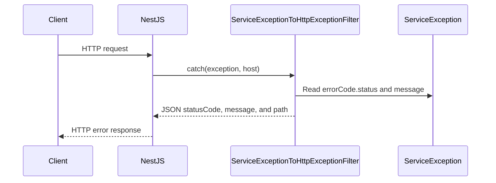

<!-- notion-page-id: 3ba2cdd741ac807cbd91c7a2b74d676a -->

# 예외처리

## **커스텀 예외 필터를 사용한 예외 핸들링**

우리가 만들 커스텀 예외 필터(ServiceExceptionToHttpExceptionFilter)는 아래와 같이 동작합니다.

1. Service에서 ServiceException을 컨트롤러로 던진다.

1. 컨트롤러에서 핸들링하지 못한 예외가 다시 던져진다.

1. 예외 필터가 ServiceException 타입 예외를 캐치한 후 HTTP 컨텍스트 에러로 변환해 응답한다.



# 01.

**에러 정보를 담은 에러 코드 만들기**

```javascript
// src/common/exception/error-code/error.code.ts
class ErrorCodeVo {
  readonly status;
  readonly message;

  constructor(status, message) {
    this.status = status;
    this.message = message;
  }
}

export type ErrorCode = ErrorCodeVo;

// 아래에 에러코드 값 객체를 생성
// Create an error code instance below.
export const ENTITY_NOT_FOUND = new ErrorCodeVo(404, 'Entity Not Found');
```

- ErrorCodeVo 클래스를 export하면 타입 체킹도 될텐데 왜 그 타입을 굳이 ErrorCode로 따로 선언했나면 ErrorCodeVo 클래스의 생성자를 통해서 값 객체 인스턴스를 생성할 수 있는 범위를 error.code.ts 파일 범위 내로 한정할 수 있기 떄문이다.

- 이렇게 **범위를 한정하면 모든 에러 코드를 한 파일 내에서 관리할 수 있다!**

# 02.

error-code를 모듈화해서 내보낼 index 파일을 작성

```javascript
// src/common/exception/error-code/index.ts
export * from './error.code';
```

# 03.

예외(Error 클래스를 상속받은 ServiceException 클래스) 만들기

```javascript
// src/common/exception/service.exception.ts

// ENTITY_NOT_FOUND 값 객체(status, default-message)를 가진
//  ServiceException 인스턴스 생성 메서드
export const EntityNotFoundException = (message?: string): ServiceException => {
  return new ServiceException(ENTITY_NOT_FOUND, message);
};

export class ServiceException extends Error {
  readonly errorCode: ErrorCode;

  constructor(errorCode: ErrorCode, message?: string) {
    if (!message) {
      message = errorCode.message;
    }

    super(message);

    this.errorCode = errorCode;
  }
}
```

이 ServiceException 클래스의 역할은

- 커스텀 예외 필터의 대상

- ServiceExeption 타입 인스턴스 생성 메서드가 사용하는 생성자 제공

# 04.

예외 필터 생성과 사용 설정

ServiceException을 캐치해서 원하는 프로토콜 컨텍스트의 에러로 변환해 응답시킬 커스텀 예외 필터를 만들기

```javascript
// src/common/exception-filter/index.ts
export * from './service.exception.to.http.exception.filter';

// src/common/exception-filter/service.exception.to.http.exception.filter.ts
@Catch(ServiceException)
export class ServiceExceptionToHttpExceptionFilter implements ExceptionFilter {
  catch(exception: ServiceException, host: ArgumentsHost): void {
    const ctx = host.switchToHttp();
    const request = ctx.getRequest<Request>();
    const response = ctx.getResponse<Response>();
    const status = exception.errorCode.status;

    response.status(status).json({
      statusCode: status,
      message: exception.message,
      path: request.url,
    });
  }
}
```

# 05.

다음은 전역 레벨에서의 필터 사용 선언

[NestJS의 공식문서](https://docs.nestjs.com/exception-filters) 설명에 따르면 두 가지 방식으로 전역 레벨에서 필터 사용을 적용할 수 있다.

```javascript
// 방법 1: main.ts 글로벌 필터 사용선언
// src/main.ts
async function bootstrap() {
  const app = await NestFactory.create(AppModule);
  ...
  // 전역 레벨에서 ServiceExceptionToHttpExceptionFilter 사용
  app.useGlobalFilters(new ServiceExceptionToHttpExceptionFilter());
  await app.listen(3000);
}
bootstrap();
```

```javascript
// 방법 2: APP_FILTER 토큰 값에 클래스 주입 방식
// src/app.module.ts
@Module({
  imports: [UsersModule, DatabaseModule],
  providers: [
    {
      provide: APP_FILTER,
      useClass: ServiceExceptionToHttpExceptionFilter,
    },
  ],
})
export class AppModule {}
```

# 06.

사용하기

```javascript
if (!user) {
      throw EntityNotFoundException(id + ' is not found');
    }
```

이렇게 사용하능합니다!
