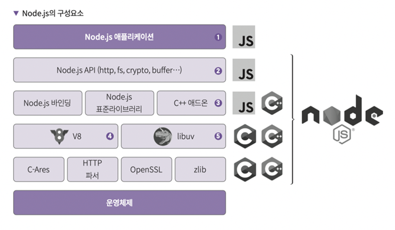
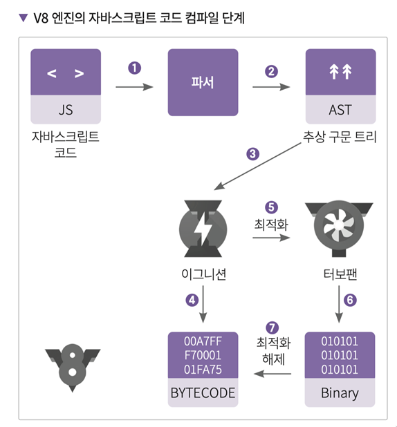
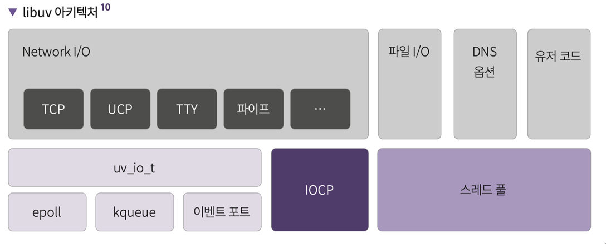
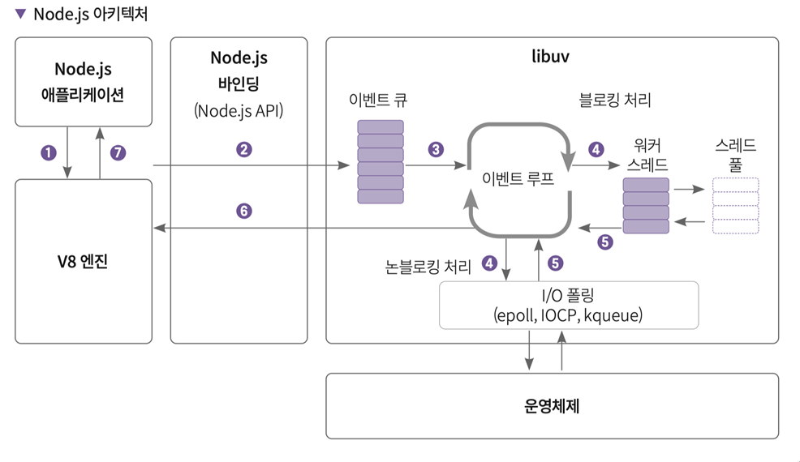

<!-- notion-page-id: 3ac2cdd741ac8040909cfa1c59ec2fc2 -->

# node.js는 누가 실행하는가

js라는 언어는 기본적으로 브라우저에서 구동되도록 설계돼었다. 그렇다면 서버에서 실행되는 Node.js는 무엇이 실행해줄까? 

바로 V8엔진이다.

- Google에서 개발한 **C++ 기반 오픈소스 JavaScript 엔진이다**
  - Node.js와 Chrome 브라우저에서 사용
  - 자바스크립트를 **기계어(Machine Code)** 로 변환하여 CPU가 실행할 수 있도록 해준다.

- 엔진은 파서, 컴파일러, 인터프리터, 가비지 컬렉터, 콜스택, 힙으로 구성된다.

[https://github.com/v8/v8](https://github.com/v8/v8)

- **이그니션 (Ignition - 인터프리터):**
  - **역할:** 자바스크립트 코드를 빠르게 바이트코드로 변환하여 실행합니다.
  - **장점:** 코드 실행 준비 시간이 매우 빨라 초기 로딩 속도가 좋습니다.
  - **단점:** 기계어로 직접 변환하지 않아 실행 효율(속도)은 최적화 컴파일러보다 낮습니다.

- **터보팬 (TurboFan - 최적화 컴파일러):**
  - **역할:** Ignition이 수집한 프로파일링 데이터(자주 실행되는 코드타입 정보 등)를 기반으로 
         기계어 코드를 생성합니다.
  - **장점:** 매우 효율적인 기계어를 생성하여 코드 실행 속도가 빠릅니다.
  - **단점:** 컴파일하는 데 시간이 걸립니다.

---

## 이벤트 루프와 운영체제 단 비동기 API 및 스레드 풀을 지원하는 libuv

- Node.js에서 HTTP, 파일, 소켓 통신, IO기능 등 자바스크립트에 없는 기능은 어떻게 제공하는가? libuv(C++) 라이브러리를 사용 

## libuv란?
  - libuv는 이벤트 루프 기반 비동기 I/O를 지원하는 다중 플랫폼 C 라이브러리입니다. 
epoll, kqueue, Windows IOCP, Solaris 이벤트 포트, Linux io_uring을 지원합니다
  - C++ 기반 라이브러리
  - 이벤트 루프 제공
  - 비동기 I/O 처리
  - 스레드 풀 제공
  [https://github.com/libuv/libuv](https://github.com/libuv/libuv)

---

## 🔹 Node.js 아키텍처

1. 애플리케이션에서 요청이 발생

1. V8 엔진은 자바스크립트 코드로 된 요청을 바이트 코드나 기계어로 변경
  - 자바스크립트로 작성된 Node.js의 API는 C++로 작성된 코드를 사용함. 

1. V8 엔진은 이벤트 루프로 libuv를 사용하고 전달된 요청을 libuv 내부의 이벤트 큐에 추가
  - 이벤트 큐에 쌓인 요청은 이벤트 루프에 전달되고, 운영체제 커널에 비동기 처리를 맡깁니다. 

1. 운영체제 내부적으로 비동기 처리가 힘든 경우(DB, DNS 룩업, 파일 처리 등)는 워커 스레드에서 처리

1. 운영체제의 커널 또는 워커 스레드가 완료한 작업은 다시 이벤트 루프로 전달됩니다. 

1. 이벤트 루프에서는 콜백으로 전달된 요청에 대한 완료 처리를 하고 넘깁니다.

1. 완료 처리된 응답을 Node.js 애플리케이션으로 전달합니다.
