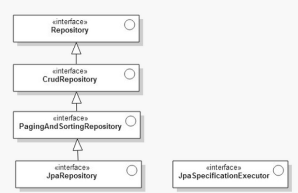
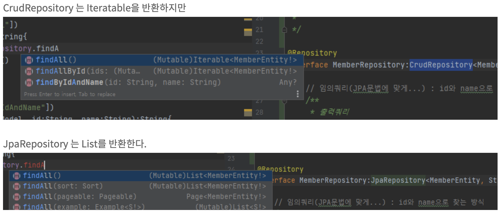

<!-- notion-page-id: 3a02cdd741ac80f883afe4cb1e0e545a -->

# Repository

### 스프링 프레임워크에서 JPA를 편하게 지원하도록 도와줌

**CRUD** 처리를 위한 공통 인터페이스 제공

- **C**reate(생성), **R**ead(읽기), **U**pdate(갱신), **D**elete(삭제)


    ### Repository의 종류
    - Repository<T, ID>
    - CrudRepository<T, ID>
    - PagingAndSortingRepository<T, ID>  
      페이징 처리를 위한 메소드를 제공한다.
    - JpaRepository <T,ID>

Repository의 상속 관계는 그림과 같다. 

> Repository에서 멀어질수록 더 많은 기능들을 담고 있는 인터페이스이다. 
그러므로 JpaRepository를 사용하면 많은 기능들을 사용할 수 있다. 하지만, 개발자가 선언하지 않은 메소드들이 외부에 노출 될 수 있다. 
  기본적인 기능들은 CrudRepository만으로도 가능하기 때문에 작은 기능들을 사용하는 프로젝트는 CrudRepository를 사용하는 것이 좋다.
  - 다른 차이점


### |  Repository interface 정의

```java
@Repository //어노테이션을 꼭 붙이지 않아도 된다.
public interface PersonRepository extends CrudRepository<엔티티 타입, 식별자 타입> {
}
```

### |  Repository 메소드 

findBy

- 퍼지검색 : 검색키워드가 정확하지 않아도 예상하여 적절한 단어를 찾는 검색 방식
