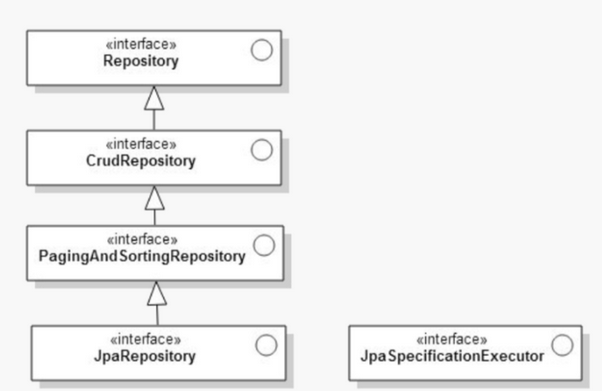
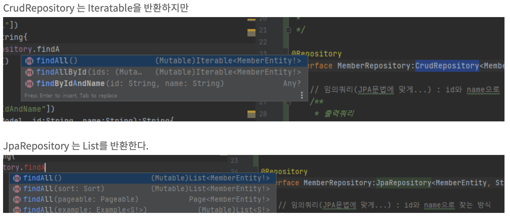

<!-- notion-page-id: 3a02cdd741ac80f883afe4cb1e0e545a -->

# Repository

### 스프링 프레임워크에서 JPA를 편하게 지원하도록 도와줌

**CRUD** 처리를 위한 공통 인터페이스 제공

- **C**reate(생성), **R**ead(읽기), **U**pdate(갱신), **D**elete(삭제)


    ### Repository의 종류
    - Repository<T, ID>
    - CrudRepository<T, ID>
    - PagingAndSortingRepository<T, ID>  
      페이징 처리를 위한 메소드를 제공한다.
    - JpaRepository <T,ID>

Repository의 상속 관계는 그림과 같다. 

> Repository에서 멀어질수록 더 많은 기능들을 담고 있는 인터페이스이다. 
그러므로 JpaRepository를 사용하면 많은 기능들을 사용할 수 있다. 하지만, 개발자가 선언하지 않은 메소드들이 외부에 노출 될 수 있다. 
  기본적인 기능들은 CrudRepository만으로도 가능하기 때문에 작은 기능들을 사용하는 프로젝트는 CrudRepository를 사용하는 것이 좋다.
  - 다른 차이점


### |  Repository interface 정의

```java
@Repository //어노테이션을 꼭 붙이지 않아도 된다.
public interface PersonRepository extends CrudRepository<엔티티 타입, 식별자 타입> {
}
```

### |  Repository 메소드 


| 메소드 | 설명 |
|---|---|
| save() | 새로운 엔티티는 저장하고 이미 있는 엔티티는 병합한다. |
| saveAll(List<>) | 객체 목록을 모두 테이블에 저장 |
| delete() | id(기본키) 속성값과 일치하는 레코드 삭제 |
| deleteAll(List<>) | 모든 레코드 삭제 및 객체 목록을 테이블에서 삭제 |
| count() | 레코드의 갯수 |
| exists(id) | id에 해당하는 레코드가 있는지 true/false를 리턴 |
| findAll() | 전체 레코드 불러오기. 정렬(sort), 페이징(pageable) 가능 |
| findById(id) | 기본키 필드 값이 id인 엔티티 하나를 조회한다. |

findBy


| 메소드 | 설명 |
|---|---|
| Like /  NotLike | [퍼지검색] 인수에 지정된 텍스트를 포함하거나 포함하지 않는 엔티티 검색 |
| StartingWith / EndingWith | 텍스트 값에서 인수에 지정된 텍스트로 시작하거나 끝나는 것 검색 findByNameStartingWith("A")이라면, name의 값이 "A"로 시작하는 항목을 검색한다. |
| IsNull / IsNotNull | 값이 null 이거나, 혹은 null이 아닌 것을 검색한다. 인수는 필요없다. "fundByNameIsNull()"이라면, name의 값이 null인 것만 검색한다. |
| LessThan / GreaterThan | 숫자 값으로 사용한다. 그 항목의 값이 인수보다 작거나 큰 것을 검색한다. "findByAgeLessThan(20)"이라면, age의 값이 20보다 작은 것을 찾는다. |
| Between | 두 값을 인수로 가지고 그 두 값 사이의 것을 검색한다. 예를 들어, "findByAgeBetween(10, 20)"라고 한다면 age의 값이 10이상 20이하인 것을 검색한다. |

- 퍼지검색 : 검색키워드가 정확하지 않아도 예상하여 적절한 단어를 찾는 검색 방식
