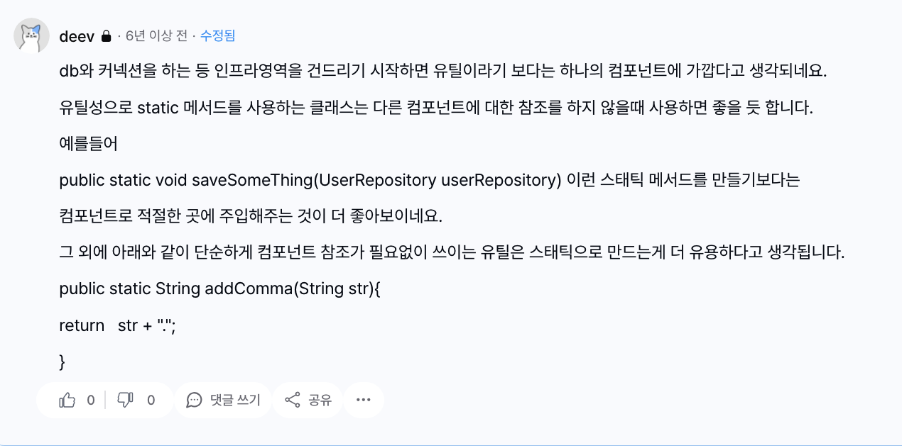

<!-- notion-page-id: 3bd2cdd741ac80b3b145c1ce63f369c2 -->

# static 메소드 vs @Component (DI)

## **Static 유틸 방식**

- **특징**: 객체 생성(`new`)이 필요 없고 메모리 효율이 좋습니다.

- **장점**: 어디서나 쉽고 빠르게 호출할 수 있습니다.

- **단점**: 외부 라이브러리나 DB, 다른 서비스 객체를 주입(`DI`)받을 수 없습니다.

- **추천 상황**: 입력값이 같으면 항상 같은 결과가 나오는 순수 계산/변환 로직 (`Math`, `StringUtils` 등)

## **컴포넌트 방식 (Spring Bean)**

- **특징**: 프레임워크가 생명주기를 관리하고 의존성 주입을 지원합니다.

- **장점**: 외부 자원(S3, DB, RestTemplate 등)을 주입받아 사용할 수 있습니다.

- **단점**: 매번 빈을 찾아야 하고 static 방식보다 초기 설정과 구조가 무겁습니다.

- **추천 상황**: 외부 서비스 연동, 상태 관리, 또는 단위 테스트 시 Mocking이 필요한 복잡한 로직

**GOAT.**

