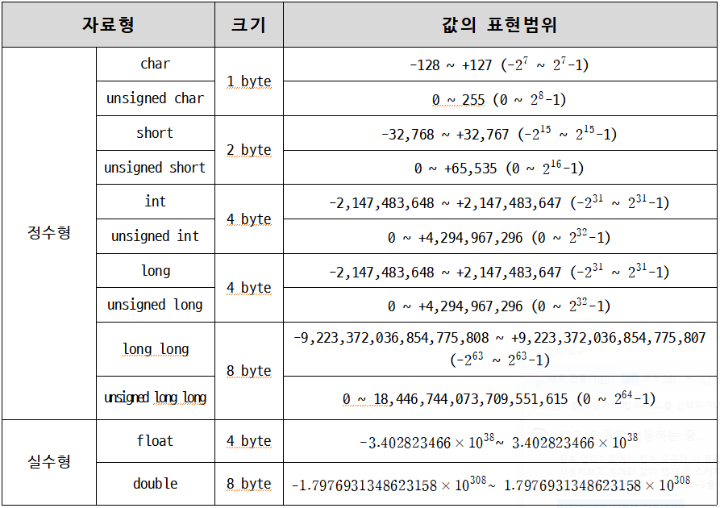
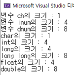

<!-- notion-page-id: 0a42cdd741ac82fea56581a76fa4a203 -->

# C언어의 기본 자료형

### 1. 자료형(data type) : 데이터를 표현하는 방법

### 2. 기본 자료형의 종류와 데이터 표현 범위



### 3. 연산자 sizeof를 이용하여 자료형 크기 확인

    - 실습 예제 (실행 결과를 보고 아래의 코드를 완성시키세요.)
```c
#include <stdio.h>
int main()
{
	char ch = 9;
	int inum = 1052;
	double dnum = 3.141592;

	// 변수의 크기 구하기
	printf("변수 ch의 크기 : %d\n", sizeof(ch));
	// inum 변수 크기 출력
	// dnum 변수 크기 출력

	// 자료형 자체의 크기 구하기
	printf("char의 크기 : %d\n", sizeof(char));
	printf("int의 크기 : %d\n", sizeof(int));
	printf("long의 크기 : %d\n", sizeof(long));
	// long long 자료형의 크기 출력
	// float 자료형의 크기 출력
	// double 자료형의 크기 출력

	return 0;
}
```
    실행결과

