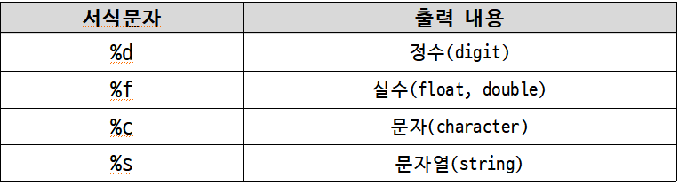
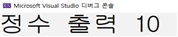
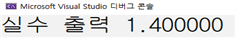
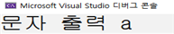
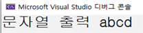
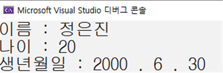
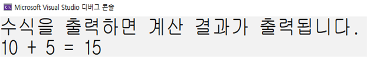

<!-- notion-page-id: 76d2cdd741ac828f80068170b1ac7da6 -->

# printf()

### 1. 주석은 무엇일까?


■ 주석이 들어가야 완성된 프로그램이라 할 수 있다.

- 주석이란? 프로그램 내에 삽입된 메모

- 컴파일 대상에서 제외


■ 블록 단위 주석

```c
/* 주석처리 된 문장 */
ㆍ두 줄 이상의 주석처리에 사용 가능
/*
주석처리 된 문장 1
주석처리 된 문장 2
주석처리 된 문장 3
*/
```

■ 행 단위 주석

```c
// 주석처리 된 문장 1
// 주석처리 된 문장 2
// 주석처리 된 문장 3
```

### 2. printf() 함수의 이해


■ printf 함수를 이용한 문자열, 정수형, 실수형 출력과 서식 문자



- 서식문자란? ‘ % ’와 같이 출력형식을 나타내는 문자가 더해져 구성되는 것 

- 즉, 출력 형태를 지정하는 용도로 사용

- 출력의 대상은? “ ” 큰따옴표로 표시되는 문자열 뒤에 이어서 표시를 하며, 콤마로 ‘,’ 구분

- %가 2개가 등장하면 출력 대상도 2개, 3개가 등장하면 출력 대상도 3개가 등장


■ printf 함수를 이용한 문자열, 정수형, 실수형 출력과 서식 문자의 예시

    - 정수형 출력과 서식 문자
      - 입력 형태
```c
printf("정수 출력 %d\n", 10);
```
    - 실수형 출력과 서식 문자
      - 입력 형태
```c
printf("실수 출력 %f\n", 1.4);
```
    - 단일 문자형 출력과 서식 문자
      - 입력 형태
```c
printf("문자 출력 %c\n", 'a');
```
    - 문자열형 출력과 서식 문자
      - 입력 형태
```c
printf("문자열 출력 %s\n", “abcd”);
```
    - 출력예시

    - 출력예시

    - 출력예시

    - 출력예시


> **단일 문자와 문자열 출력시 주의 사항**

단일 문자는 작은따옴표 ‘ ’를 사용하고, 문자열은 큰따옴표 “ ”를 사용한다.

■ printf 함수 기초 예제

```c
/*
서식 문자 3개를 활용하여
본인의 학번을 작성해봅시다.
서식 문자가 3개라면 출력 대상도 3개인 점 유의합시다.
*/
#include<stdio.h> // 헤더파일 선언
int main() // main 함수 시작
{
printf("나는 %d학년, %d반, %d번이다.\n", 1, 4, 0); // 학번 출력
return 0; // 함수 종료
} // main 함수 끝
```

## 관련 문제
1. 다음의 출력 결과가 보이도록 프로그램을 작성해보자.
단, ‘ : ’ 뒤에 나오는 문자, 문자열, 숫자 등은 모두 서식 문자 %를 사용하여 출력하도록 하자.

1. 다음의 출력 결과가 보이도록 프로그램을 작성해보자.
이번에도 역시 출력되는 숫자들은 모두 서식 문자 %를 사용하여 출력하도록 하자.

1. 코드업 출력문 문제 모두 해결해보기
