<!-- notion-page-id: c892cdd741ac837594fc013596835910 -->

# 구조체

### 1. 구조체란?

- 구조체 : 하나 이상의 변수(포인터 변수와 배열 포함)를 묶어서 새로운 자료형을 정의하는 것

- 배열은 자료형이 같은 여러 자료를 처리하기 위해 사용

- 구조체는 서로 다른 자료형을 묶어서 나타내기 위한 것

- 구조체 정의
```c
// Hello 라는 이름의 구조체 정의
struct Hello
{
	int x; // Hello 구조체를 구성하는 멤버변수 x
	int y; // Hello 구조체를 구성하는 멤버변수 y
};
```
```c
// Person 이라는 이름의 구조체 정의
struct Person
{
	char name[20];		// 이름을 저장하는 char형 배열 멤버 name
	char phoneNum[20];	// 전화번호를 저장하는 char형 배열 멤버 phoneNum
	int age;			// 나이를 저장하는 int 형 멤버변수 age
};
```
```c
// Record 이라는 이름의 구조체 정의
struct Record
{
	double fKo;		// 국어 성적을 저장하는 double형 멤버변수 fKo
	double fMa;		// 수학 성적을 저장하는 double형 멤버변수 fMa
	double fEng;	// 영어 성적을 저장하는 double형 멤버변수 fEng
	double fInfo;	// 정보 성적을 저장하는 double형 멤버변수 fInfo
};
```
```c
// Student 이라는 이름의 구조체 정의
struct Student {
	int number;              // 번호를 저장하는 int형 멤버변수 number
	char name[10];           // 이름을 저장하는 char형 배열 멤버 name
	double grade;            // 점수를 저장하는 double형 멤버변수 grade
};
```

- struct : 구조체를 선언할 때 사용하는 키워드

- Hello, Person, Record, Student : 구조체 이름

- 중괄호 안의 변수 선언 : 구조체 멤버

- 위의 활동은 구조체 변수를 선언한 것이 아니다. 즉, 구조체를 정의하고 선언하는 것은 구조체의 형태(틀)만 정의한 것이고 아직 구조체를 활용한 변수를 만들지 않았다. 
  > → 예를 들면, 붕어빵을 만드는 틀만 정의, 붕어빵은 하나도 만들지 않음.

### 2. 구조체 변수 선언

- 구조체 정의(선언)를 했을 때 실제 메모리 공간 할당? (X)

- 구조체 변수를 선언했을 때 실제 메모리 공간 할당? (O)

- 구조체 변수 선언
```c
struct Hello myPoint;			      // struct Hello형 변수 myPoint 선언
struct Person myPerson;		      // struct Person형 변수 myPoint 선언
struct Record classRecord[20];	// struct Record형 배열 변수 classRecord 선언 
	                              // classRecord[0]~classRecord[19] 사용가능
struct Student s1, s2;		      // struct Student형 변수 s1, s2 선언
```

- 구조체 선언과 동시에 변수 선언
```c
// Student 이라는 이름의 구조체 정의
struct Student {
	int number;        // 번호를 저장하는 int형 멤버변수 number
	char name[10];     // 이름을 저장하는 char형 배열 멤버 name
	double grade;      // 점수를 저장하는 double형 멤버변수 grade
}s1;              // 구조체 Student의 변수 s1
```

- 함수 외부에 구조체 선언
```c
#include <stdio.h>
// 함수 정의
void MyFunc();

struct Student {
	int number;              // 번호를 저장하는 int형 멤버변수 number
	char name[10];           // 이름을 저장하는 char형 배열 멤버 name
	double grade;            // 점수를 저장하는 double형 멤버변수 grade
}s;         

struct Student s1; // struct Student 형 전역 변수 선언 가능

int main()
{
	struct Student s2; // struct Student 형 변수 선언 가능(지역 변수)
	return 0;
}

void MyFunc()
{
	struct Student s3; // struct Student 형 변수 선언 가능(지역 변수)
}
```

- 함수 내부에 구조체 선언
```c
#include <stdio.h>
// 함수 정의
void MyFunc();

// struct Student s1; // struct Student 형 전역 변수 선언 불가(정의되어있지 않음)

int main()
{
	// Student 라는 이름의 구조체 정의(main() 함수 내부에서만 사용가능)
	struct Student
	{
		int number;              // 번호를 저장하는 int형 멤버변수 number
		char name[10];           // 이름을 저장하는 char형 배열 멤버 name
		double grade;            // 점수를 저장하는 double형 멤버변수 grade
	} s1; // struct Student 형 지역변수 선언 가능
	return 0;
}
void MyFunc()
{
//   struct Student s3; // struct Student 형 지역변수 선언 불가(정의되어있지 않음)
}
```

### 3. 구조체 초기화

- 구조체 선언 후 초기화
```c
struct Student {
	int number;            
	char name[10];          
	double grade;            
};
struct Student s1 = { 1, "Jung", 4.5 };
```

- 구조체 선언과 동시에 초기화
```c
struct Student {
	int number;            
	char name[10];          
	double grade;            
} s1 = { 1, "Jung", 4.5 };
```
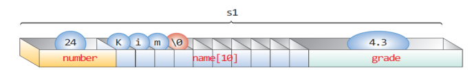

- s1과 s2를 동시에 초기화 할 수는 없을까?

- int num[10]이라는 변수가 있다면 어떻게 초기화 할까?

- 전부 0으로 초기화하는 방법은 없을까?

### 4. 구조체 멤버 참조

- 구조체 변수를 선언하고 구조체 안의 멤버 변수들을 참조하는 것이 가장 중요!

- 멤버 연산자(.)를 이용한다.
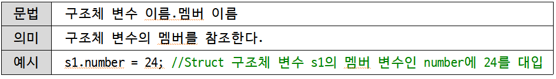

- 문자열을 대입할 때는?
```c
strcpy(s1.name, "Jung");
s1.grade = 4.5;
```
  > strcpy(대입할 구조체 멤버, 대입할 문자열)을 사용한다!

- 실습 예제1
```c
#include<stdio.h>
#include<stdlib.h> //strcpy를 사용하기 위한 헤더파일

//구조체 정의하기
//student라는 이름을 가진 구조체 만들기
//멤버는 int형 number, char형 name[20], double형 grade

int main()
{
	struct student s;
	s.number = 1419;
	strcpy(s.name, "정은진");
	s.grade = 4.5;

	//학번 출력
	//이름 출력
	//학점 출력

	return 0;
}
```
  실행결과
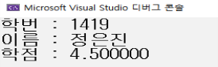

- 실습 예제2 (위의 예제와 똑같은 프로그램이지만, 직접 입력하여 구조체 멤버에 값을 대입)
```c
#include<stdio.h>
#include<stdlib.h> //strcpy를 사용하기 위한 헤더파일

//구조체 정의하기
//student라는 이름을 가진 구조체 만들기
//멤버는 int형 number, char형 name[20], double형 grade

int main()
{
	//구조체 변수 선언하기
	//학번, 이름, 학점 각각 입력받기
	//학번, 이름, 학점 각각 출력하기

	return 0;
}
```
  실행 결과
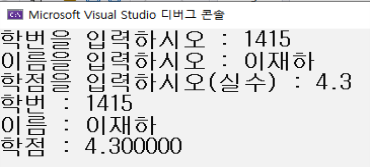

- 실습 예제3 
  > 두 점 사이의 거리를 구하기 :  
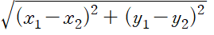
```c
#define _CRT_SECURE_NO_WARNINGS
#include<stdio.h>
#include<math.h> //sqrt를 사용하기 위한 헤더파일

//sqrt()함수는? 제곱근을 구하기 위한 표준 함수
//사용 방법 : 변수 = sqrt(제곱근 구하기 위한 수)
//double x = sqrt(20); x = 4.472136;

//x좌표와 y좌표를 멤버로 갖는 구조체 선언

int main()
{
	//프로그램 작성

	return 0;
}
```
  실행 결과
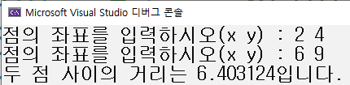

### 5. 구조체를 멤버로 가지는 구조체

- 구조체 자체도 구조체의 멤버가 될 수 있다.

- 지금까지 사용했던 student 구조체에 생년월일을 멤버로 갖는 구조체를 추가해본다.
```c
struct date {  //생년월일을 멤버로 갖는 구조체 date
	int year;  //년도
	int month; //월
	int day;   //일
};

struct student {
	int number;
	char name[20];
	struct date birth;  //생년월일을 멤버로 갖는 구조체 date를 멤버로 갖는 student 구조체
	double grade;
} s1;
```

- 사용 방법
```c
s1.number = 1419;
strcpy(s1.name, "jung");
s1.grade = 4.5;
s1.birth.year = 2010;  //student 구조체의 멤버 birth 구조체의 멤버 year에 2010 대입
s1.birth.month = 6;    //student 구조체의 멤버 birth 구조체의 멤버 month에 6 대입
s1.birth.day = 2;      //student 구조체의 멤버 birth 구조체의 멤버 day에 2 대입
```

- 실습 예제
  > 문제 예시
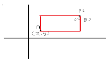
```c
#define _CRT_SECURE_NO_WARNINGS

#include<stdio.h>
#include<stdlib.h>
struct point {
         //x, y 좌표를 저장하는 멤버 작성
};

struct rec {
	//point 구조체 변수 2개 선언
}r1;

int check(int a)
{
	//넓이 결과가 음수일 때 양수로 반환
}

int main()
{
	int result;
	printf("두 점의 좌표를 입력받아 넓이를 출력하시오.\n");
	printf("첫번째 점의 좌표 (x y) : ");
	//첫번째 좌표 입력
	printf("두번째 점의 좌표 (x y) : ");
	//두번째 좌표 입력

	//넓이 구한 뒤 음수면 양수로 변환하여 출력하기

	return 0;
}
```
  실행결과
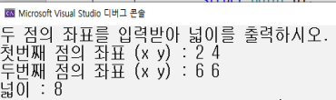

- 구조체 변수끼리 대입하는 것은 가능하다.

- 즉, 하나의 구조체 변수를 다른 구조체 변수에 대입하는 것은 가능하다.
```c
struct point {  
	int x;
	int y;
};

struct point p1 = {10, 20};
struct point p2 = {20, 10};

p2 = p1;
```

- point 구조체 변수 p2에 p1을 대입하면 p2는 10, 20으로 값이 바뀐다.

- 단, 구조체 변수와 구조체 변수를 서로 비교하는 것은 불가능하다.
```c
if (p1.x == p2.x && p1.y == p2.y)
	{
		printf("p1과 p2는 같습니다.");
	}
```

- 구조체 변수를 비교하기 위해서는 각 멤버를 비교해줘야 한다.
```c
if ((p1.x == p2.x) && (p1.y == p2.y))
	{
		printf("p1과 p2는 같습니다.");
	}
```

### 6. 구조체의 배열

- 위의 struct student 구조체 변수 s1은 한 명의 데이터만 저장하는 변수이다.

- 구조체의 배열 : 배열 원소가 구조체인 것을 의미한다.
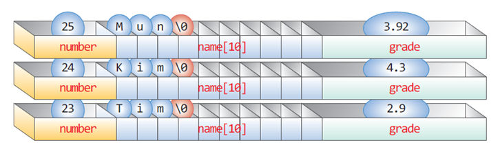

- 구조체 배열의 선언
```c
struct Student {
	int number;            
	char name[20];          
	double grade;            
};
struct Student list[100];
```

- 구조체 배열 대입
```c
list[0].number = 1401;
strcpy(list[0].name, "김민승");
list[0].grade = 4.5;
```

- 구조체 배열의 초기화
```c
struct Student list[3] = {
	{ 1, “Kim”, 4.4 },
	{ 2, “Do”, 4.6 },
	{ 3, “Park”, 4.3 }
};
```

- 실습예제1
```c
#define _CRT_SECURE_NO_WARNINGS
#include<stdio.h>
#include<stdlib.h>
#define SIZE 3

struct student {
	int number;
	char name[20];
	double grade;
};

int main()
{
	// student 구조체 배열 선언 (크기는 SIZE) 
	for (int i = 0; i < SIZE; i++)
	{
		// 학번, 이름, 학점 입력받기
	}

	for (int i = 0; i < SIZE; i++)
	{
		// 학번, 이름, 학점 출력하기
	}

	return 0;
}
```
  실행 결과
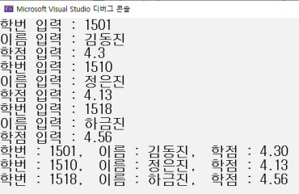

- 실습예제2
```c
#define _CRT_SECURE_NO_WARNINGS
#include<stdio.h>

struct point {
	int x;
	int y;
};

int main()
{
	// point 구조체 배열 선언 (크기는 3) 
	for (int i = 0; i < 3; i++){
		// x, y좌표 입력
	}
	
	for (int i = 0; i < 3; i++)
	{
		// 1사분면 : x>0, y>0 / 2사분면 : x<0, y>0 / 3사분면 : x<0, y<0 / 4사분면 : x>0, y<0
	}

}
```
  실행 결과
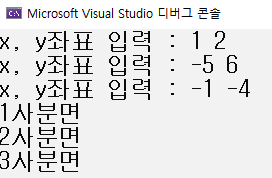

### 7. 구조체와 포인터

- 구조체를 가리키는 포인터
  - 변수를 가리키는 포인터가 있듯이 구조체를 가리키는 포인터도 만들 수 있다.
  - 선언 방법
```c
struct student *p;
```
  - 이때 p는 student 구조체를 가리키는 포인터 변수로 사용된다.
  - 사용 예시
```c
struct student s = { 1419, "정은진", 45 };
struct student* p;

p = &s;

printf("학번 : %d, 이름 : %s, 학점 : %.1lf\n", s.number, s.name, s.age);
printf("학번 : %d, 이름 : %s, 학점 : %.1lf\n", p.number, (*p).name, (*p).grade);
```
  - p는 s의 주소를 저장하고 있다. 따라서, *p는 저장하고 있는 주소를 가리키는 것이기 때문에 s와 동일하게 생각할 수 있다.
  - 주의 : *p.number라고 쓰면?
  - 연산자의 우선순위 중 * < . 이다. 따라서 *(p.number)와 같은 의미로 해석되기에
  - 반드시 (*p).number로 써줘야 우선순위에 밀리지 않는다.
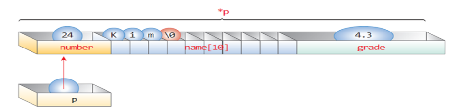
  - 사용 방법2 : 간접 멤버 연산자(->) 사용
```c
struct student s = { 1419, "정은진", 4.5 };
struct student* p;

p = &s;
printf("학번 : %d, 이름 : %s, 학점 : %.1lf\n", p->number, p->name, p->grade);
```
  - 실습 예제1
```c
#include<stdio.h>
// student 구조체 선언

int main() {
	struct student s = { 1419, "정은진", 4.5 };
	struct student* p;
	p = &s;
	// 구조체 변수 s 사용해서 출력
	// 구조체를 가리키는 포인터 변수*p 사용해서 출력
	// 간접 멤버 연산자(->) 사용해서 출력
	return 0;
}
```
    실행 결과
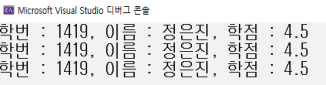

- 포인터를 멤버로 가지는 구조체
  - 구조체는 멤버로 포인터도 가질 수 있다.
  - 선언 방법
```c
struct test {
	int a;
	char b;
	double c;
};

struct pointer {
	int number;
	char name[20];
	double grade;
	struct test *t1;
};

//main 함수에서 사용할 때

int main() {
	struct test t = { 1, ‘c’, 4.5 };
	struct pointer p = { 1419, “정은진”, 4.5 };

	p.t1 = &t;
}
```
  - pointer 구조체 멤버 중 t1은 test 구조체를 가리키는 포인터 변수이다.
  - 먼저 test 구조체 변수 t를 초기화 한 뒤, pointer 구조체 변수 p를 초기화 해 준다.
  - 단, p의 멤버 중 t1은 포인터이므로 pointer 구조체 변수 p의 멤버인 t1(p.t1)은 구조체 변수 t의 주소로 초기화 하면 된다.
  - 실습 예제
```c
#include<stdio.h>

// date 구조체 선언 (year, month, day를 멤버로 갖는다.)
// student 구조체 선언 (number, name[20], grade, date 구조체를 가리키는 포인터 변수를 멤버로 갖는다.)

int main()
{
	struct date d1 = // date 구조체 변수 d1 초기화
	struct student s = // student 구조체 변수 s 초기화

	// 구조체를 가리키는 변수 따로 초기화 해주기

	// 실행 결과대로 출력하기

	return 0;
}
```
    실행 결과
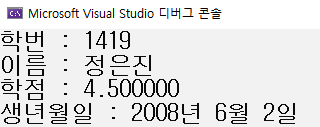

### 8. 구조체와 함수

- 구조체를 함수로 보내고 받는 것은 기본 자료형을 보내고 받는 것과 동일하다.

- 실습 예제1
```c
#define _CRT_SECURE_NO_WARNINGS
#include<stdio.h>

struct student {
	int age;
	char name[20];
};

int compare(struct student ss1, struct student ss2) // 구조체 변수를 형식 매개변수로 갖는다.
{
	if (// 나이 비교)
		return 1;
	else
		return 0;
}

int main()
{
	struct student s1, s2;
	int result;

	// 이름 입력 받기
	// 나이 입력 받기

	result = // result변수에 두 구조체의 나이를 비교하여 나온 결과를 대입한다.

	if (result)
		printf("동갑\n");
	else
		printf("동갑아님\n");

	return 0;
}
```
  실행 결과   
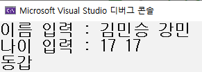

- 위의 예제는 복사본을 전달(call-by-value)를 사용하고 있다.

- 유의할 점 : 구조체의 크기가 크면 시간과 메모리가 많이 소요된다.

- 그럼 구조체 크기가 클 때는?

- 구조체 복사본을 보내는 것이 아닌 구조체 포인터를 보내는 것이 좋다.

- 왜? 모든 포인터는 동일한 크기를 갖기 때문에

- 위의 예제를 포인터로 바꾸어 실행시켜 보자.

- 실습 예제2
```c
#define _CRT_SECURE_NO_WARNINGS
#include<stdio.h>

struct student {
	int age;
	char name[20];
};

int compare(// 구조체 포인터 변수로 받기) 
{
	if (// 나이 비교하기)
		return 1;
	else
		return 0;
}

int main()
{
	struct student st1;
	struct student st2;
	// 구조체 포인터 변수 2개 선언 후 초기화하기
	int result;

	// 이름 입력 받기
	// 나이 입력 받기

	result = compare(s1, s2);

	if (result)
		printf("동갑\n");
	else
		printf("동갑아님\n");

	return 0;
}
```
  실행 결과
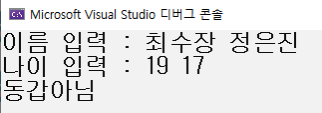

- 구조체도 반환이 가능할까?

- 다음과 같이 반환할 수 있다.

- 사용 예시
```c
struct student make_stu() // void, int, double 등으로 썼던 반환형을 struct student 구조체를 쓴다.
{
	struct student s;
	...
	return s; // 구조체 변수를 반환한다.
}
```

- 실습 예제3(두 점의 좌표를 더해서 출력하기)
```c
#define _CRT_SECURE_NO_WARNINGS
#include<stdio.h>

struct point {
	int x;
	int y;
};

// 구조체 반환형 작성 get_sum(struct point pp1, struct point pp2)
{
	struct point result;

	// result 변수에 x의 합 대입

	// result 변수에 y의 합 대입

	// 구조체 변수 반환
}

int main()
{
	struct point p1, p2;
	struct point sum;

	// p1의 x, y좌표 입력
	// p2의 x, y좌표 입력

	// 구조체 변수 sum에 두 좌표를 더한 결과 대입하기 – 함수 호출

	printf("두 좌표의 합 : %d %d\n", sum.x, sum.y);

	return 0;
}
```
  실행 결과
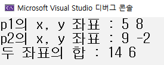
