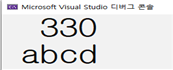
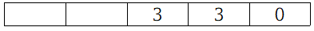
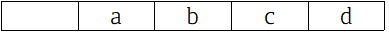
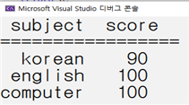
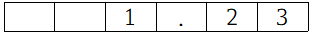
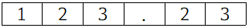
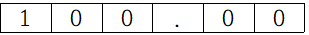
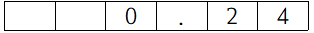
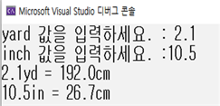

<!-- notion-page-id: 6322cdd741ac83048dd781ba22af510c -->

# 다양한 출력 형태

### 1. 공백을 확보하기 위한 서식 문자

- 정수형 표현 : %( 공간 크기 )d

- 실수형 표현 : %( 공간 크기 )f

- 문자형 표현 : %( 공간 크기 )c

- 문자열형 표현 : %( 공간 크기 )s

- 공간 크기에 만큼의 공백을 확보하고 오른쪽으로 정렬되어 출력한다.

- 지정한 자리보다 출력 값의 자리가 더 큰 자료는 오버되어 출력된다.

- 실습 예제
```c
// 예제 1
#include<stdio.h>
int main()
{
	printf("%5d\n", 330);
	printf("%5s\n", "abcd");
	return 0;
}
```
  실행결과


- 기본 구조
  1. printf(“%5d\n”, 330); 

  1.  printf(“%5s\n”, “abcd”);


+관련 문제(각 요소들은 8칸 6칸씩 공간을 확보하여 오른쪽으로 정렬한다.)
```c
#include<stdio.h>

실행결과

int main()
{
	printf("%8s %6s\n", "subject", "score");
	printf("=================\n");
	// 국어 점수 출력
	// 영어 점수 출력
	// 컴퓨터 점수 출력

	return 0;
}   
```
  실행결과


- %06d는 앞에 빈 공간은 0으로 채워진다.

### 2. 소수점 n째 자리까지 출력하기 위한 형식

- %.2f  : 전체 자릿수는 실제대로 출력하고 소수점 이하는 소수 3자리에서 반올림하여 두 번째 자리까지 출력한다.

- %6.2f : 6은 소수점을 포함한 전체 자릿수, 2는 소수점 이하 자릿수를 나타낸다.
  1. 1. 23

  1. 123. 23

  1. 100

  1. 0.235


- %06.2f는 앞에 빈 공간은 0으로 채워진다.

+관련 문제 : 야드(yard)와 인치(inch)를 cm로 변환하여 소수 첫째 자리까지 출력하는 프로그램을 작성하시오.
```c
#define _CRT_SECURE_NO_WARNINGS
#include<stdio.h>
int main()
{
	float yard, inch;
	printf("yard 값을 입력하세요. : ");
	// yard값 입력
	// inch 값을 입력하세요. : 출력
	// inch값 입력

	// yard값을 cm로 변환하여 소수점 첫째 자리까지 출력(1yard = 91.44cm)
	// inch값을 cm로 변환하여 소수점 첫째 자리까지 출력(1inch = 2.54cm)

	return 0;
}
```
  실행결과

