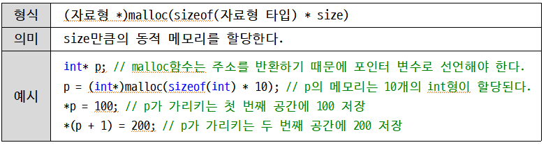
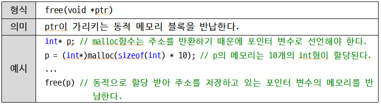
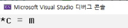
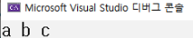
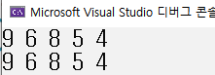
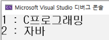

<!-- notion-page-id: 3bb2cdd741ac80a1b062f43ec5f91267 -->

# 동적메모리

### 1. 정적메모리

- 메모리를 할당받는 방법 중 정적 할당이 있다.

- 정적 메모리 할당이란? 프로그램이 시작되기 전에 미리 정해진 크기의 메모리를 할당 받는 것

- 프로그램 실행 도중 크기는 변경할 수 없다.

- 변수나 배열 선언 -> 정적 메모리 할당
```c
int i, j;
int array[80];
char name[] = "my name is eunjin";
```

- 장점 : 매우 간단하게 메모리를 할당할 수 있다.

### 2. 동적메모리

- 필요한 메모리의 크기를 미리 알 수 없는 경우에는 고정된 크기의 메모리를 할당할 수 밖에 없음.

- 만약, 결정된 메모리 크기보다 더 큰 입력이 들어온다면 처리 불가능

- 만약, 결정된 메모리 크기보다 작은 입력이 들어온다면 공간 낭비

- 동적 메모리 할당이란? 프로그램이 실행 도중에 동적으로 메모리를 할당받는 것

- 필요한 만큼 메모리를 할당받아 사용하고, 사용이 끝나면 시스템에 메모리 반납

- 필요한 때에 할당받고 반납하기 때문에 메모리를 효율적으로 사용할 수 있다.

### 3. 동적메모리 사용 절차

1. 동적 메모리 할당(**malloc()**)
  - 표준함수 malloc()을 제공하는 헤더파일은 “stdlib.h”이다.
  - malloc()은 byte 단위로 메모리 할당
  - 동적 메모리 할당이 성공적이면 malloc()함수는 메모리의 주소(즉, 포인터)를 반환한다.
  - 동적 메모리 할당을 할 수 없는 경우는 NULL 값을 반환

  - malloc() 함수는 원래 반환형이 void* 이기 때문에 (int *)의 의미는 void가 아닌 int로 형변환을 해 주기 위함이다.

1. 동적 메모리 사용
  - 정적 메모리는 변수나 배열 이름으로 사용
  - 동적 메모리 공간은 포인터를 써서 사용할 수 있다.

1. 동적 메모리 반납(**free()**)
  - 동적 메모리를 다 사용하고 필요없는 경우 반납한다.
  - free() 함수는 메모리를 시스템에 반납한다.


- 단, 주소가 이동되면 반납할 때 오류 발생함.
```c
#include<stdio.h>
#include<stdlib.h>

int main()
{
	char* c;
	c = (char*)malloc(sizeof(char) * 3); // 1) 동적 메모리 할당

	if (c == NULL)
	{
		printf("메모리 할당 오류!");
		return 0;
	}

	*c = 'm'; // 2) 동적 메모리 사용
	++c; // 주소가 이동되면 어디서 부터 반납을 할지 모르기 때문에 free가 되지 않음.
	*c = 'c';
	
	free(c); // 3) 동적 메모리 반납
	
	return 0;
}
```

- 실습 예제1
```c
#include<stdio.h>
#include<stdlib.h>

int main()
{
	char* c;
	c = (char*)malloc(sizeof(char)); // 1) 동적 메모리 할당

	if (c == NULL)
	{
		printf("메모리 할당 오류!");
		return 0;
	}

	*c = 'm'; // 2) 동적 메모리 사용
	printf("*c = %c\n", *c);
	free(c); // 3) 동적 메모리 반납
	
	return 0;
}
```
  실행 결과


- 실습 예제2
```c
#include<stdio.h>
#include<stdlib.h>
int main(){
	char* pc;
	// 동적 메모리 3바이트 할당받기
	if (pc == NULL)
	{
		printf("메모리 할당 오류!");
		return 0;
	}
	*pc = 'a'; // 첫 번째 주소에 a 저장
	// 두 번째 주소에 b 저장
	// 세 번째 주소에 c 저장
	for (int i = 0; i < 3; i++) {
		printf("%c ", *(pc + i));
	}
	// 메모리 반환
	return 0;
}
```
  실행 결과


- 실습 예제2-1
```c
문자열을 저장할 수 있는 메모리 공간을 동적으로 할당받고 문자를 저장해보자. 
100바이트를 할당받아서 !가 입력될 때까지 알파벳 대문자를 입력하여 
저장한 뒤 출력하자.
#define _CRT_SECURE_NO_WARNINGS
#include<stdio.h>
#include<stdlib.h>
int main()
{
	char* pc;
	pc = (char*)malloc(sizeof(char));
	int i = 0;

	if (pc == NULL){
		printf("메모리 할당 오류!");
		return 0;
	}

	while(1) {
		// pc를 활용해서 입력받기
		if (// 입력받은 문자가 !면 )
			//멈추기
		i++;
	}

	for (int j = 0; j < i; j++) {
		// 입력받은 문자 그대로 출력하기
	}
	// 메모리 반납하기
	return 0;
}
```
  실행 결과


- 실습 예제3(배열로 만들어보기)
```c
다섯 개의 정수를 저장할 수 있는 메모리를 할당받아 
그 메모리를 배열처럼 활용해서 정수 5개를 입력받고 그대로 출력하자.

#define _CRT_SECURE_NO_WARNINGS
#include<stdio.h>
#include<stdlib.h>

int main()
{
	int* pi;
	// 5개 정수 저장하는 메모리 할당받기

	if (pi == NULL)
	{
		printf("메모리 할당 오류!");
		return 0;
	}

	for (int i = 0; i < 5; i++) {
		// 5개의 정수 입력받기(배열처럼 써보기) pi[i]
	}

	for (int i = 0; i < 5; i++) {
		// 5개의 정수 출력하기(배열처럼)
	}

	// 메모리 반납하기
	return 0;
}
```
  실행 결과


- 실습 예제4(구조체 변수도 메모리 할당하기)
```c
#include<stdio.h>
#include<stdlib.h>

// 구조체 Book 선언, 멤버로 정수형 number와 문자형 title[20] 가지고 있음

int main()
{
	// 구조체 Book의 포인터 변수 선언
	p = // 2개의 구조체 Book을 가지는 동적 메모리 할당

	if (p == NULL) {
		printf("메모리 할당 오류!");
		return 0;
	}

	// 구조체에 값 대입 시키기. 문자열을 대입하는 함수 : strcpy(p->title, “C프로그래밍”)

	for (int i = 0; i < 2; i++) {
		// 출력
	}

	return 0;
}
```
  실행 결과

