<!-- notion-page-id: a8e2cdd741ac83a5a72701d533dc2fcd -->

# 반복문

> 반복문이란?  하나 이상의 문장을 두 번 이상 반복 실행하기 위해 구성하는 문장

### 1. while : 조건 기반 반복문

- 기본 흐름 구조
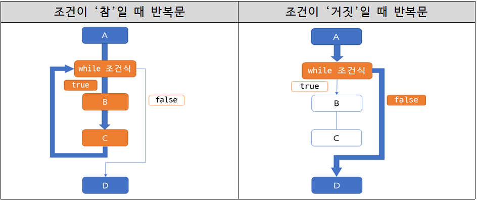

- while문은 소괄호 ‘( )’ 안에는 조건을 명시하고, 조건이 ‘참’이면 조건이 만족되는 동안 중괄호 ‘{ }’ 코드가 반복되는 구조이다.

- if문은 단 한 번만 실행되고 끝나지만 while문은 조건이 ‘거짓’이 될 때까지 반복하는 것

- 실습 예제1
```c
//예제1
#define _CRT_SECURE_NO_WARNINGS // visual studio 만 필요!
#include<stdio.h>
int main()
{
	int num = 1; //변수 num 초기화
	while (num <= 5) //()소괄호 안의 조건문이 거짓이 될 때까지 반복
	{
		printf("while 내부 실행 : %d\n", num);
		num++; // 반복의 횟수를 조절   하기 위한 변수
	}
	return 0;
}
```
  실행 결과
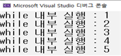

- 실습 예제2
```c
//예제2
#define _CRT_SECURE_NO_WARNINGS // visual studio 만 필요!
#include<stdio.h>
int main()
{
	int num = 1;
	while (1) {  // (1)의 의미는 항상 참이다.
		if (num >= 5) {  // num이 5이상이면
			break;  // while문을 멈춘다. * break는 반복문을 탈출시키는 명령어다.
		}
		printf("while문 실행 : %d\n", num); 
		num++;
	}
	return 0;
}
```
  실행 결과
    예측한 뒤 메모장에 작성해보세요!

## +) 관련문제 1
1. 프로그램을 실행시켰을 때 출력 결과 같이 나올 수 있도록 작성하시오. (반드시 while문을 쓸 것!)
```c
#define _CRT_SECURE_NO_WARNINGS // visual studio 만 필요!
#include<stdio.h>
int main()
{
	int i = 1, num;
	scanf("%d", &num);
	// while문 작성
	return 0;
}
```
  - 입력 예시 : 15
  - 출력 예시
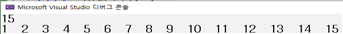
1. 프로그램을 실행시켰을 때 출력 결과 같이 나올 수 있도록 작성하시오. (반드시 while문을 쓸 것!)
```c
#define _CRT_SECURE_NO_WARNINGS // visual studio 만 필요!
#include<stdio.h>
int main()
{
	int alph = 65;
	int num;
	scanf("%d", &num); // 입력받는 num의 크기는 65보다 항상 커야한다.
	// while문 작성
	return 0;
}
```
  - 입력 예시 : 68
  - 출력 예시
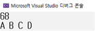
1. 1부터 n까지의 숫자의 합을 구하는 프로그램을 작성하시오.
  - 입력 예시1 : 5
  - 출력 예시1
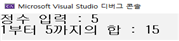
  - 입력 예시2 : 20
  - 출력 예시2
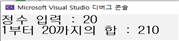
1. 다음을 보고 문제를 해결하시오. [코드업 1253]
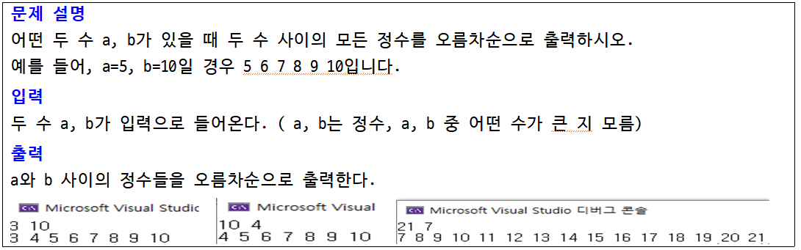
1. 다음을 보고 문제를 해결하시오. [코드업 1254]
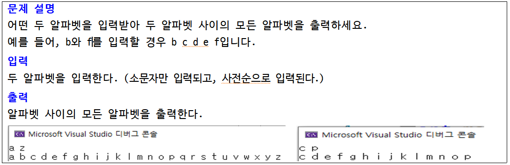
1. 점수를 입력받아 80점 이상이면 합격을 그렇지 않으면 불합격을 출력하는 작업을 반복하다가 0~100점 이외의 점수가 입력되면 종료되는 프로그램을 작성하세요. [교과서 116p 3번]
  - 출력 결과1
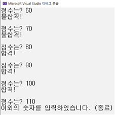
  - 출력 결과2
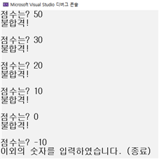
1. 정수를 계속 입력받다가 100초과의 수가 입력되면 마지막 입력된 수를 제외하여 합계와 평균을 출력하는 프로그램을 작성하시오. (평균은 반올림하여 소수 첫째자리까지 출력한다.) [교과서 119p 자가진단 4번]
  - 출력 결과1
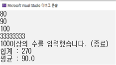
  - 출력 결과2
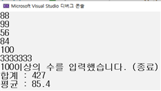
1. 다음을 보고 문제를 해결하시오. [코드업 1087]
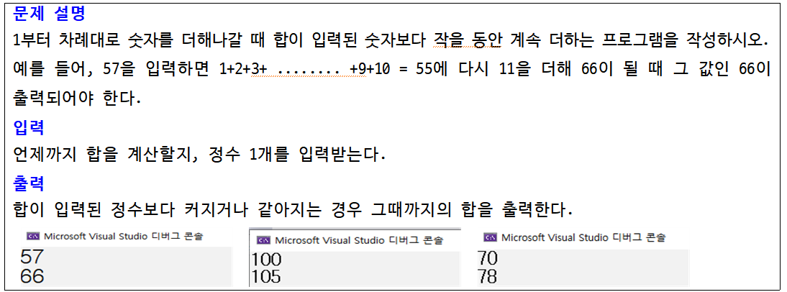

### 2. for, 계수 기반 반복문

- for문은 계수에 기반을 둔 측면이 강함(while은 조건에 기반을 둠)

- 초기식 : 반복을 시작하기에 앞서 딱 한 번만 실행
  > > 반복을 위한 변수의 선언 및 초기화에 사용

- 조건식 : 매 반복의 시작에 앞서 실행되며, 그 결과의 기반으로 반복 유무를 결정함.

- 증감식 : 매 반복 실행 후 마지막에 연산이 이루어짐.
  > > 반복의 조건을 ‘거짓’으로 만드는 증가 및 감소 연산

- while문과 for문의 비교
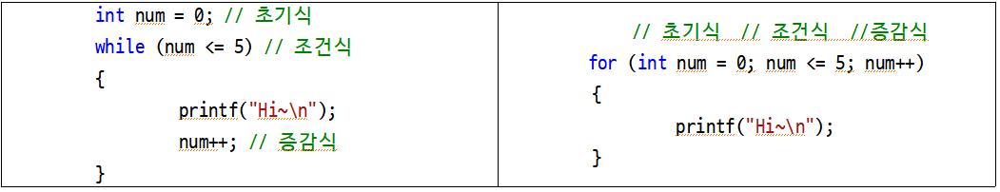

- 기본 구조
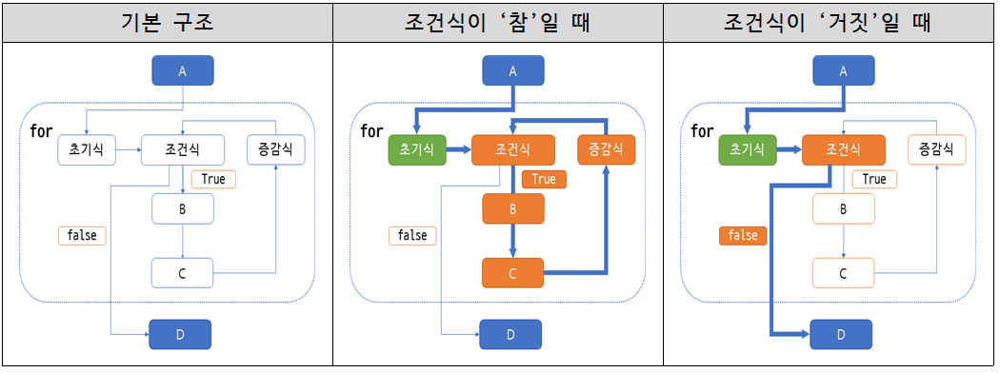

- 실습 예제
```c
// 예제1
#define _CRT_SECURE_NO_WARNINGS // visual studio 만 필요!
#include <stdio.h>
int main()
{
	int i;
	for (i = 1; i <= 5; i++)
	{ // i는 1로 초기화 된 상태에서 5가 될 때까지 반복
		printf("%d : for문 내부 실행문\n", i);
	}
	printf("\n프로그램 종료\n");
	return 0;
}
```
  실행 결과
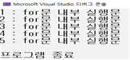
```c
// 예제2
#define _CRT_SECURE_NO_WARNINGS // visual studio 만 필요!
#include<stdio.h>
int main()
{
	int num;
	scanf("%d", &num);
	for (  ;  ;  ){
		// for문을 채워보세요~
	}
	printf("\n\n프로그램 종료\n");
	return 0;
}
```
  실행 결과
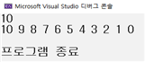

## +) 관련문제 2
1. 정수 한 개 n을 입력받아 1부터 n까지의 합을 구하는 프로그램을 작성하시오
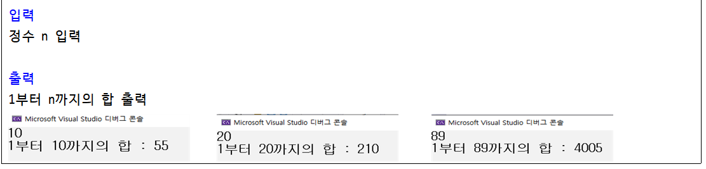
1. 구구단을 외자 구구단을 외자! 구구단의 원하는 단을 입력받아 구구단이 출력되게 하는 프로그램을 작성하          시오.
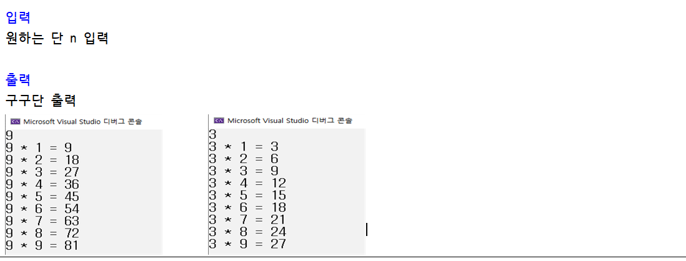
1. 10개의 정수를 입력받아 짝수를 더하여 출력하는 프로그램을 작성하시오.
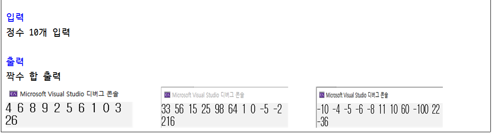
1. 10개의 정수를 입력받아 5의 배수와 7의 배수를 각각 출력하는 프로그램을 작성하시오. [교과서p.138]
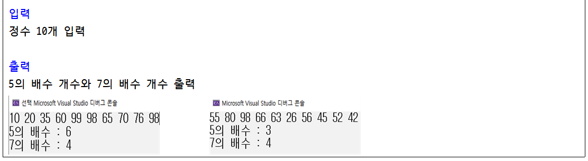
  1. 어떤 수 s, f가 주어진다. s와 f의 관계는 s <= f이다. s에서 f까지의 수 중 4의 배수의 합을 출력하는 프로그램을 작성하시오. [코드업 1260]
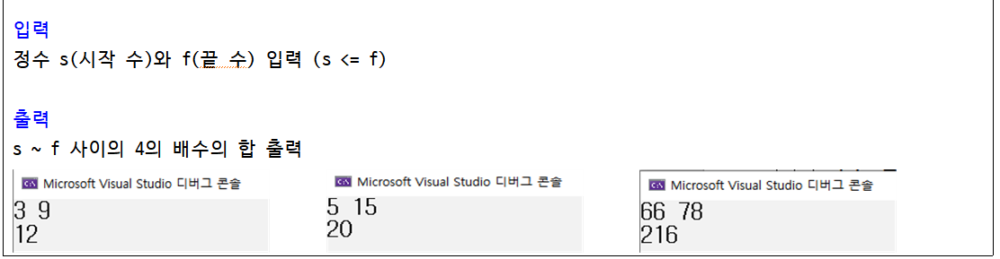
  1. 실수를 입력받아 평균을 출력하는 프로그램을 작성하시오. 단, 음수가 입력되었을 때 반복문이 종료되게 한다. (반드시 for문을 사용할 것)
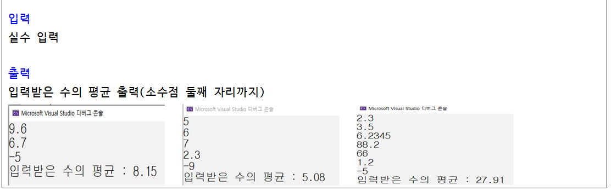
1. while문 문제 활용) 1부터 차례대로 숫자를 더해나갈 때 합이 입력된 숫자보다 커졌을 때 마지막으로 더한 숫자와 그 때까지의 합을 출력하는 프로그램을 작성하시오. 예를 들어, 57을 입력하면 1+2+3+ ........ +9+10 = 55에 다시 11을 더해 66이 될 때 마지막으로 더한 11과 그 때까지의 합인 66이 출력되어야 한다.
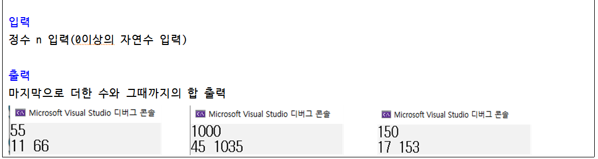
1. 입력의 개수 n이 입력되고, n개의 데이터가 입력된다. 이 n개의 데이터 중 최대값을 출력하는 프로그램을 작성하시오. [코드업 : 1271]
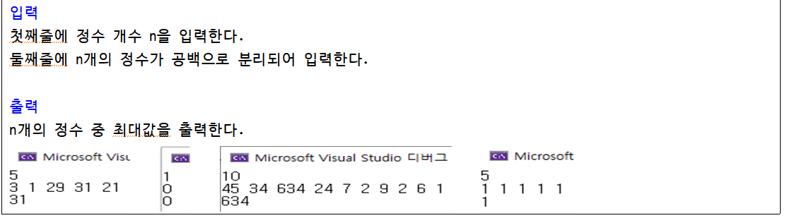
## +심화문제
1. 소수란, 약수가 1과 자기 자신인 수이다. 어떤 수를 입력받아 소수인지 판별하는 프로그램을 작성하시오. [코드업1274]
  > 입력 : 2 이상의 자연수를 한 개 입력
  > 출력결과
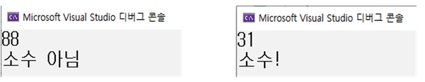
1. 첫 번째 줄에는 입력받을 숫자의 개수(n)를 나타내는 수가 입력되고, 그 다음 줄에 n개의 숫자가 입력된다. 이때 첫 번째, 중간, 마지막 데이터를 출력하는 프로그램을 작성하시오. [코드업 1277]
  > 입력 :                                                                                                                                첫 째줄에는 입력받을 숫자의 개수 n 입력 (n은 1이상의 홀수다.)                                                                                        둘 째줄에는 n개의 데이터 입력
  > 출력결과
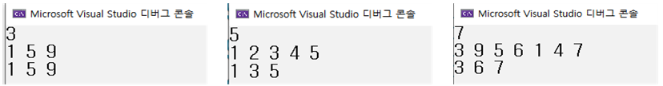

### 3. do ~ while문에 의한 문장의 반복

- while문과 마찬가지로 반복문

- while문과 차이점은 ‘반복의 조건을 검사하는 시점!’

- 즉, while문은 조건이 거짓이면 문장을 한번도 실행하지 않는다. 

- 그러나, do~while문은 **무조건 한번은 실행된 뒤** 조건이 거짓이면 문장을 벗어난다.

- 조건식 괄호 뒤에 세미콜론(;)이 붙음 > 예시 : while(n ≠ 0);

- 실습 예제
```c
// 예제1
#define _CRT_SECURE_NO_WARNINGS // visual studio 만 필요!
#include<stdio.h>
int main()
{
	int n;
	do // 반복문 시작(조건을 보지 않고 무조건 실행)
	{
		scanf("%d", &n);
		printf("%d 입력\n", n);
	} while (n > 0); // 위의 문장이 실행된 뒤 조건 확인

	return 0;
}
```
  실행 결과
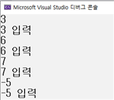

## +) 관련 문제3
1. 입력한 수를 짝수와 홀수로 구분하는 반복문을 작성하시오. 단, 0을 입력하면 프로그램이 종료된다. (반드시 do~while문을 쓸 것)
  > 출력 예시
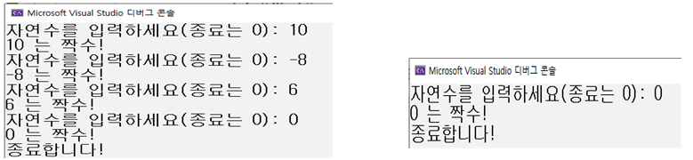
1. 두 수를 입력받아 서로 같을 때까지 다시 입력받는 프로그램을 작성하시오.
  > 출력 예시
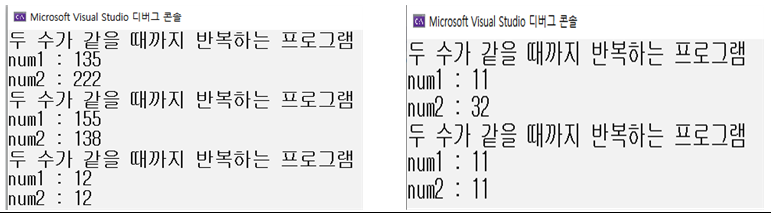

### 4. continue와 break

- 반복문에서 사용되는 문장이다.

- continue; 는 이 이후의 문장이 실행되지 않고 반복문 처음으로 돌아가 다시 실행하는 명령어

- break; 는 반복문이 종료되는 명령어
  - 실습 예제
```c
// 예제1
#define _CRT_SECURE_NO_WARNINGS // visual studio 만 필요!
#include<stdio.h>
int main()
{
	int num;
	while (1) {
		scanf("%d", &num);
		if (num < 0) break; // 입력값이 음수일 때 반복문 종료
		if (num % 7 != 0) continue; // 입력값이 7의 배수가 아니면 다시 입력받기
		printf("%d는 7의 배수입니다!\n", num); // 입력값이 7의 배수일 때 출력
	}
	return 0;
}
```
    실행 결과
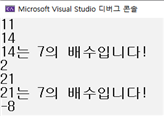

## +) 관련문제4
1. 정수를 계속 입력받고 입력이 0이 되면 입력된 수 중 홀수의 합과 평균을 출력하는 프로그램을 작성하시오.
```c
#define _CRT_SECURE_NO_WARNINGS // visual studio 만 필요!
#include<stdio.h>
int main()
{
	int n, sum = 0, cnt = 0;
	while (1)
	{
		scanf("%d", &n);
		// 입력된 값이 0일 때 반복문 종료
		// 입력된 값이 짝수이면 다시 반복문 시작
		sum += n;
		cnt++;
	}
	// 홀수의 합 출력
	// 입력한 홀수 값의 평균 출력
	return 0;
}
```
  실행결과
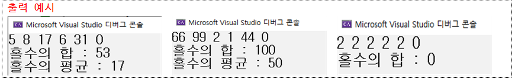

### 5. 중첩 반복문

- 반복문 내에 또 다른 반복문이 들어있는 것

- 이를 다중 반복문, 중첩 반복문이라고 부른다.

- 반복문 안에 반복문이 있는 기본 구조
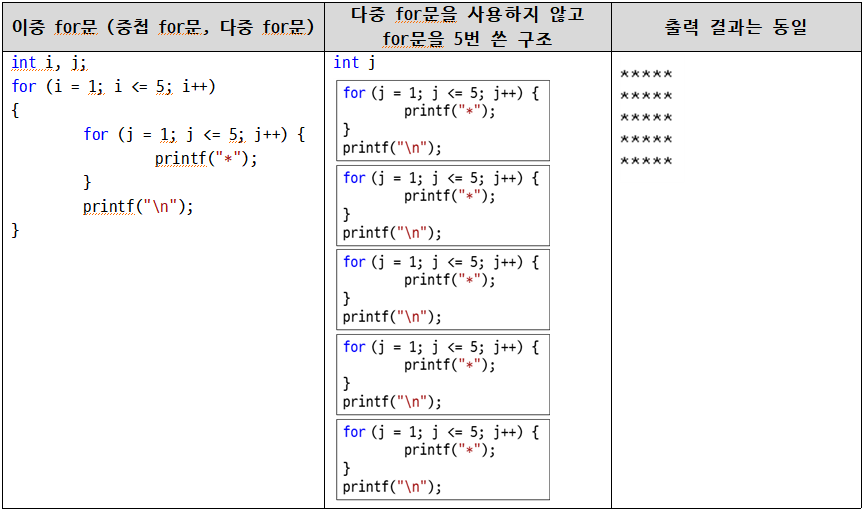

## +) 관련문제5
1. 정수 n을 입력하면 길이가 n인 사각형을 출력하시오. 단, 사각형은 * 모양으로 채운다.
```c
#define _CRT_SECURE_NO_WARNINGS // visual studio 만 필요!
#include<stdio.h>
int main()
{
	int n;
	scanf("%d", &n);
	for (int i = 1; i <= n; i++) {
		// 중첩 for문 작성
	}
	return 0;
}
```
  실행결과
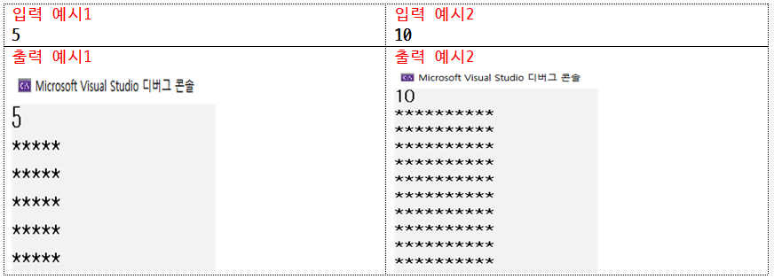
1. 구구단을 출력하는 프로그램을 작성하시오.
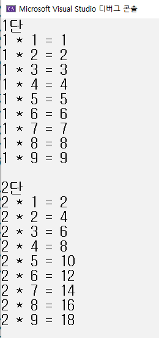
1. 자연수 n을 입력받아 다음과 같은 모양이 나타나게 하시오.
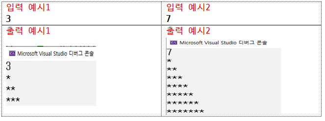
1. 자연수 n을 입력받아 다음과 같은 모양이 나타나게 하시오.
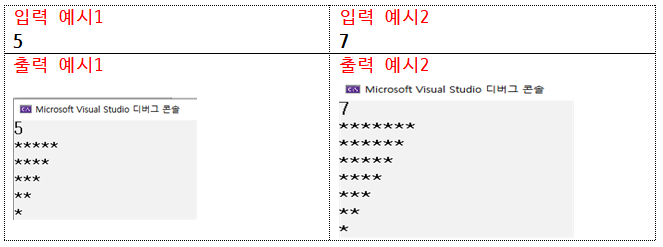
1. 자연수 n을 입력받아 다음과 같은 모양이 나타나게 하시오.
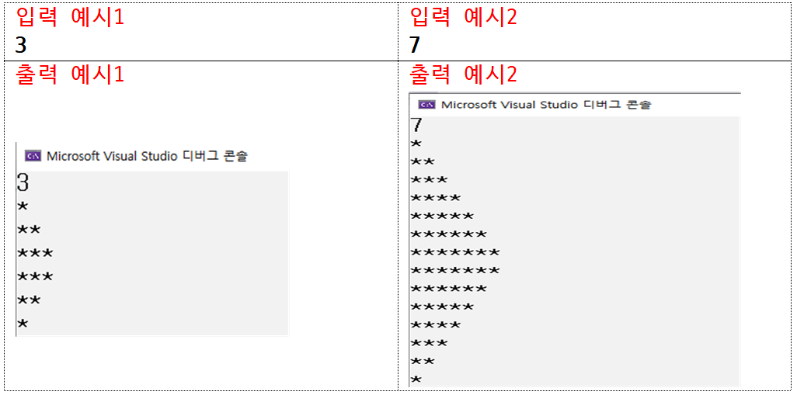
1. 자연수 n을 입력받아 다음과 같은 모양이 나타나게 하시오.
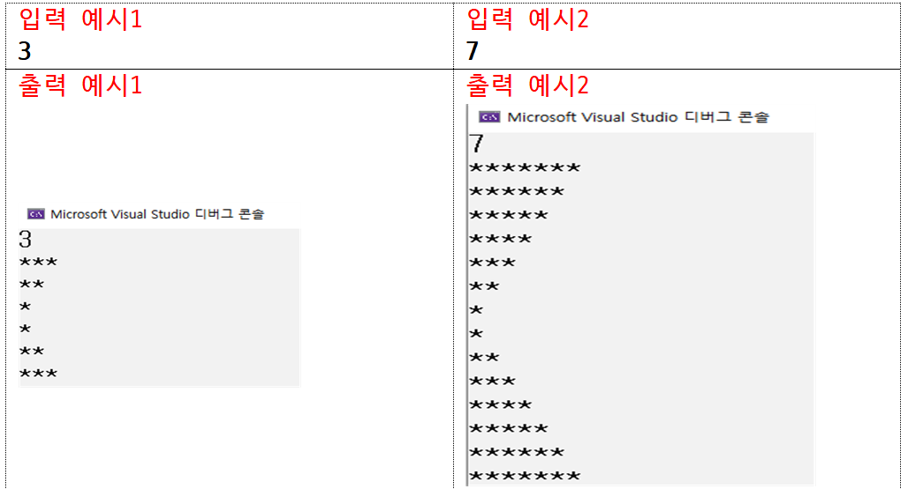
1. 자연수 n을 입력받아 n줄 만큼의 *모양이 나타나게 하시오.
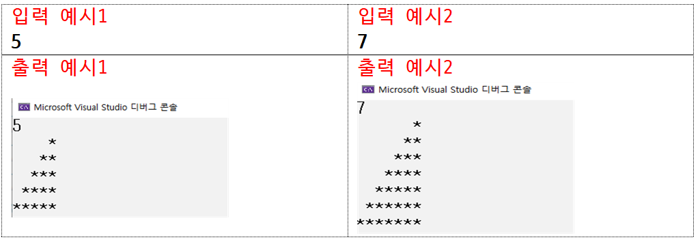
1. 자연수 n을 입력받아 다음과 같은 모양이 나타나게 하시오.
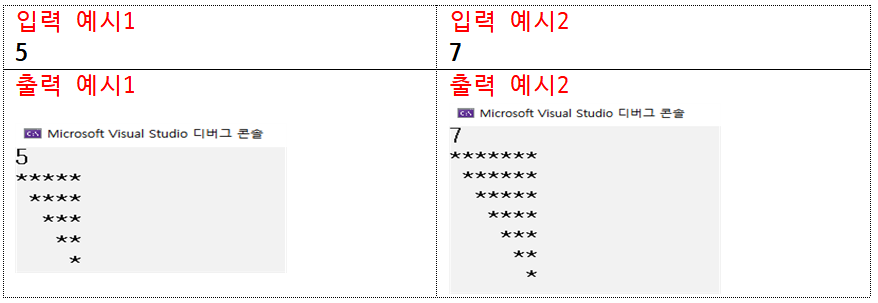
1. 자연수 n을 입력받아 다음과 같은 모양이 나타나게 하시오.
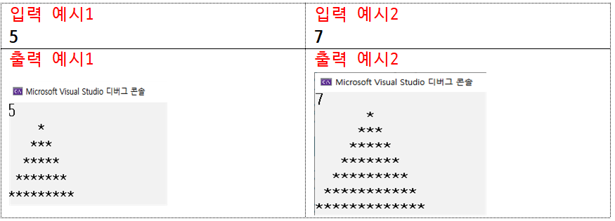
1. 자연수 n을 입력받아 다음과 같은 모양이 나타나게 하시오.
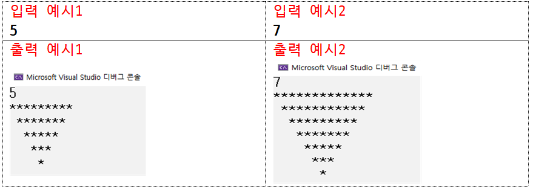
1. 자연수 n을 입력받아 다음과 같은 모양이 나타나게 하시오.
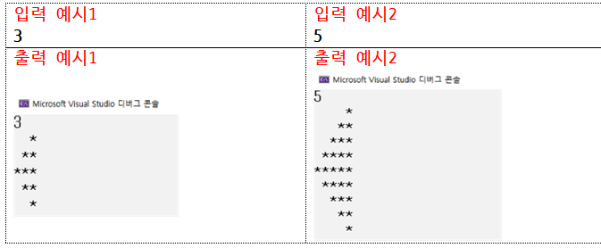
1. 자연수 n을 입력받아 다음과 같은 모양이 나타나게 하시오.
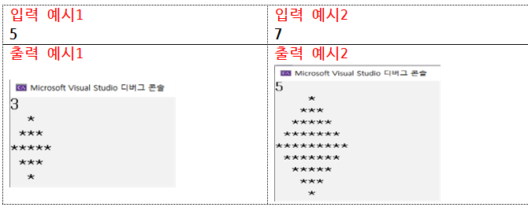
1. 자연수 n을 입력받아 다음과 같은 모양이 나타나게 하시오.
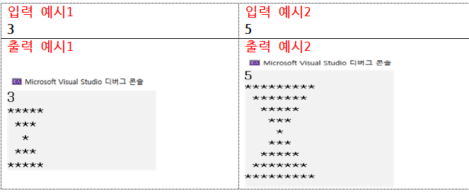
1. 자연수 n을 입력받아 다음과 같은 모양이 나타나게 하시오.
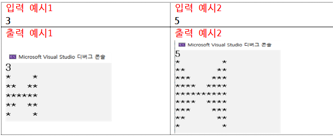
## +) 중첩for문 연습
코드업 gogo
코드업까지 다 했어요? 대단하네요
+) 심화문제
1. [https://www.acmicpc.net/problem/10995](https://www.acmicpc.net/problem/10995)
1. [https://www.acmicpc.net/problem/10996](https://www.acmicpc.net/problem/10996)
1. [https://www.acmicpc.net/problem/10991](https://www.acmicpc.net/problem/10991)
1. [https://www.acmicpc.net/problem/10990](https://www.acmicpc.net/problem/10990)
1. [https://www.acmicpc.net/problem/10992](https://www.acmicpc.net/problem/10992)
