<!-- notion-page-id: aaa2cdd741ac8292b93b0144f7592432 -->

# 배열

### 1. 1차원 배열

- 배열(array)이란? 형식(자료형, type)이 같은 자료 여러 개가 모여 새로운 하나를 이룬 형식

- 배열은 똑같은 자료형(int, char, float, double, ...)을 모아 놓은 변수라고 할 수 있음.

- 일반적인 변수와 달리 여러 개의 값을 저장함.

- 여러 개의 변수가 모여 하나의 배열을 이룬다.

- 1차원 배열의 선언 방법
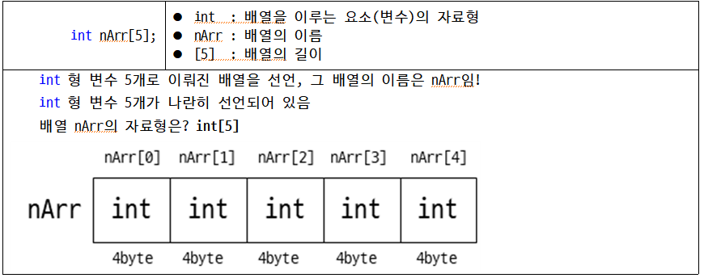

- 1차원 배열의 접근
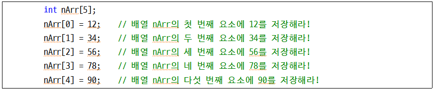

- 배열 이름 옆에 있는 ‘[ ]’ 안의 숫자는 배열의 위치 정보를 알려준다. (인덱스)

- 배열의 위치 정보를 명시하는 인덱스 값은 1이 아닌 **0부터 시작**

- 실습 예제
```c
// 예제1
#include<stdio.h>
int main()
{
	int nArr[5]; // 배열이 아닌 변수로 선언한다면, n1, n2, n3, n4, n5로 선언을 모두 해야함.
	int i;

	nArr[0] = 10, nArr[1] = 20, nArr[2] = 30, nArr[3] = 40, nArr[4] = 50;
	for (i = 0; i < 5; i++)
	{
		printf("nArr[%d] = %d\n", i, nArr[i]);
	}

	return 0;
}
```
  실행 결과
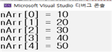

### 2. 배열 선언과 동시에 초기화

- 1차원 배열의 선언과 초기화 방법
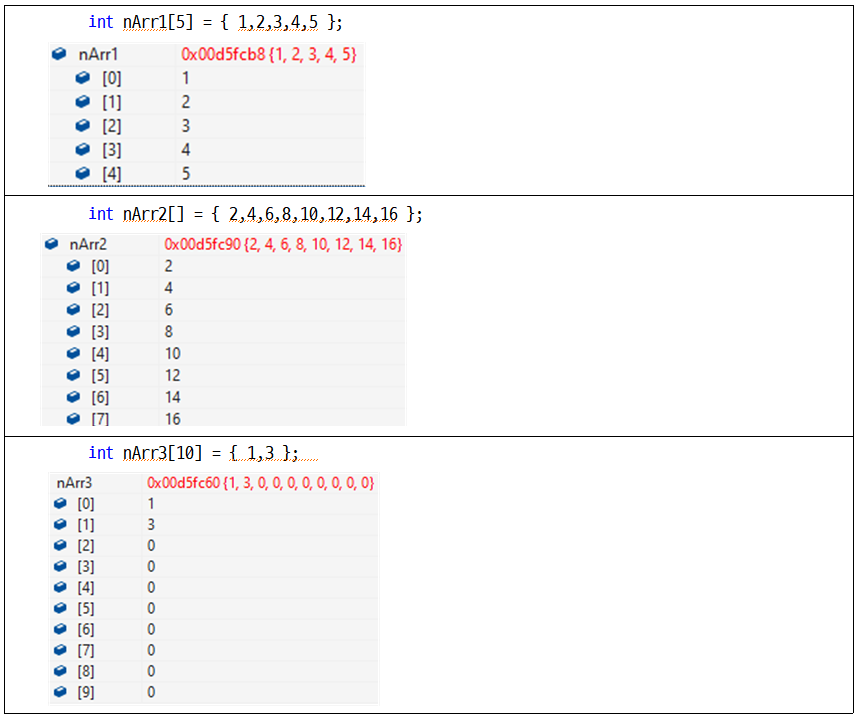

- 실습 예제
```c
// 예제2
#include<stdio.h>
int main()
{
	int nArr1[5] = { 10,20,30,40,50 };
	int nArr2[5] = { 0 }; // 배열 전체 요소를 모두 0으로 초기화 시키는 구문
	int i = 0;

	// 배열 전체 요소를 동시에 대입하려 시도한다.
	nArr2 = nArr1;

	for (i = 0; i < 5; i++) {
		printf(" nArr2[%d] : %d\n", i, nArr2[i]);
	}
	printf("\n");
	return 0;
}
```
  > 오류 발생
    - error C2106: '=': 왼쪽 피연산자는 l-value이어야 합니다.
    - 단순 대입 연산자의 왼쪽 피 연산자가 변수가 아니라서 발생한 것임.
    - 배열 이름의 실체는 ‘주소 상수’

- 실습 예제 오류를 수정하기 위한 방법
```c
// 예제2 수정
#include<stdio.h>
int main()
{
	int nArr1[5] = { 10,20,30,40,50 };
	int nArr2[5] = { 0 };
	int i = 0;
	// nArr2 = nArr1; 와 같은 코드는 불가능
	// 아래와 같이 반복문으로 하나씩 복사해야 함.
	for (i = 0; i < 5; i++) {
		nArr2[i] = nArr1[i];
	}

	for (i = 0; i < 5; i++) {
		printf(" nArr2[%d] : %d\n", i, nArr2[i]);
	}
	printf("\n");
	return 0;
}
```
  실행 결과
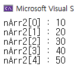

### 3. 문자의 배열

- 문자열의 실체는 char형 배열의 모습

- 상수 형태로 기술하는 “Nice to meet you!”와 같은 문자열도 배열이다.

- printf(“%s”, “Nice to meet you!”)는 char str[18]의 배열에 저장된 모습과 같다.
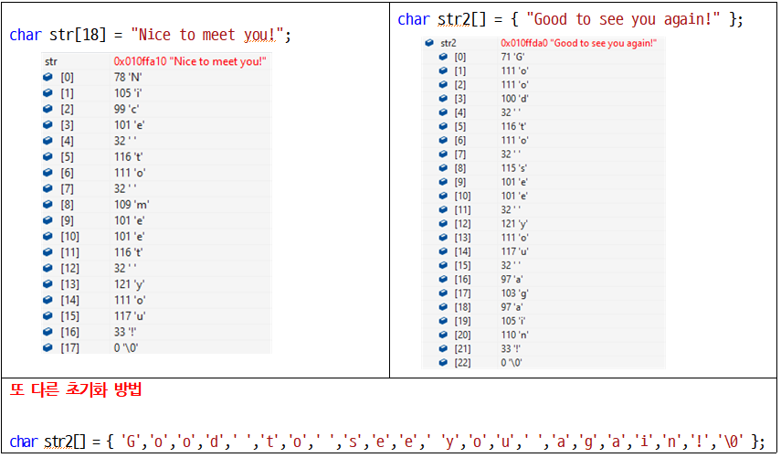

- 실습 예제1
```c
// 예제3
#include<stdio.h>
int main()
{
	char str[18] = "Nice to meet you!";
	printf("배열 str의 크기 : %d\n", sizeof(str));
	printf("NULL 문자 문자형 출력 : %c\n", str[17]);
	printf("NULL 문자 정수형 출력 : %d\n", str[17]);

	str[16] = '?';
	printf("문자열 출력 : %s\n", str);
	return 0;   
}
```
  실행 결과
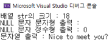

- 위의 예제에서 NULL 문자를 문자형으로 출력했을 때는 공백으로 아무것도 출력되지 않는다.

- 아스키코드에서 NULL 값은 0을 가진다.

- 실습 예제2
```c
// 예제4
#include<stdio.h>
int main()
{ 
	char nu = '\0';	// 널 문자 저장
	char sp = ' ';	// 공백 문자 저장
	printf("null값의 아스키코드 값은 : %d\n", nu);
	printf("공백의 아스키코드 값은 : %d\n", sp);
	return 0;
}
```
  > 실행 결과를 예측해서 메모장에 적어보세요!

- 아스키코드에서 NULL 값과 공백의 값은 각각 다른 값을 가진다.

## +) 1차원 배열 기초 문제
1. 5개의 정수를 입력받아 그대로 출력하는 프로그램을 작성하시오.(배열로 풀 것)
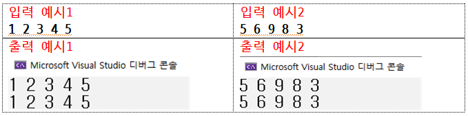
1. 5개의 문자를 입력받아 그대로 출력하는 프로그램을 작성하시오.(배열로 풀 것)
+) 버퍼 공간을 지우기 위해 scanf를 할 때 공백을 앞에 넣는다. -> 추가 설명할게요!
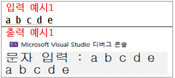
1. 출력 결과를 보고 아래 빈칸을 채워보세요.
```c
#define _CRT_SECURE_NO_WARNINGS
#include<stdio.h>
int main()
{
	int cnt = 0; // 이름의 길이를 세는 변수
	char sName[100], sNum[10]; // 이름과 학번을 문자열로 저장하는 배열
	printf("이름을 영어로 입력하세요 : ");
	scanf("%s", sName); // 이름을 문자열로 입력받기
	printf("학번을 입력하세요 : ");
	// 학번 입력받기

	while (sName[cnt] != '\0')
	{
		// 이름이 몇글자인지 세는 코드 작성
	}

	// 마지막 출력 결과처럼 나오게 하기
	return 0;
}
```
  출력 결과
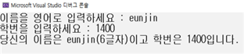
1. 다음 코드를 보고 출력 결과를 예측하여 메모장에 작성해보세요.
```c
#define _CRT_SECURE_NO_WARNINGS
#include<stdio.h>
int main()
{
	char str[100] = "I love C programming!"; // str 배열에 문자열로 초기화
	printf("저장된 문자열 : %s\n",str); // str 배열 값 출력
	
	str[10] = '\0'; // 인덱스 값 10인 str 배열 값에 null값 저장
	printf("null값 전까지 문자열 : %s\n", str);

	str[7] = '\0'; // 인덱스 값 7인 str 배열 값에 null값 저장
	printf("null값 전까지 문자열 : %s\n", str);

	str[3] = '\0'; // 인덱스 값 3인 str 배열 값에 null값 저장
	printf("null값 전까지 문자열 : %s\n", str);
	return 0;
}
```
1. 출력 결과를 보고 아래 빈칸을 채워보세요.
```c
#include<stdio.h>
int main()
{
	int num[10];
	for (int i = 0; i < 10; i++) {
		// num 배열에 1부터 10까지의 숫자 저장하는 코드 작성
		//출력
	}
	return 0;
}
```
  출력 결과
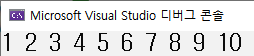
활용문제 

### 4. 다차원 배열

- 1차원 배열은 기차 모양의 선형 구조

- 1차원 배열을 여러 겹으로 쌓으면 2차원 면 구조가 됨.

- 2차원 배열은 행(row)과 열(colum)으로 구성됨.

- 2차원 배열을 선언할 때는 **자료형 배열이름 [행][열];** 형식으로 구성됨.
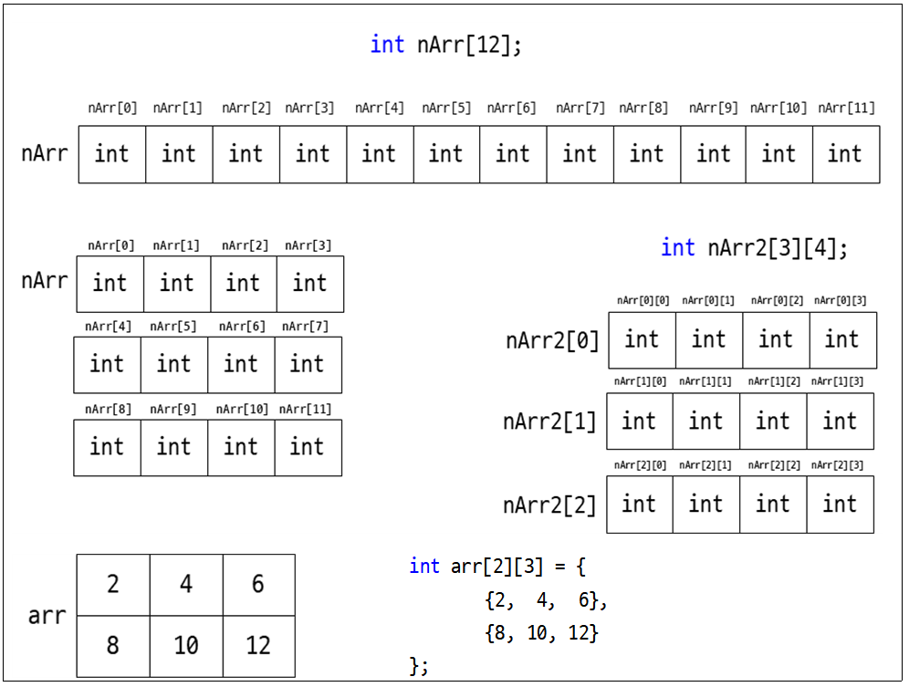

### 5. 2차원 배열의 접근

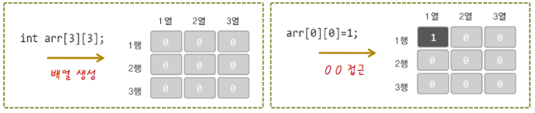

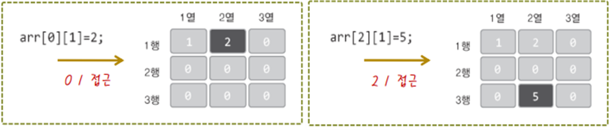

### 6. 다차원 배열의 초기화

- 한 줄로 나열하며 초기화하기
```c
#include<stdio.h>
int main()
{
	int i, j;
	int arData1[3][4] = { 1,2,3,4,5,6,7,8,9,10,11,12 }; // [행][열]의 길이에 맞게 초기화 됨

	printf("arData1 size : %d\n", sizeof(arData1));
	for (i = 0; i < 3; i++) {
		for (j = 0; j < 4; j++) {
			printf("%d\t", arData1[i][j]);
		}
		printf("\n");
	}
	return 0;
}
```
  실행 결과
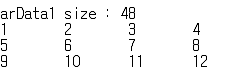
```c
#include<stdio.h>
int main()
{
	int i, j;
	int arData2[3][4] = { 1,2,3,4,5,6,7}; // 빈 부분은 0으로 초기화

	printf("arData2 size : %d\n", sizeof(arData2));
	for (i = 0; i < 3; i++) {
		for (j = 0; j < 4; j++) {
			printf("%d\t", arData2[i][j]);
		}
		printf("\n");
	}
	return 0;
}
```
  실행 결과
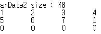

- 행, 열 길이에 맞게 초기화하기
```c
#include<stdio.h>
int main()
{
	int i, j;
	int arData3[3][4] = { 
		{ 1, 2, 3, 4},
    { 5, 6, 7, 8},
		{ 9,10,11,12} }; // 행, 열 길이에 맞게 초기화
	printf("arData3 size : %d\n", sizeof(arData3));
	for (i = 0; i < 3; i++) {
		for (j = 0; j < 4; j++) {
			printf("%d\t", arData3[i][j]);
		}
		printf("\n");
	}
	return 0;
}
```
  실행 결과
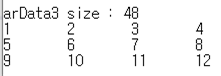
```c
#include<stdio.h>
int main()
{
	int i, j;
	int arData4[3][4] = {
		{ 1,2,3},
		{ 5,6,7} }; // 남은 행과 열은 0으로 초기화
	printf("arData4 size : %d\n", sizeof(arData4));
	for (i = 0; i < 3; i++) {
		for (j = 0; j < 4; j++) {
			printf("%d\t", arData4[i][j]);
		}
		printf("\n");
	}
	return 0;
}
```
  실행 결과
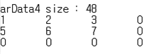

- 열로만 초기화하기
```c
#include<stdio.h>
int main()
{
	int i, j, length;
	int arData5[][4] = { 1,2,3,4,5,6,7,8,9,10,11,12,13 }; // 열의 숫자에 맞춰 행의 개수 결정
	
	printf("arData5 size : %d\n", sizeof(arData5));
	length = sizeof(arData5) / sizeof(int);

	for (i = 0; i < length/4; i++) {
		for (j = 0; j < 4; j++) {
			printf("%d\t", arData5[i][j]);
		}
		printf("\n");
	}
	return 0;
}
```
  실행 결과
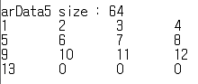
```c
#include<stdio.h>
int main()
{
	int i, j;
	int arData6[4][] = { 1,2,3,4,5,6,7,8,9,10,11,12 }; // 행은 삭제 가능, 그러나 열은 삭제 불가능
	printf("arData6 size : %d\n", sizeof(arData6));
	for (i = 0; i < 3; i++) {
		for (j = 0; j < 4; j++) {
			printf("%d\t", arData6[i][j]);
		}
		printf("\n");
	}
	return 0;
}
```
  실행 결과
    • error C2087: 'arData6': 첨자가 없습니다.(열의 크기를 알 수 없기 때문!)
  ## +) 2차원 배열 기초 문제
  1. 2차원 배열(행3, 열3)을 입력받아 입력받은 숫자를 그대로 출력하는 프로그램을 작성하시오.
```c
#define _CRT_SECURE_NO_WARNINGS
#include<stdio.h>
int main()
{
	// 2차원 배열 선언
	// 이중 for문으로 입력받기
	// 이중 for문으로 출력하기
	return 0;
}
```
    - 입력 예시 : **3 5 1 6 8 9 6 7 55**
    - 출력 예시
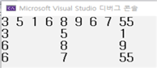
  1. 구구단을 외자! 구구단을 외자! 2단부터 9단까지 출력 출력~
```c
#define _CRT_SECURE_NO_WARNINGS
#include<stdio.h>
int main()
{
	int arr[8][9];
	// 이중 for문으로 2차원 배열에 구구단 저장
	// 이중 for문으로 구구단 출력
	return 0;
}
```
    - 출력 예시
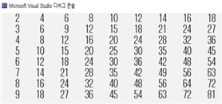
  1. 출력 결과를 보고 아래 빈칸을 채워보세요.
```c
#define _CRT_SECURE_NO_WARNINGS
#include<stdio.h>
int main()
{
	int arr[5][5] = {
		{1,2,3,4,5},
		{6,7,8,9},
		{10,11,12},
		{13,14},
		{15}```c
#define _CRT_SECURE_NO_WARNINGS
#include<stdio.h>
int main()
{
	int arr[5][5] = {
		{1,2,3,4,5},
		{6,7,8,9},
		{10,11,12},
		{13,14},
		{15}
	};
	// 이중 for문으로 배열 그대로 출력하기
	return 0;
}
```
	};
	// 이중 for문으로 배열 그대로 출력하기
	return 0;
}
```
    - 출력 예시
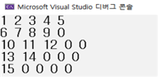
  1. 2차원 배열(행3, 열3)에 1부터 9까지 숫자가 차례로 초기화 되고 그 값을 출력하는 프로그램을 작성하시오.
```c
#define _CRT_SECURE_NO_WARNINGS
#include<stdio.h>
int main()
{
	int arr[3][3];
	int cnt = 0;
	// 이중 for문으로 배열 초기화하기
	// 이중 for문으로 출력하기
	return 0;
}
```
    - 출력 예시
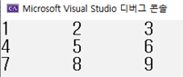
  ## +) 활용 문제
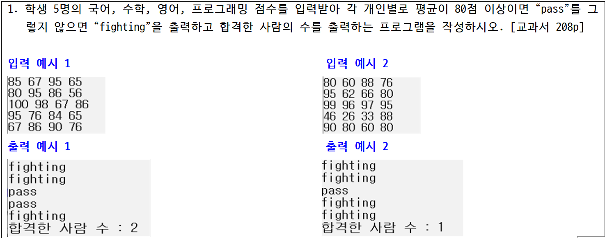
  입력1 : 85 67 95 65 80 95 86 56 100 98 67 86 95 76 84 65 67 86 90 76
  입력2 : 80 60 88 76 95 62 66 80 99 96 97 95 46 26 33 88 90 80 60 80
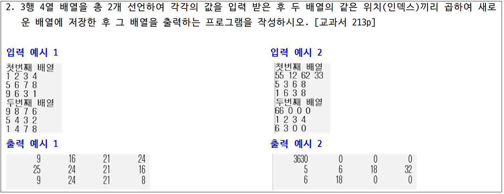
  입력 1 : 1 2 3 4 5 6 7 8 9 6 3 1            9 8 7 6 5 4 3 2 1 4 7 8
  입력 2 : 55 12 62 33 5 3 6 8 1 6 3 8           66 0 0 0 1 2 3 4 6 3 0 0 
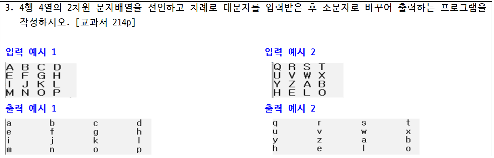
  입력 1 : A B C D E F G H I J K L M N O P
  입력 2 : Q R S T U V W X Y Z A B H E L O
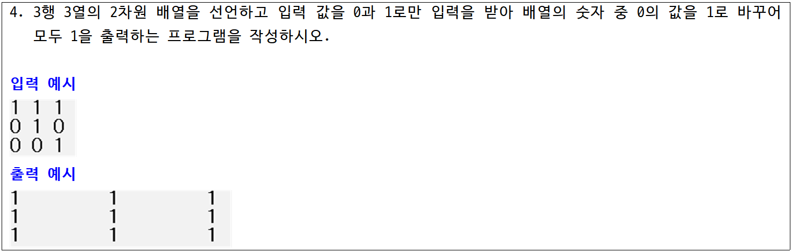
  입력 : 1 1 1 0 1 0 0 0 1
  ## +심화문제(선택사항)
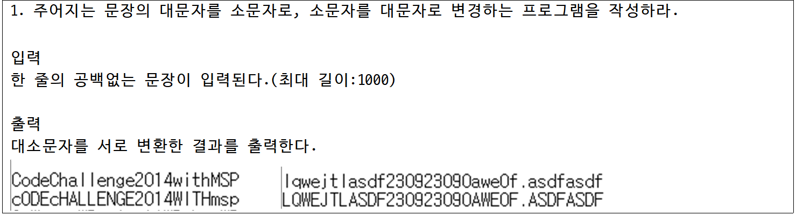
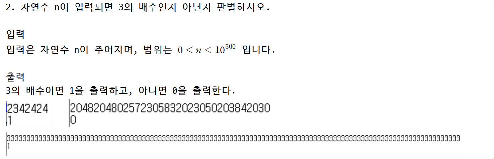
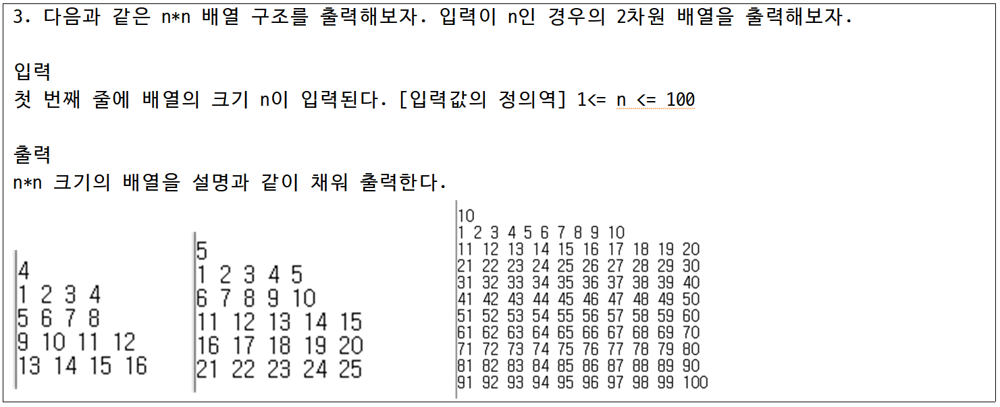
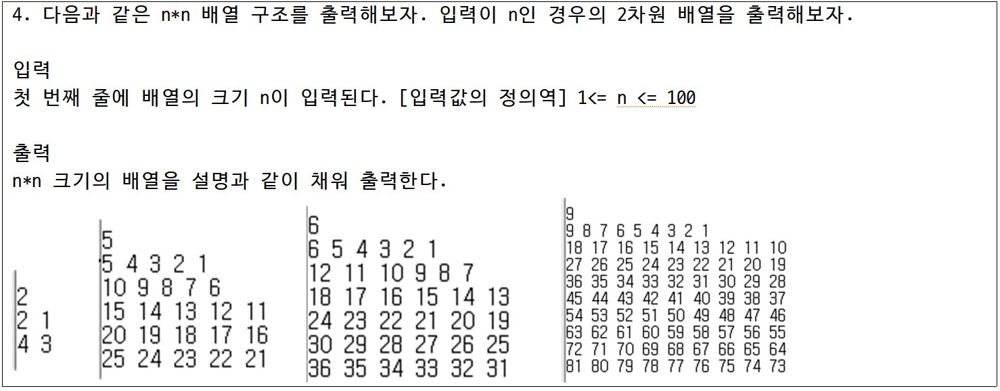
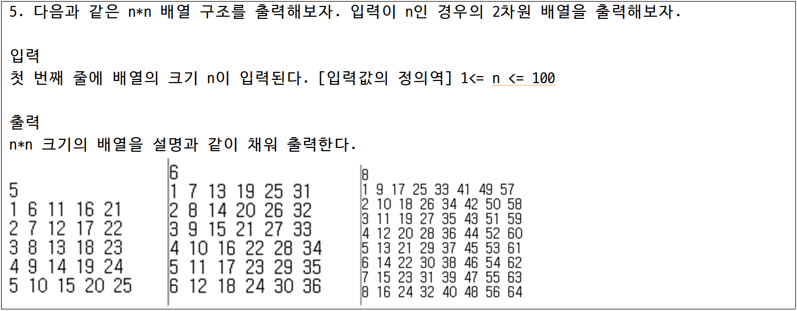
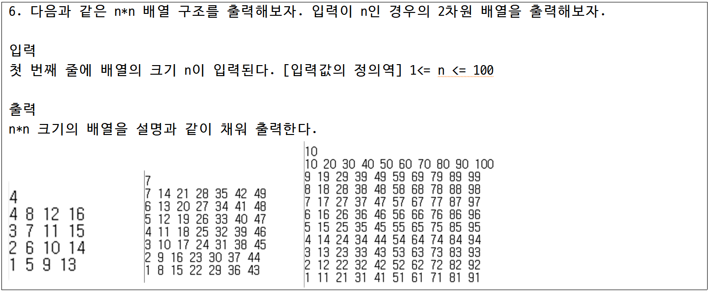
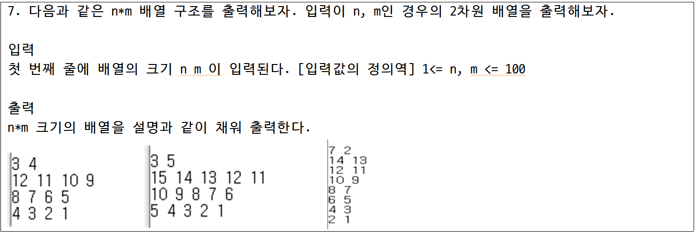
