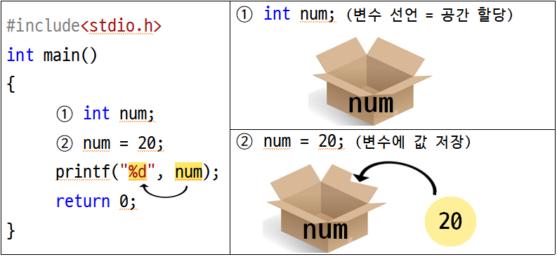
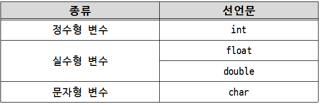
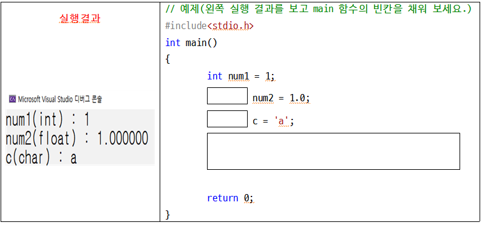
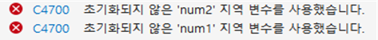
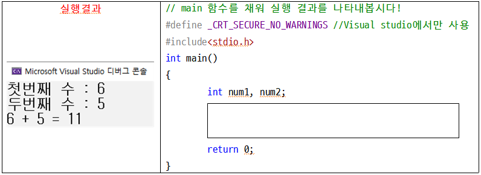
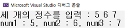
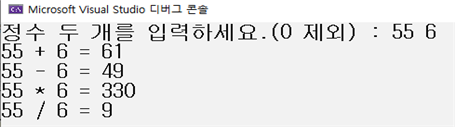
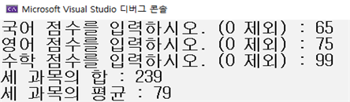
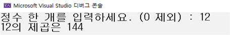
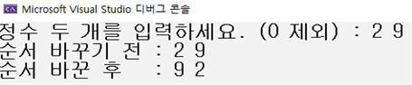

<!-- notion-page-id: 6752cdd741ac83dd9cbf81ec959ecb66 -->

# 변수 & scanf()

### 1. **변수**

■ 변수를 이용한 데이터의 저장

- 변수란? 값을 저장할 수 있는 메모리 공간에 붙여진 이름.

- 변수를 선언하면(만들면) 메모리 공간이 할당되고 공간에 이름이 붙는다.


- int : 정수를 저장하기 위한 메모리 공간 할당

- num : 할당된 메모리 공간의 이름은 num

- num = 20 : 변수 num에 정수 20을 저장 (**주의 C언어에서 기호 ‘ = ’는 대입을 의미)

■ 변수 선언 및 초기화 방법

- 초기화 : 선언된 변수에 처음 값을 저장하는 
  1) 변수 선언과 동시에 초기화
```c
int num = 20; // 변수 num을 선언 후 값을 20으로 초기화 시킴
```
  2) 둘 이상의 변수를 동시에 선언 및 초기화
```c
int num1, num2; //변수 num1과 num2를 동시 선언
int num3 = 3, num4 = 4; // 변수 2개를 동시 선언 후 초기화
```

■ 변수의 여러 종류



- 실습 예제


■ 예제로 보는 변수 초기화의 필요성

```c
#include<stdio.h>
int main()
{
	int num1, num2;
	int num3 = 30, num4 = 40;

	printf("num1: %d, num2: %d\n", num1, num2);
	num1 = 10;
	num2 = 20;
	
	printf("num1: %d, num2: %d\n", num1, num2);
	printf("num3: %d, num4: %d\n", num3, num4);

	return 0;
}
```

- 실행 오류


- 이유? 변수를 초기화해 주지 않으면 처음에 ‘쓰레기 값(의미없는 값)’이 저장되어 있기 때문

- 수정
```c
#include<stdio.h>
int main()
{
	int num1 = 0, num2 = 0;
	int num3 = 30, num4 = 40;

	printf("num1: %d, num2: %d\n", num1, num2);
	num1 = 10;
	num2 = 20;
	
	printf("num1: %d, num2: %d\n", num1, num2);
	printf("num3: %d, num4: %d\n", num3, num4);

	return 0;
}
```

■ 변수 이름을 지을 때 적용되는 규칙

- 첫째, 변수의 이름은 알파벳, 숫자, 언더바( _ )로 구성된다.

- 둘째, C언어는 대소문자를 구분한다. 따라서 변수 Num과 변수 num은 서로 다른 변수이다.

- 셋째, 변수 이름은 숫자로 시작할 수 없고, **키워드**도 변수의 이름으로 사용할 수 없다.
  > **키워드 예시** : int, void, if, return 등

- 넷째, 이름 사이에 공백이 삽입될 수 없다.

> ▶ 꼭! 변수 이름을 지을 때는 **유의미한 이름**을 짓는 것이 가장 중요하다! (용도에 맞는 이름)

### 2. 입력 scanf()

■ 키보드로부터 입력을 위한 scanf() 함수의 호출

- scanf()는 키보드로부터 다양한 형태의 데이터를 입력받기 위한 함수이다.

- scanf() 함수 기본 형태
```c
#define _CRT_SECURE_NO_WARNINGS // Visual studio에서만 사용
#include<stdio.h>
int main()
{
	int num; // 변수 num 선언
	scanf("%d", &num); // num값 입력
	printf("%d", num); // num값 출력
	return 0;
}
```
  1) #define _CRT_SECURE_NO_WARNINGS 또는 #pragma warning(disable:4996)
      : Visual studio에서 scanf() 함수를 쓰기 위해 반드시 필요한 선언이다.
2) scanf(“%d”, &num);
      : 앞서 printf() 함수에서 서식 문자와 동일하게 %d는 정수를 입력 받는다.
      : &num은 변수 num에 입력한 값을 저장한다는 의미를 가진다.

- 실습 예제


■ 입력의 형태를 다양하게 지정할 수 있다.

- 한 번의 scanf() 함수 호출을 통해 둘 이상의 데이터를 입력받을 수 있다.
```c
#define _CRT_SECURE_NO_WARNINGS // Visual studio에서만 사용
#include<stdio.h>
int main()
{
	int num1, num2, num3;
	printf("세 개의 정수를 입력 : ");
	scanf("%d %d %d", &num1, &num2, &num3);

	printf("num1 : %d, num2 : %d, num3 : %d", num1, num2, num3);
	return 0;
}
```
  실행 결과


## 관련 문제
1. 두 개의 정수를 입력받아 다양한 연산을 수행하는 프로그램을 작성하시오.
  입력 예시 : 55 6
  출력 예시

1. 세 과목의 점수를 입력받아 세 과목의 합과 평균을 출력하는 프로그램을 작성하시오.
  입력예시 : 65 75 99
  출력예시

1. 하나의 정수를 입력받아 그 수의 제곱을 출력하는 프로그램을 작성하시오.
  입력예시 : 12
  출력예시 

1. 두 개의 정수를 입력받아 순서를 바꿔 출력하는 프로그램을 작성하시오.
  입력예시 : 2 9
  출력예시

