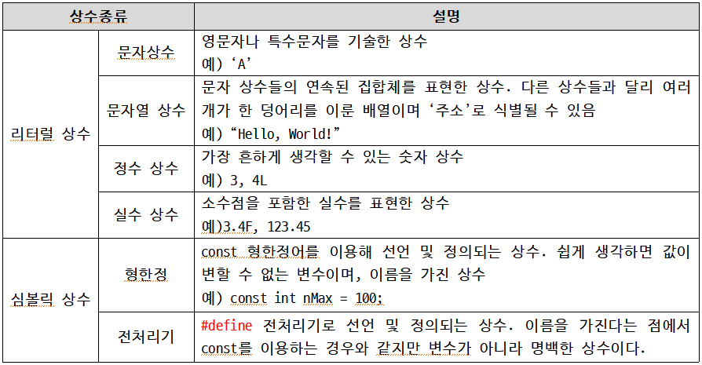
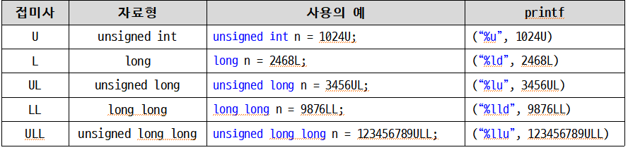
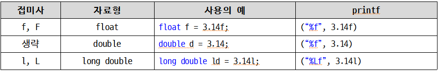

<!-- notion-page-id: 2d92cdd741ac82bfaf378194fbc61759 -->

# 상수의 이해

### 1. 상수란?

- 상수 : 숫자의 구체적인 값이 확정되어 앞으로 변할 가능성이 없는 수 (ex. 3.14, 5, A)

- 평소 우리가 쓰는 변수에 상수를 넣는 개념과 같다. ex) 변수 이름 = 3.14;


### 2. 이름을 지니는 심볼릭(Symbolic)상수 : const 상수

- 심볼릭 상수 : 변수와 마찬가지로 이름을 지니는 상수, const 키워드 사용

- 변수 선언시 const 선언 추가, 선언과 동시에 초기화 필수!
```c
#define NUM 100
const int MAX = 100;		// MAX는 상수!
	// MAX = 200;			// 상수로 정의했으므로 값의 변경 불가!
const double PI = 3.1415;	// PI는 상수!
	// PI = 3.14;			// 상수로 정의했으므로 값의 변경 불가!.
```

### 3. 접미사를 이용한 다양한 상수의 표현

- 정수형 상수의 표현을 위한 접미사 -> 크기를 크게 해주는 접미사


- 실수형 상수의 표현을 위한 접미사

