<!-- notion-page-id: 3372cdd741ac8338aea381cbec22d588 -->

# 선택제어문

### 1. if문

- if문은 조건 선택문이라고 하며 ( ) 안에 **조건이 ‘참’이면 { } 안의 문장을 실행**하고 **‘거짓’이면 실행하지 않고 건너뛴다.**

- 기본 흐름 구조
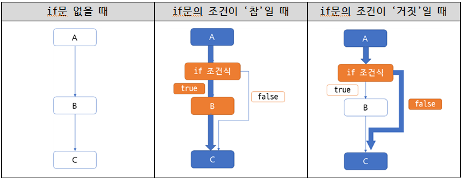

- 실습 예제
```c
// 예제1
#define _CRT_SECURE_NO_WARNINGS // visual studio 만 필요!
#include<stdio.h>
int main()
{
	int num;
	printf("숫자를 입력하세요. : ");
	scanf("%d", &num);

  // if문 시작
	if (num > 10){
    // 조건문 num>10을 만족할 때만 아래 printf() 실행
		printf("입력한 숫자는 10보다 큽니다.\n");
  }
  // if문 끝

	printf("끝\n");

	return 0;
}
```
  문제!
    1) 입력값이 15일 때 출력 결과는?
    2) 입력값이 6일 때 출력 결과는?

### 2. 제어문과 스코프(scope)

- 만일 if문에서 조건식을 만족할 때 **수행할 구문이 여러 개**라면, 반드시 { } 블록 **스코프**로 묶어줘야 한다.
  > **스코프?** 우리말로 번역하면 ‘범위’의 의미. 즉, 접근할 수 있는 범위를 의미한다.

- 실습 예제
```c
// 예제2
#define _CRT_SECURE_NO_WARNINGS
#include<stdio.h>
int main()
{
	int num;
	printf("숫자를 입력하세요. : ");
	scanf("%d", &num);
  // if문 시작
	if (num > 10)
  { // 조건이 ‘참’일 때 수행해야 할 작업들
    // 수행해야 할 작업이 여러 개 일 때 반드시 { } 블록 스코프로 묶는다.
		printf("입력한 숫자는 10보다 큽니다.\n");
		printf("입력한 숫자에서 3을 뺀 값은 %d입니다.\n", num - 3);
	}
  // if문 끝
	printf("끝\n");

	return 0;
}
```
  문제!
    1) 입력값이 15일 때 출력 결과는?
    2) 입력값이 6일 때 출력 결과는?

## +) 관련문제 1
1. 한 개의 정수를 입력받아 첫 줄엔 입력받은 숫자를 출력하고 음수이면 ‘minus’를 출력하는 프로그램을 작성하시오.
  - 입력 예시 : 5
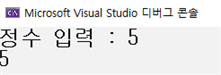
    - 입력 예시 : -5
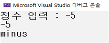
1. 한 개의 정수를 입력받아 1) 입력값이 0보다 작을 때, 2) 입력값이 0보다 클 때, 3) 입력값이 0일 때를 구분하는 프로그램을 작성하시오. (단, else를 사용하지 않고 if만 사용하시오)
  - 입력 예시 : -1
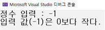
  - 입력 예시 : 10
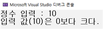
  - 입력 예시 : 0
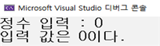
1. 아래 예시를 참고하여 if문을 활용한 계산기 프로그램을 작성하시오.
```c
#define _CRT_SECURE_NO_WARNINGS //visual studio만 필요!
#include<stdio.h>
int main()
{
	int opt; // 연산식 선택을 위한 변수
	int num1, num2; // 두 개의 정수 저장을 위한 변수
	int result; // 결과 저장을 위한 변수

	printf("1. 덧셈 2. 뺄셈 3. 곱셈 4. 나눗셈\n"); // 연산 메뉴
	printf("연산을 선택하세요. : "); // 연산 입력 안내
	// 메뉴 입력

	printf("두 개의 정수를 입력하세요. : "); // 정수 입력 안내
	// 정수 입력

	// opt가 1이면 result에 두 정수를 더한 값을 저장 후 결과 출력
	// opt가 2이면 result에 두 정수를 뺀 값을 저장 후 결과 출력
	// opt가 3이면 result에 두 정수를 곱한 값을 저장 후 결과 출력
	// opt가 4이면 result에 두 정수를 나누어 나온 몫 값을 저장 후 결과 출력
		
	return 0;
}
```
1. 두 개의 정수를 입력받아 1) num1 > num2 일 때, 2) num1 < num2 일 때, 3) num1 == num2 일 때를 구분하는 프로그램을 작성하시오.
  - 입력 예시 : 8 6
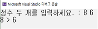
  - 입력 예시 : 5 6
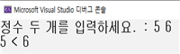
  - 입력 예시 : 7 7
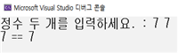
1. 정수 2개를 입력받아, 큰 수와 작은 수를 차례로 출력하는 프로그램을 작성하시오.
  - 입력 예시 : 22 6
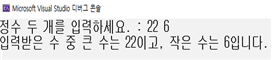
  - 입력 예시 : 0 6
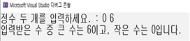

### 3. if else문

- if문은 조건을 만족하는 경우에만 처리하는 반면,

- if else문은 조건을 만족하는 경우와 만족하지 않는 경우 모두를 처리할 수 있다.

- if else문은 하나의 문장으로 if와 else 사이에 다른 문장이 삽입될 수 없다.

- 기본 흐름 구조
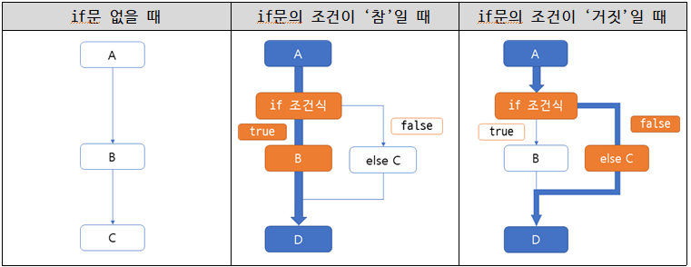

- 실습 예제
```c
//예제1(if문에서 사용한 예제와 동일)
#define _CRT_SECURE_NO_WARNINGS // visual studio 만 필요!
#include<stdio.h>
int main()
{
	int num;
	printf("정수를 입력하세요. : ");
	scanf("%d", &num);

	//if else문 시작
	if (num > 10){
		// 조건문 num>10을 만족할 때만 printf() 실행(참인 경우)
		printf("입력한 숫자는 10보다 큽니다.\n");
}
	else{
		// 조건문 num>10을 만족하지 않을 때 printf() 실행(거짓인 경우)
		printf("입력한 숫자는 10보다 작습니다.\n");
}

	return 0;
}
```
  문제!
    1) 입력값이 25일 때 출력 결과는?
    2) 입력값이 2일 때 출력 결과는?

## +) 관련문제 2
1. 나이를 입력받아 20살 이상이면 ‘adult’를 출력하고, 그렇지 않으면 몇 년후에 성인이 되는지를 ‘0 years later -> adult’를 출력하는 프로그램을 작성하시오. (교과서 95p 자가진단3)
  - 입력 예시 : 25
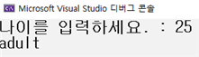
  - 입력 예시 : 18
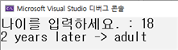
1. 한 개의 정수를 입력받아 9의 배수이면 ‘multiple’을 출력하고, 아니면 ‘not multiple’을 출력하는 프로그램을 작성하시오.
  - 입력 예시 : 99
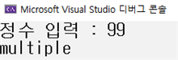
  - 입력 예시 : 30
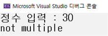
1. 자연수를 입력하고, 입력한 수가 짝수이면 ‘even’, 홀수이면 ‘odd’를 출력하는 프로그램을 작성하시오.
  - 입력 예시 : 8
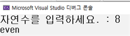
  - 입력 예시 : 55
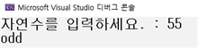
1. 공의 위치를 나타내는 정수를 하나 입력(n)하여 그 공의 위치가 30<=n<=40 이거나 60<=n<=70이면 ‘win’을 출력하고 아니면 ‘lose’를 출력하는 프로그램을 작성하시오. [코드업 1158]
  - 입력 예시 : 35
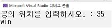
  - 입력 예시 : 45
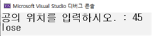

### 4. 다중 if문

- 다중 if문은 if else문 여러 개를 연이어 붙인 것처럼 작동한다.

- 코드 실행 시 첫 번째 조건식부터 차례로 실행

- 조건식의 결과가 참이면 조건에 포함된 명령문 실행하고 제어문을 빠져나온다.

- 주어진 모든 조건식을 만족하는 조건이 없다면 else문의 명령문을 실행한다.

- 기본 구조
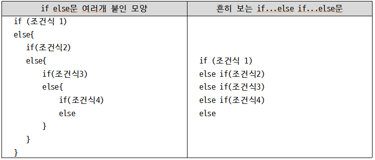

- 실습 예제
```c
//예제1
#define _CRT_SECURE_NO_WARNINGS // visual studio 만 필요!
#include<stdio.h>
int main()
{
	int score;
	printf("점수를 입력하세요. : ");
	scanf("%d", &score);

	if (score >= 90)
		printf("A\n");
	else if (score >= 80)
		printf("B\n");
	else if (score >= 70)
		printf("C\n");
	else if (score >= 60)
		printf("D\n");
	else
		printf("F\n");

	return 0;
}
```
  문제!
    1) 입력값이 99일 때 출력 결과는?
    2) 입력값이 78일 때 출력 결과는?
    3) 입력값이 55일 때 출력 결과는?

- 위의 예제를 두 구조로 나눈다면?
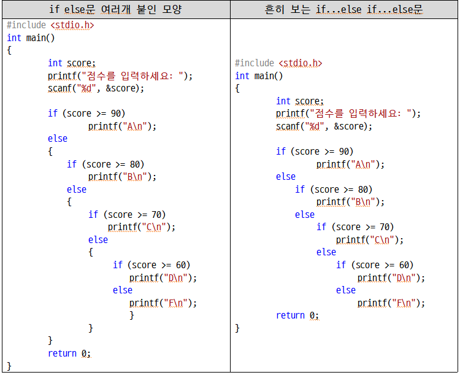

## +) 관련문제 3
1. 주사위를 두 번 던져서 나온 수를 입력받아 두 수가 모두 4이상이면 “이겼습니다.” 한 개만 4 이상이면 “비겼습니다.” 둘 다 4 미만이면 “졌습니다”를 출력하는 프로그램을 작성하시오. (교과서 98p 5번)
  - 입력 예시 : 4 6
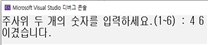
  - 입력 예시 : 1 5
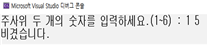
  - 입력 예시 : 2 3
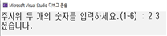
1. 세 개의 숫자를 입력받아 두 번째로 작은 숫자를 출력하는 프로그램을 작성하시오.
  - 입력 예시 : 5 8 4
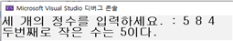
  - 입력 예시 : 6 9 9
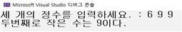
1. 하나의 숫자를 입력받아 음수와 양수를 구분하고 짝수와 홀수를 구분하는 프로그램을 작성하시오. 단, 0일떄는 ‘0입니다.’를 출력하시오. [코드업-1067 변형]
  - 입력 예시 : 89
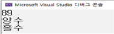
  - 입력 예시 : -8
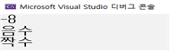
  - 입력 예시 : 0
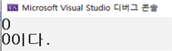
1. 세 개의 직선(정수)을 입력받아 삼각형이 될 수 있는지 판단하는 프로그램을 작성하시오.
  삼각형 성립의 조건 : a, b, c 중 c가 제일 길다면 c < a + b 이면 삼각형이 성립 [코드업-1212]
  - 입력 예시 : 1 2 3
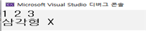
  - 입력 예시 : 8 9 6
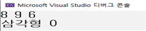
  1. 버스의 기본 요금을 1000원이라 가정하고 다음과 같은 연령별 분류에 따라 별도 할인율을 적용하여 최종 요금을 계산하는 프로그램을 작성하시오.
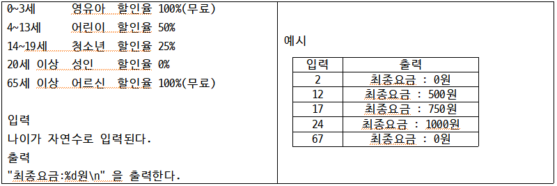
6. 윤년을 구하는 프로그램을 작성하시오. [백준 – 2753번]
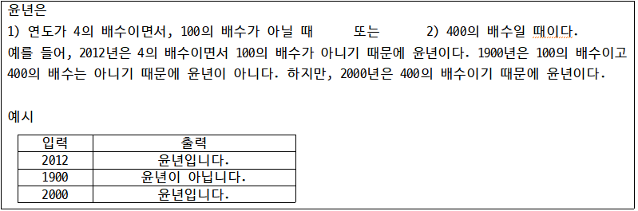
1. 사분면을 구하는 프로그램을 작성하시오. [백준 – 14681번]
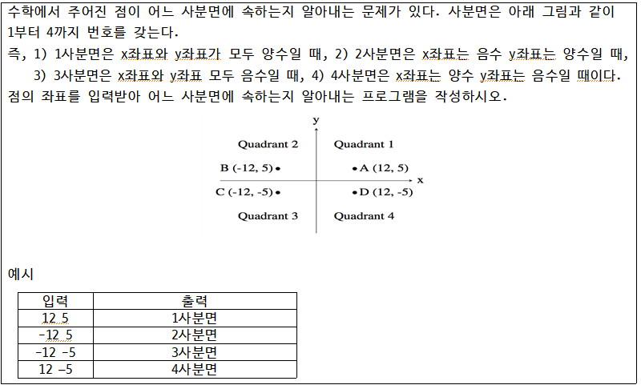
1. 상금을 계산하는 프로그램을 작성하시오. [백준 – 2480번] 
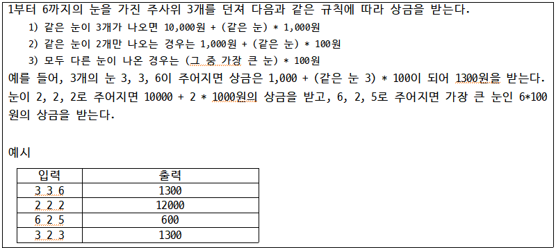

### 5. switch( ) ~ case문

- switch() ~ case문은 다중 if문이나 중첩 if문처럼 정보를 ‘분류’하는데 사용하는 제어문

- ( )안의 결과값과 일치하는 값을 case에서 찾아 수행

- 만약, 일치하는 값이 case에 없으면 default 이후부터 실행한다.

- switch( ) : 괄호 안에 들어가 값은 정수 또는 문자만 가능

- 기본 형식
```c
switch(변수 혹은 식)
{
case 정수1:
    구문;
    break;
case 정수2:
    구문;
    break;
.....
default:
    구문;
}
```

- break : switch( )문 전체 블록 { }을 빠져나가게 한다.
    → 즉, 한 개의 case에는 반드시 한 개의 break를 작성해야 한다.

- default : case에 맞는 값이 없을 경우 이곳으로 이동하여 실행한다.

- 실습 예제
```c
// 예제1
#define _CRT_SECURE_NO_WARNINGS // visual studio 만 필요!
#include<stdio.h>
int main()
{
	int num;
	printf("1. 삽입\n2. 수정\n3. 삭제\n숫자를 선택하세요. : ");
	scanf("%d", &num);

  // switch문 시작
	switch (num) {
	case 1: // 입력한 값이 1이면 아래 구문 실행
		printf("삽입을 선택하였습니다.\n");
		break; // switch문 종료
	case 2:
		printf("수정을 선택하였습니다.\n");
		break;
	case 3:
		printf("삭제를 선택하였습니다.\n");
		break;
	default: // 입력한 값이 1~3 중에 없다면 아래 구문 실행
		printf("1~3중의 숫자를 누르세요.\n");
	}
	return 0;
}
```
  문제!
    1) 입력값이 1일 때 출력 결과는?
    2) 입력값이 5일 때 출력 결과는?

- break의 특징을 활용하여 다음의 예제와 같이 두 개의 case를 묶어서 표현할 수 있다.

- break를 사용하지 않으면 case를 계속 수행하는 특징
```c
// 예제2
#define _CRT_SECURE_NO_WARNINGS // visual studio 만 필요!
#include<stdio.h>
int main()
{
	char alp;
	printf("영어 소문자를 입력하세요. : ");
	scanf("%c", &alp);

	switch (alp) {
	case 'a': 
	case 'e':
	case 'i':
	case 'o':
	case 'u': // 입력한 값이 ‘a’ or ‘e’ or ‘i’ or ‘o’ or ‘u’이면 아래 구문 실행
		printf("입력한 %c는 모음입니다.\n", alp);
		break;
	default: // 위에 제시된 알파벳 제외하고 모든 알파벳에서 아래 구문 실행
		printf("입력한 %c는 자음입니다.\n", alp);
	}
	return 0;
}
```
  문제!
    1) 입력값이 a일 때 출력 결과는?
    2) 입력값이 c일 때 출력 결과는?

## +) 관련문제 4
1. 두 정수와 하나의 산술연산자를 입력받고 입력받은 산술연산자에 따라 계산을 실행하는 프로그램을 작성하시오. 단, 반드시 switch() ~ case 문을 사용한다.
  - 입력 예시 : 88 / 9
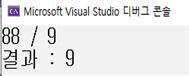
  - 입력 예시 : 76 % 6
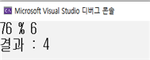
  - 입력 예시 : 33 ! 5
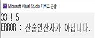
1. (다중 if문의 예제5번을 **switch ~ case문**으로 바꿔보자! - 약간 변형) 버스의 기본 요금이 1000원 일 때 다음과 같은 연령별 분류에 따라 별도 할인율을 적용하여 최종 요금을 계산하는 프로그램을 작성하시오.
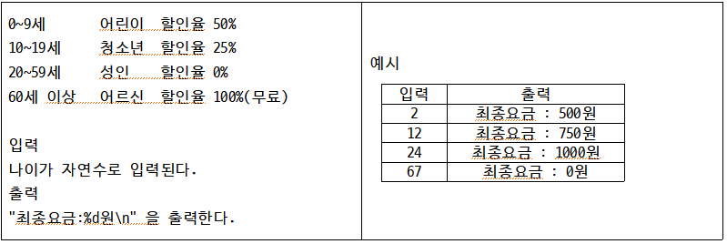

### 6. 조건 연산자 : 삼항 연산자

- (num1 > num2) ? num1 : num2 의 형태로 사용

- 즉, (조건) ? data1 : data2   

- 조건이 참이면 data1을 반환하고, 거짓이면 data2를 반환한다.
```c
int num 3 = (num1 > num2) ? num1 : num2;	// num3은 조건에 따라 값이 달라진다.

//만약 num1 > num2 가 참이면
int num3 = num1;
//만약 num1 > num2 가 거짓이면
int num3 = num2;
```

- 실습 예제
```c
//예제1
#define _CRT_SECURE_NO_WARNINGS // visual studio 만 필요!
#include<stdio.h>
int main()
{
	int num, abs;
	printf("정수 입력 : ");
	scanf("%d", &num);

	abs = (num > 0) ? num : -1 * num;

	printf("절댓값 : %d\n", abs);
	return 0;
}
```
  문제!
    1) 입력값이 50일 때 출력은?
    2) 입력값이 -99일 때 출력은?

## +) 관련문제 5
1. 2개의 정수를 입력받아 큰 값을 출력하는 프로그램을 작성하시오. 단, if문은 사용하지 않고 삼 항 연산자를 사용한다. [코드업 – 1063번]
  - 입력 예시 : 123 456
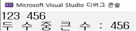
  1. 세 과목의 성적을 입력받아(double형으로) 평균이 80.5점 이상일 때는 O, 미만일 때는 X을 출력하는 프로그램을 작성하시오. 단, if문은 사용하지 않고 삼 항 연산자를 사용한다.
  - 입력 예시 : 50.6 
                       99.3 
                       45.0
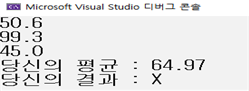
  - 입력 예시 : 90.5
                       88.3 
                       78
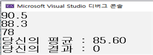
1. 세 개의 정수를 입력받아 최대값을 출력하는 프로그램을 작성하시오. (단, 삼 항 연산자 사용!)

여기까지 다 완료한 학생은 codeup의 “정은진 조건문”의 문제를 푸세요.

이거까지 진짜 다 한 사람은 아래의 링크를 따라가서 문제를 푸세요.

## +) 심화문제
1. [https://www.acmicpc.net/problem/2525](https://www.acmicpc.net/problem/2525)
1. [https://www.acmicpc.net/problem/2884](https://www.acmicpc.net/problem/2884)
1. [https://www.acmicpc.net/problem/1712](https://www.acmicpc.net/problem/1712)
