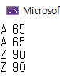
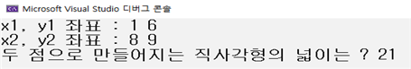
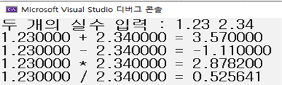
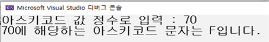
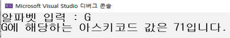

<!-- notion-page-id: 6022cdd741ac838f9d4f81ba2251b527 -->

# 아스키코드(ASCII)

### 1. 문자 표현을 위한 아스키(ASCII)코드

- 미국 표준 협회에 의해 정의된 코드

- 컴퓨터는 0과1 이진수로 이루어져 있기 때문에 문자를 표현하기 위한 표준 코드

- 문자와 숫자의 연결 관계를 정의

- ASCII 코드의 범위는 0이상 127이하

- 실습 예제(이런식으로 활용하는 겁니다~)
```c
#include <stdio.h>
int main()
{
	char ch1 = 'A', ch2 = 65;
	int ch3 = 'Z', ch4 = 90;

	printf("%c %d\n", ch1, ch1);
	printf("%c %d\n", ch2, ch2);
	printf("%c %d\n", ch3, ch3);
	printf("%c %d\n", ch4, ch4);
	return 0;
}
```
  실행 결과


- 서식문자 %c : 문자의 형태로 데이터를 출력

- 정수는 출력의 방법에 따라서 문자의 형태로도, 숫자의 형태로도 출력이 가능하다.

## +) 관련문제
1. 두 점의 x, y 좌표를 입력받아 두 점이 이루는 직사각형의 넓이를 계산하여 출력하는 프로그램을 작성하시오. (단, 좌표 (x1, y1), (x2, y2)에서 x1 < x2 이고 y1 < y2 이다!)
  - 입력 예시 
    > **1 6**
      **8 9**
  - 출력 예시 

1. 두 개의 실수를 입력받아 double 변수에 저장하자. 그리고 두 수의 사칙연산 결과를 출력하는 프로그램을 작성하시오.
  - 입력 예시 
    > **1.23 2.34**
  - 출력 예시 

1. 아스키코드 값을 정수의 형태로 입력받고 정수의 아스키코드를 문자로 변환하여 출력하는 프로그램을 작성하시오.
  - 입력 예시 
    > **70**
  - 출력 예시 

1. 아스키코드 알파벳 문자를 하나 입력받고 이에 해당하는 아스키코드 값을 정수로 출력하는 프로그램을 작성하시오.
  - 입력 예시 
    > **G**
  - 출력 예시 

