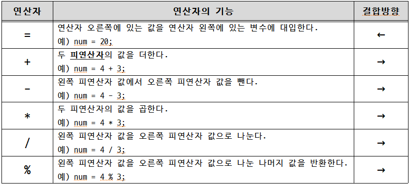
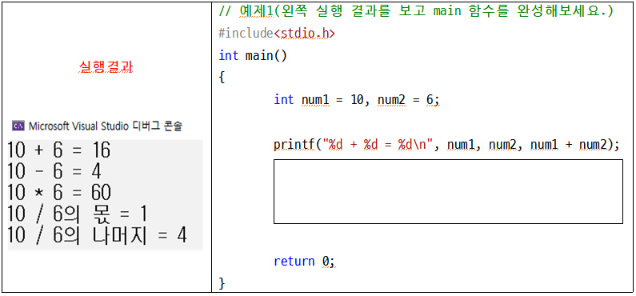
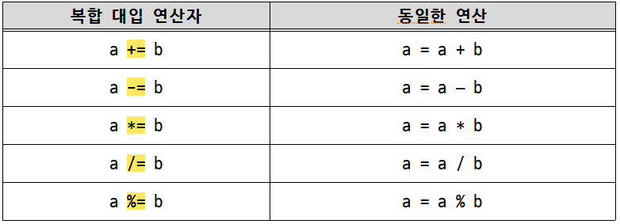
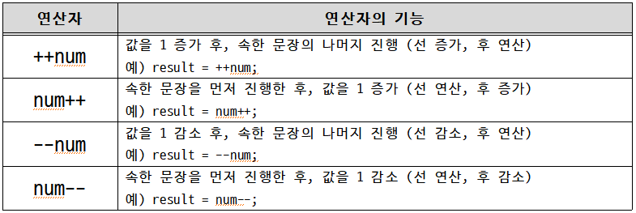
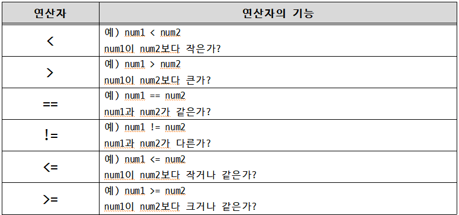
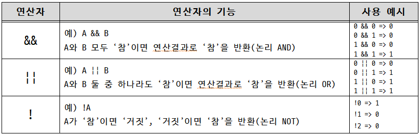
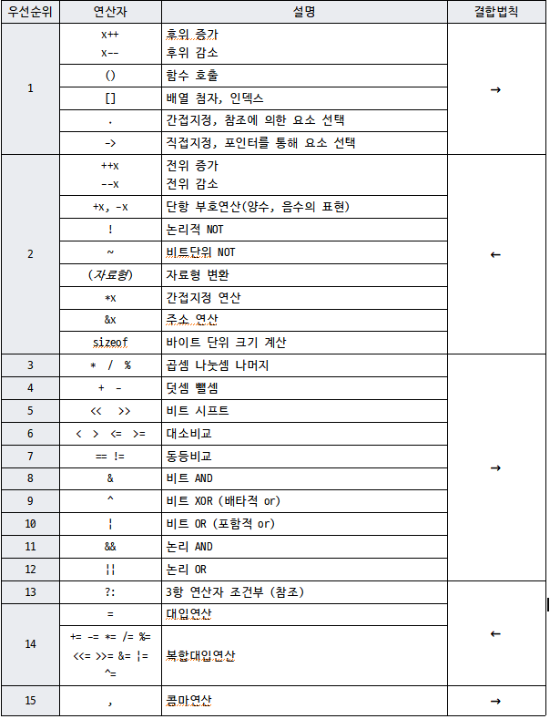

<!-- notion-page-id: 8712cdd741ac8232bb3801e21f28a202 -->

# 연산자

### 1. **C언어의 다양한 연산자**

■ 대입연산자와 산술연산자



> **피연산자란?** 수학에서 연산을 위한 연산 대상을 말한다.

- 실습 예제


■ 복합 대입 연산자

- 복합 대입 연산자란? 다른 연산자와 합쳐진 형태의 대입 연산자


- 실습 예제
```c
// 예제2
#include<stdio.h>
int main()
{
	int num1 = 5, num2 = 2;

	num1 += 3;
	num2 *= 6;

	printf("num1 = %d, num2 = %d\n", num1, num2);

	return 0;
}
```
  실행 결과

■ 부호의 의미를 갖는 + 연산자와 - 연산자

- +와 – 연산자는 부호를 의미하기도 함.

- +2와 –6과 같이 숫자 앞에 붙게 되면 부호를 의미함.

- 실습 예제
```c
// 예제3
#include<stdio.h>
int main()
{
	int num1 = +5, num2 = -2;

	num1 = -num1;
	num2 = -num2;

	printf("num1 = %d, num2 = %d\n", num1, num2);

	return 0;
}
```
  실행 결과

■ 증가, 감소 연산자 



- 실습 예제
```c
// 예제4
#include<stdio.h>
int main()
{
	int num1 = 10, num2 = 10;

	printf("num1 : %d\n", num1);
	printf("num1++ : %d\n", num1++); // 후위증가
	printf("num1 : %d\n", num1);
	printf("num2 : %d\n", num2);
	printf("++num2 : %d\n", ++num2); // 전위증가
	printf("num2 : %d\n", num2);

	return 0;
}
```

- 실습 문제: 다음 코드를 실행했을 때 출력되는 값은?
```c
// 예제5
#include<stdio.h>
int main()
{
	int num1 = 10;
	int num2 = (num1--) + 5;

	printf("num1 : %d, num2 : %d\n", num1, num2);

	return 0;
}
```

■ 관계 연산자



- 관계 연산자는 조건에 만족했을 때 1을 반환, 만족하지 못했을 때 0을 반환한다.

- 1은 참(true), 0은 거짓(false)을 의미하는 대표적인 숫자이다.

- C언어에서는 0이 아닌 모든 값을 참으로 간주하지만, 1이 참을 대표하는 값이다.

- 실습 예제
```c
// 예제6  
#include<stdio.h>
int main()
{
	int num1 = 5;
	int num2 = 9;

	int result1, result2, result3, 
            result4, result5, result6;

	result1 = (num1 < num2);
	result2 = (num1 > num2);
	result3 = (num1 == 5);
	result4 = (num1 != num2);
	result5 = (9 <= num2);
	result6 = (num1 >= num2);

	printf("result1 : %d\nresult2 : %d\nresult3 : %d\n
                result4 : %d\nresult5 : %d\nresult6 : %d\n", 
                result1, result2, result3, result4, result5, result6);

	return 0;
}
```
  실행 결과

■ 논리 연산자



- 실습 예제
```c
// 예제 7 
#include<stdio.h>
int main()
{
	int num1 = 5;
	int num2 = 9;

	int result1, result2, result3, result4;

	result1 = (num1 == 5 && num2 < 8);
	result2 = (num1 >= 6 || num2 <= 9);
	result3 = !(num1 == 5);
	result4 = !num2;

	printf("result1 : %d\nresult2 : %d\nresult3 : %d\nresult4 : %d\n", 
                result1, result2, result3, result4);

	return 0;
}
```
  실행 결과

■ 콤마(,) 연산자

- 둘 이상의 변수를 동시에 선언, 둘 이상의 문장을 한 행에 삽입하는 경우에 사용

- 둘 이상의 매개변수(인자)를 함수에 전달할 때도 매개변수 구분을 목적으로 사용

- 연산의 결과가 아닌 ‘구분’을 목적으로 사용

- 실습 예제
```c
// 예제8
#include<stdio.h>
int main()
{
	int num1 = 1, num2 = 2;
	printf("Hello "), printf("world!\n");

	num1++, num2++;
	printf("%d ", num1), printf("%d \n", num2);

	return 0;
}
```
  실행 결과

■ 연산자의 우선순위와 결합 방향

- 우선순위가 동일한 두 연산자가 하나의 수식에 존재하는 경우, 어떤 순서대로 연산하느냐를 결정해 놓은 것

