<!-- notion-page-id: f272cdd741ac836bb25e0158fc82b0f2 -->

# 포인터

### 1. 메모리란?

- 메모리 주소 : 변수의 본질은 메모리이며, 모든 메모리는 자신의 위치를 식별하기 위한 근거로 고유번호를 갖는데, 이 번호를 메모리 주소라 함.
  > 변수는 다른 말로 메모리인데, 이 변수(메모리)의 위치를 저장하는 고유번호를 메모리 주소라 부른다.

- 변수를 이루는 3가지 요소
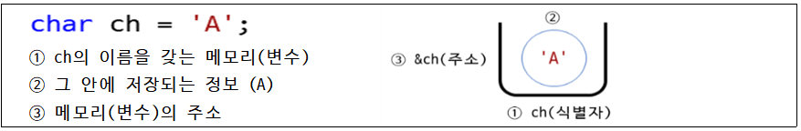

- 어떤 변수를 피연산자로 사용한다면 대부분 변수에 저장된 정보를 연산에서 사용
  > ex) sum = n1 + n2; > 변수를 피연산자로 사용

- 어떤 연산자는 메모리에 저장된 정보가 아닌 변수의 이름, 즉 메모리 자체에 관심이 있음

- 주소 연산자 & 실습 예제
```c
//예제1
#include<stdio.h>
int main()
{
	int nData = 10;
	// 변수 nData에 들어있는 값을 출력
	printf("%d\n", nData);
	// 변수 nData의 메모리 주소를 출력
	printf("%p\n", &nData);
	return 0;
}
```
  실행 결과
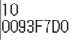
     * 두 번째 결과는 실행되는 프로그램마다 달라질 수 있음
  - %p : 주소를 출력하는 서식 문자
  - &nData 라는 연산은 “변수 이름이 nData인 메모리의 실제 주소는?” 이라는 의미
  - 이름이 nData인 정수형 메모리의 실제 주소는 0x0093F7D0 이고, 그 안에 저장된 정보는 10이 된다.
    > 풀이 >> nData는 단독 주택의 이름이 되고 그 주택 주소는 0x0093F7D0 이며, 그 안에 살고 있는 사람은 10이다.

### 2. 포인터란?

- 포인터 변수 : 메모리(변수) **주소를 저장**하기 위한 변수

- 포인터 변수 선언 ( * : 참조 연산자, 즉 포인터가 가리키는 주소에 저장된 값으로 직통 연결)
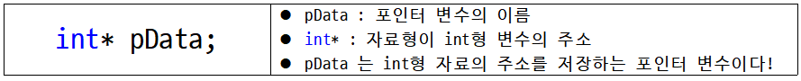
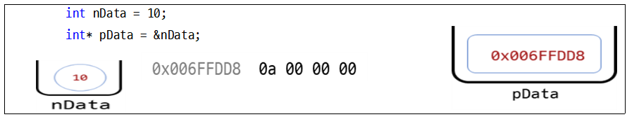

- 포인터의 자료형(Type)
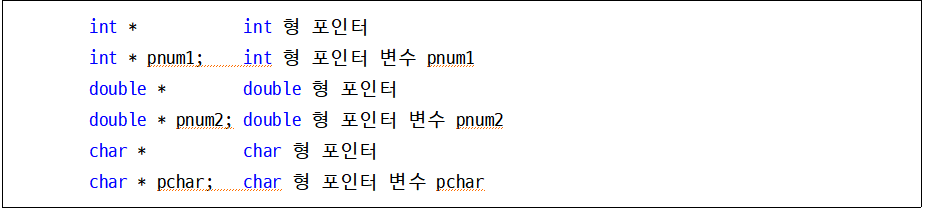

- 포인터 변수 실습 예제1
```c
//예제2
#include<stdio.h>
int main()
{
	int num = 10;
	int* pnum = &num;

	// 변수 nData에 들어있는 값을 출력
	printf("변수 num의 값 : %d\n", num);
	// 변수 nData의 메모리 주소를 출력
	printf("&num(주소값) : %p\n", &num);
	// 변수 pData에 들어있는 값을 출력
	printf("포인터 변수 pnum의 값 : %p\n", pnum);
	return 0;
}
```
  실행 결과
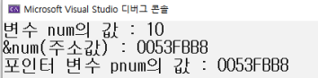

- 포인터 변수 실습 예제2
```c
//예제3
#include<stdio.h>
int main()
{
	int num1 = 20;
	int num2 = 30;

	int* pnum1 = &num1; //포인터변수 pnum1에 num1 주소 저장
	int* pnum2 = &num2; //포인터변수 pnum2에 num2 주소 저장

	printf("num1 : %9d   &num1 : %p\n", //들어갈 내용 작성);
	printf("num2 : %9d   &num2 : %p\n", //들어갈 내용 작성);
        //포인터 변수 pnum1의 값 출력하고 포인터 변수의 주소 &pnum1 출력
	printf("pnum1 : %p   &pnum1 : %p\n", //들어갈 내용 작성);
        //포인터 변수 pnum2의 값 출력하고 포인터 변수의 주소 &pnum2 출력
	printf("pnum2 : %p   &pnum2 : %p\n", //들어갈 내용 작성);

	return 0;
}
```
  실행 결과
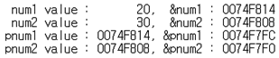

- 포인터 변수 실습 예제3
```c
//예제4
#include<stdio.h>
int main()
{
	printf("sizeof(char)   : %d, sizeof(char*)    : %d\n", sizeof(char), sizeof(char*));
	printf("sizeof(int)    : %d, sizeof(int*)     : %d\n", sizeof(int), sizeof(int*));
	printf("sizeof(double)  : %d, sizeof(double*)   : %d\n", sizeof(double), sizeof(double*));
	printf("sizeof(long long) : %d, sizeof(long long*) : %d\n", sizeof(long long), sizeof(long long*));
	return 0;
}
```
  실행 결과
    예측해서 메모장에 작성하기!

### 3. 간접지정 연산자

- 간접지정 연산자 : 주소 연산과 정반대의 의미 (주소 연산자 &) <-> (간접지정 연산자 * )

- int nData = b; 변수를 선언하여 메모리를 사용하는 것이 직접 지정 방식

- 간접 지정 : 임의의 주소로 상대적인 위치를 식별하는 방식
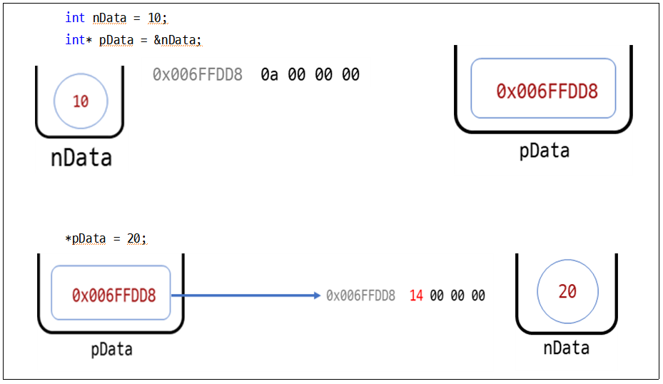

- 실습 예제1
```c
//예제5
#include<stdio.h>
int main()
{
	int num = 10;
	int* pnum = &num;

	printf("num   : %d   pnum : %p\n", //이곳에 들어갈 것을 작성하세요.);
	printf("*pnum : %d\n", *pnum);

	*pnum = 20;

	printf("*pnum : %d   pnum : %p", //이곳에 들어갈 것을 작성하세요.);
	return 0;
}
```
  실행 결과
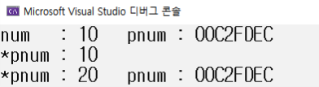

- 실습 예제2
```c
//예제6
#include<stdio.h>
int main()
{
	int x = 10, y = 20;
	int *p;
	
	p = &x;
	printf("p = %p\n", p);
	printf("*p = %d\n", *p);
	
	p = &y;
	printf("p = %p\n", p);
	printf("*p = %d\n", *p);

	return 0;
}
```
  실행 결과
    예측해서 메모장에 작성하기
(단, 주소는 모르기 때문에 임의로 작성)

- 실습 예제3
```c
//예제7
#include<stdio.h>
int main()
{
	int i = 10;
	int* p;
	
	p = &i;
	printf("i = %d\n", i);

	*p = 20;
	printf("i = %d\n", i);

	return 0;
}
```
  실행 결과
    예측해서 메모장에 작성하기
(단, 주소는 모르기 때문에 임의로 작성)

- 실습 예제4
```c
//예제8
#include<stdio.h>
int main()
{
	int num1 = 100, num2 = 200;
	int* pnum;

	// 1번
	pnum = &num1; 
	printf("1. num1 : %d\t&num1 : %p\tpnum : %p\t*pnum : %d\n", num1, &num1, pnum, *pnum);

	// 2번
	(*pnum) += 20; 
	printf("2. num1 : %d\t&num1 : %p\tpnum : %p\t*pnum : %d\n", num1, &num1, pnum, *pnum);

	// 3번
	pnum = &num2; 
	printf("3. num2 : %d\t&num2 : %p\tpnum : %p\t*pnum : %d\n", num2, &num2, pnum, *pnum);

	// 4번 
	(*pnum) *= 2; 
	printf("4. num2 : %d\t&num2 : %p\tpnum : %p\t*pnum : %d\n", num2, &num2, pnum, *pnum);

	return 0;
}
```
  실행 결과
    예측해서 메모장에 작성하기
(단, 주소는 모르기 때문에 임의로 작성)

### 4. 초기화의 중요성

- 포인터 변수를 초기화하지 않고 사용하면?
```c
//예제9
#include<stdio.h>
int main()
{
	int *p;
	*p = 100;

	return 0;
}
```

- 오류가 발생한다. 왜?

- 해결방법 : 아무것도 가리키고 있지 않을 때는 int* p = NULL; 로 설정한다.

- 포인터 타입과 변수의 타입은 일치시킨다.
```c
//예제10
#include<stdio.h>
int main()
{
	int i;
	double *pd;

	pd = &i;
	*pd = 36.5;

	return 0;
}
```

- 문법적인 오류는 없으나 실행 오류가 발생

- double형 포인터에 int 형 변수의 주소가 대입되었고, 포인터가 가리키는 곳에 36.5를 대입

- 즉, int형에 double 값을 대입 -> int가 double보다 작기 때문에 int 범위를 넘어간다.

### 5. 포인터와 배열

- 배열의 이름은 배열의 주소를 쉽게 표현한 것

- 배열의 이름은 배열의 시작 주소 값을 의미하며, 그 값은 상수이다.

- 배열의 이름 주소와 [0] 인덱스 번호의 주소는 같다.

- 배열의 이름(시작 주소) 알아보는 예제1
```c
//예제1
#include<stdio.h>
int main()
{
	int arr[3] = { 0, 1, 2 };
	printf("  배열의 이름 : %p \n", arr);
	printf("arr[0]의 주소 : %p \n", &arr[0]);
	printf("arr[1]의 주소 : %p \n", &arr[1]);
	printf("arr[2]의 주소 : %p \n", &arr[2]);

	return 0;
}
```
  실행 결과
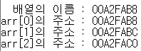
  > arr라는 배열은 그 이름 자체가 주소이기 때문에 주소연산자(&)를 따로 쓰지 않아도 주소가 출력된다.

- 배열 예제2
```c
//예제2
#include<stdio.h>
int main()
{
	int arr1[3] = { 1, 2, 3 };
	double arr2[3] = { 1.1, 2.2, 3.3 };

	printf("arr[0] : %d, arr2[0] : %lf\n", arr1[0], arr2[0]);
	printf("*arr1 : %d, *arr2 : %lf\n", *arr1, *arr2); // *arr1 == arr1[0], *arr2 == arr2[0]

	*arr1 += 100; // *arr1 == arr1[0]
	*arr2 += 100.0; //*arr2 == arr2[0]

	printf("arr[0] : %d, arr2[0] : %lf\n", arr1[0], arr2[0]);
	printf("*arr1 : %d, *arr2 : %lf\n", *arr1, *arr2);
	return 0;
}
```
  실행 결과
    메모장, A4 둘 중에 한군데는 꼭! 작성해보기
  > arr1는 주소로 이루어지고 그 주소는 arr1[0]의 주소와 동일하기 때문에 간접 지정 연산자(*)를 *arr1 이렇게 붙이면 arr1[0]와 동일하게 된다.

- 배열 예제3
```c
//예제3

#include<stdio.h>
int main()
{
	int a[] = { 10, 20, 30, 40, 50 };
	printf("a = %p\n", a); 
	printf("a + 1 = %p\n", a + 1);
	printf("*a = %d\n", *a);
	printf("*(a + 1) = %d\n", *(a + 1));

	return 0;
}
```
  실행 결과
    메모장, A4 둘 중에 한군데는 꼭! 작성해보기
  > 
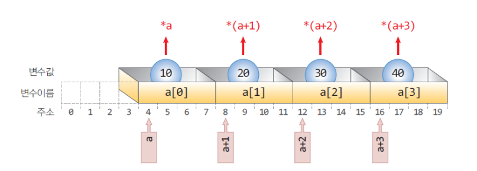

- 배열 예제4
```c
//예제4
#include<stdio.h>
int main()
{
	int arr[3] = { 15, 25, 35 };
	int* ptr = arr; // int *ptr = &arr[0];과 동일한 문장

	printf("   ptr : %p,   arr : %p, &arr[0] : %p\n", ptr, arr, &arr[0]);
	printf(" ptr+1 : %p, arr+1 : %p, &arr[1] : %p\n", ptr+1, arr+1, &arr[1]);
	printf(" ptr+2 : %p, arr+2 : %p, &arr[2] : %p\n", ptr+2, arr+2, &arr[2]);

	printf("\n");
	
	// 실행결과와 같이 되려면 어떤 코드가 들어가야 할까요? 포인터 변수를 사용하세요!
	
	printf("arr[0] : %d, ptr[0] : %d, *(ptr+0) : %d\n", arr[0], ptr[0], *(ptr+0));
	printf("arr[1] : %d, ptr[1] : %d, *(ptr+1) : %d\n", arr[1], ptr[1], *(ptr+1));
	printf("arr[2] : %d, ptr[2] : %d, *(ptr+2) : %d\n", arr[2], ptr[2], *(ptr+2));

	return 0;
}
```
  실행 결과
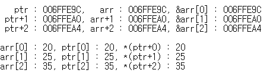

- 포인터 타입에 따른 증가 값
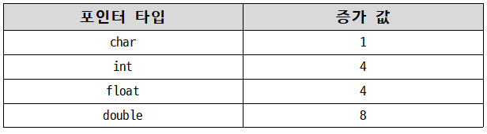

- 관련 배열 예제5
```c
//예제5
#include<stdio.h>
int main()
{
	char* pc;
	int* pi;
	double* pd;

	pc = 10;
	pi = 10;
	pd = 10;

	printf("증가 전 : pc = %d\tpi = %d\tpd = %d\n", pc, pi, pd); 

	pc++;
	pi++;
	pd++;
	printf("증가 후 : pc = %d\tpi = %d\tpd = %d\n", pc, pi, pd); 11,14,18
	printf("증가 후 : pc = %d\tpi = %d\tpd = %d\n", pc+2, pi+2, pd+2); 13,19,27

	return 0;
}
```
  실행 결과
    메모장, A4 둘 중에 한군데는 꼭! 작성해보기

- 증감연산자, 괄호, 포인터의 위치에 따른 증감 의미
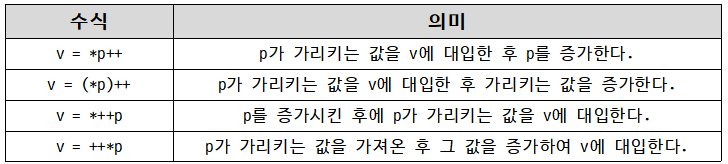
  1. 주소 +1 후위
  1. 값+1 후위
  1. 주소+1 전위
  1. 값 +1 전위

- 관련 배열 예제6
```c
//예제6
#include<stdio.h>
int main()
{
	int i = 10;
	int* pi = &i;

	printf("i = %d, pi = %p\n", i, pi); 10, 0x0

	(*pi)++; 11

	printf("i = %d, pi = %p\n", i, pi); 11,0x0

	*pi++;
	printf("i = %d, pi = %p\n", i, pi); 11,0x4

	return 0;
}
```
  실행 결과
    메모장, A4 둘 중에 한군데는 꼭! 작성해보기

- 관련 배열 예제7
```c
//예제7
#include<stdio.h>
int main()
{
	int i;
	int arr[5] = { 1,2,3,4,5 };
	int* ptr = arr; // int *ptr = &arr[0];과 동일한 문장
	printf("ptr : %p, arr : %p\n", ptr, arr); 
	for (i = 0; i < 5; i++)
		printf("%d ", arr[i]);

	printf("\n");
	for (i = 0; i < 5; i++)
		printf("%d ", *(ptr+i));

	printf("\n");
	for (i = 0; i < 5; i++)
		printf("%d ", *(ptr++));
	// 참고용
	// for (i = 0; i < 5; i++) {
	//	printf(" ptr : %p, *ptr : %d, ", ptr, *ptr);
	//	ptr++;
	//	printf("  ptr++ 연산 후 >> ptr : %p, *ptr : %d\n", ptr, *ptr);
	// }
	printf("\n");
	printf("*ptr : %d\n", *ptr); 쓰레기 값
	printf("ptr : %p, arr : %p\n", ptr, arr);
	return 0;
}
```
  실행 결과
    메모장, A4 둘 중에 한군데는 꼭! 작성해보기
    단, arr[0]의 주소값은 0으로 생각해서 작성

- 배열 예제8
```c
//예제8

#include<stdio.h>
int main()
{
	int a[] = { 10,20,30,40,50 };
	int* p;

	p = a;

	printf("a[0] = %d a[1] = %d a[2] = %d\n", a[0], a[1], a[2]);
	printf("p[0] = %d p[1] = %d p[2] = %d\n", p[0], p[1], p[2]);

	p[0] = 60;
	p[1] = 70;
	p[2] = 80;

	printf("a[0] = %d a[1] = %d a[2] = %d\n", a[0], a[1], a[2]);
	printf("p[0] = %d p[1] = %d p[2] = %d\n", p[0], p[1], p[2]);
	return 0;
}   
```
  실행 결과
    메모장, A4 둘 중에 한군데는 꼭! 작성해보기

### 6. Call by value, Call by reference

- 함수를 호출할 때 값을 전달하는 방식은 2가지이다.

- 값에 의한 호출(call-by-value)

- 참조에 의한 호출(call-by-reference)

- c-b-v : 함수를 호출했을 때 값의 복사본이 함수로 전달되는 것

- c-b-r : 함수를 호출했을 때 값의 원본이 함수로 전달되는 것.

- 값에 의한 호출(call-by-value) 예제1
```c
//예제1
#include<stdio.h>
void swap(int, int);
int main()
{
	int a = 100, b = 200;
	printf("swap() 호출 전 a = %d b = %d\n", a, b);

	swap(&a, &b);

	printf("swap() 호출 후 a = %d b = %d\n", a, b);

	return 0;
}

void swap(int *x, int *y)
{
	int tmp;
	printf("swap() x = %d y = %d\n", x, y);

	tmp = x;
	x = y;
	y = tmp;

	printf("swap() x = %d y = %d\n", x, y);
}
```
  실행 결과
    메모장, A4 둘 중에 한군데는 꼭! 작성해보기
  > swap 함수의 매개변수로 변수의 ‘값만’ 전달되었기 때문에 원본 변수 자체를 변경할 수 없다.
  > swap의 x, y는 main 함수의 a, b와는 다른 변수이다.

- 참조에 의한 호출(call-by-reference)은 포인터를 이용하여 구현

- 변수의 주소를 함수에 넘겨주면 호출된 함수에서는 이 주소를 이용하여 원본 변수의 값을 수정한다.

- c-b-r의 예제1
```c
//예제2
#include<stdio.h>
void swap(int*, int*);
int main()
{
	int a = 100, b = 200;
	printf("swap() 호출 전 a = %d b = %d\n", a, b);

	swap(&a, &b);

	printf("swap() 호출 후 a = %d b = %d\n", a, b);
	return 0;
}

void swap(int* x, int* y)
{
	int tmp;
	
	tmp = *x;
	*x = *y;
	*y = tmp;
}
```
  실행 결과
    메모장, A4 둘 중에 한군데는 꼭! 작성해보기
  > swap(&a, &b) : a, b의 값이 아닌 두 변수의 주소 값을 전달(실매개변수는 주소값)
  > swap(int* x, int* y) : 두 주소값을 받을 수 있는 포인터 변수 선언
-> 형식 매개변수는 주소값을 저장하는 포인터 변수로 선언

- c-b-r의 예제2
```c
//예제2(두 수의 크기를 비교하여 “작은 수, 큰 수”로 출력되는 프로그램 작성)
#define _CRT_SECURE_NO_WARNINGS
#include<stdio.h>
void result(int*, int*);
int main()
{
	int a, b;
	//두 정수 입력 받는 멘트 출력
	//두 정수 입력 받기

	//a, b 중 큰 수를 b에 저장하고 작은 수를 a에 저장하기 위한 함수 호출(call by reference)
	printf("result() 호출 후 %d, %d\n", a, b);
	return 0;
}
//result()함수 정의
{
	int tmp;
	//두 수 중 a가 더 크면 a를 b로 b를 a로 바꾸기위한 조건식 작성
	{
		//swap을 위한 식 작성
	}
}
```
  실행 결과
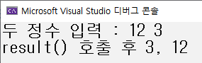

### 7. 배열이 함수로 전달되는 경우

- 배열을 매개변수로 주고 받을 수 있다.

- 일반 변수를 매개변수로 주고받을 때는 변수들은 함수 안에서만 생존하는 지역변수 특징이었다.

- 배열은? 배열 이름 자체가 주소이기 때문에 배열을 주고 받으면 자동으로 주소를 전달 ⇒ call by reference

- 예제1
```c
//예제1
#include<stdio.h>
void arr(int ar[], int n)
{
	for (int i = 0; i < n; i++)
	{
		printf("%d ", ar[i]);
	}
}
int main()
{
	int a[5] = { 1, 2, 3, 4, 5 };
	printf("배열 내용 출력하는 함수 호출하기\n");

	arr(a, 5);
	return 0;
}
```
  실행결과
    메모장, A4 둘 중에 한군데는 꼭! 작성해보기
  - 실매개변수로 배열을 보낼 때는 배열의 이름만 보내도 된다.
  - 왜? 배열 자체가 주소이기 때문
  - 형식 매개변수로 배열을 받을 때는 int ar[]로 선언하면 된다.
  - 정수형의 배열 ar[]이 생성되고 이 배열은 실매개변수에서 보낸 a라는 배열의 시작 주소를 가지고 있다.

- 예제2
```c
//예제2
#include<stdio.h>
void arr(int *p, int n)
{
	for (int i = 0; i < n; i++)
	{
		printf("%d ", p[i]*2);
	}
}

int main()
{
	int a[5] = { 1, 2, 3, 4, 5 };
	printf("배열 내용에 2곱해서 출력하는 함수 호출하기\n");

	arr(a[0], 5);
	for(int i =0; i<5; i++){
		printf("%d", a[i]);
	} 
	return 0;
}
```
  실행결과
    메모장, A4 둘 중에 한군데는 꼭! 작성해보기
  - 실매개변수로 배열을 보낼 때는 배열의 이름만 보내도 된다. => 예제1과 동일
  - 왜? 배열 자체가 주소이기 때문 => 예제1과 동일
  - 형식 매개변수로 배열을 받을 때는 int *p로 선언하면 된다.
  - 주소를 저장하는 포인터 변수 p가 선언되고 a는 배열의 주소값을 보내는 것이기 때문에 p에는 a의 주소값이 저장된다. 즉, p는 a의 배열을 담고 있는 포인터 변수가 되는 것이다.

- 정리
  - a를 보내고 int ar[]로 받고
  - a를 보내고 int *p로 받고

## +) 배열과 함수 문제
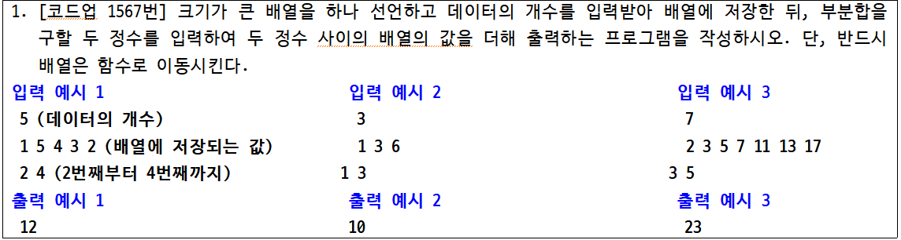
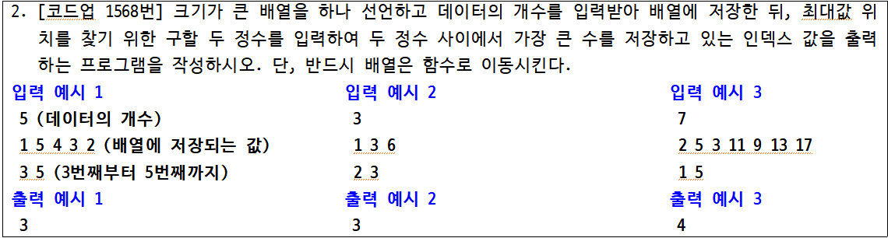
1. 다음은 배열에 데이터를 입력하고 그 값의 평균을 구하는 함수를 작성하여 호출하는 프로그램을 작성하시오. 단, 배열 안에 음수가 있으면 0으로 변경하는 함수도 사용하여야 한다.
```c
#define _CRT_SECURE_NO_WARNINGS
#include<stdio.h>
#define SIZE 5
double get_avg(//매개 변수 입력){
	double sum = 0;
	for (int i = 0; i < n; i++){
		//합 구하기
	}
	return //평균 반환하기
}
void check_values(//매개 변수 입력){
	for (int i = 0; i < n; i++){
		//배열의 값이 음수인지 확인하고 음수이면 0으로 변환하여 저장
	}
}
int main()
{
	int i;
	int data[5];
	double result;
	for (i = 0; i < SIZE; i++){
		printf("값을 입력하시오 : ");
		scanf("%d", &data[i]);
	}
	//check_values함수 호출
	printf("값들의 평균 : %.2lf", //평균 구하는 함수 호출);
	return 0;
}
```
