<!-- notion-page-id: 3942cdd741ac833ca8d301a640ba6aaf -->

# 함수

### 1. 함수란?

- 함수 : 프로그램 내에서 특정한 작업을 수행하기 위해 독립적으로 만들어진 프로그램의 단위

- C언어는 함수의 집합으로 구성되어 있고 프로그램을 실행하면 처음으로 실행되는 함수가 main() 함수이다.

- 각종 연산식 > 구문 > 절차상의 흐름 > 함수 > 함수가 함수를 호출...

- C언어의 기본은 ‘함수’이기 때문에 큰 흐름을 완성시키는 것이 함수이다.

- 함수를 사용하면 불연속적인 반복을 통해 코드를 재사용할 수 있다.

### 2. 함수의 종류

- 표준라이브러리 함수와 사용자 정의 함수로 나뉜다.

- 표준라이브러리 함수 : printf(), scanf()와 같이 C언어에 내장되어 있는 함수

- 사용자 정의 함수 : 사용자가 직접 정의해서 사용하는 함수

### 3. 반복되는 일의 단순 묶음(가장 간단한 함수)

- 동일한 일을 반복하는 프로그램을 함수로 표현할 수 있다.

- 실습예제
```c
#include <stdio.h>
int main()
{
	printf("  *\n");
	printf(" ***\n");
	printf("*****\n");

	printf("  *\n");
	printf(" ***\n");
	printf("*****\n");
	return 0;
}
```
  실행 결과
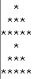

- (함수 선언과 정의 따로) 위와 동일한 일을 수행하는 함수를 제작한다. (사용자 정의 함수) 
```c
#include <stdio.h>
// 함수 선언 : 반환자료형, 함수이름, 매개변수 등을 기술하여 함수의 외형적 특징을 기술
void printStar();

int main()
{
	printStar(); // 함수 호출
	printStar(); // 함수 호출

	return 0;
}

// 함수 정의
void printStar()
{
	printf("  *\n");
	printf(" ***\n");
	printf("*****\n");
}
```

- (함수 선언과 동시에 정의) 위와 동일한 일을 수행하는 함수를 제작한다. (사용자 정의 함수)  
```c
//예제3
#include<stdio.h>
//함수 선언 및 정의
void printStar()
{
	printf("  *  \n");
	printf(" *** \n");
	printf("*****\n");
}

int main()
{
	printStar(); // 함수 호출
	printStar(); // 함수 호출

	return 0;
}
```

## +) 함수 기초 문제
1. 다음과 같이 출력되는 프로그램을 작성하시오. 단, ======= 이 부분은 line() 함수로 만들어 호출한다.
  **출력예시 **
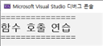
1. 함수를 star1(), star2(), star3(), main()을 선언하여 별을 출력하는 프로그램을 작성하시오. (star1은 *, star2는 ***, star3은 *****)
  **출력예시 **
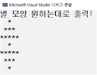
1. 함수 string(), main()을 선언하여 다음과 같이 출력되도록 프로그램을 작성하시오.
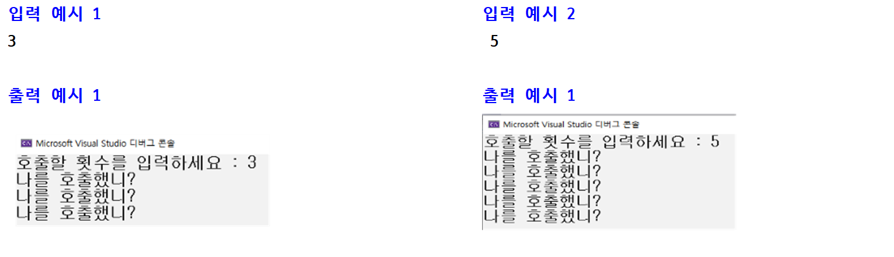

### 4. 값을 전달받아 동작하는 함수(매개변수, parameter)

- 아래와 같이 출력할 삼각형의 개수를 파라미터(매개변수)로 전달할 수 있게 수정

- 매개변수란? 함수의 정의에서 전달받은 수를 함수 내부로 전달하기 위해 사용하는 변수를 의미

- 실습 예제1
```c
//예제4
#include<stdio.h>

void printStar(int cnt)
{
	for (int i = 1; i <= cnt; i++) {
		printf("  *  \n");
		printf(" *** \n");
		printf("*****\n");
	}
}

int main()
{
	printStar(2);
	return 0;
}
```
  실행결과


- 함수의 파라미터(매개변수)는 호출하는 함수(위의 예제에서는 main)가 호출당하는 함수(위의 예제에서는 printStar)에게 값을 ‘복사’해서 넘겨준다.

- 호출하는 함수 : caller, 호출당하는 함수 : callee

- call-by-value 전달

- caller(호출하는 함수)가 전달하는 값을 ‘실 매개 변수’

- callee(호출당하는 함수)가 전달받는 값을 ‘형식 매개 변수’

- 위의 예제 해석 : main 함수의 printStar(2); 에서 ‘2’가 실 매개 변수

- void printStar(**int cnt**) 함수 정의에서 **int cnt** 변수가 형식 매개 변수

- 실습 예제2
```c
//예제5
#define _CRT_SECURE_NO_WARNINGS
#include<stdio.h>

void printStar(int cnt)
{
	for (int i = 1; i <= cnt; i++) {
		printf("  *  \n");
		printf(" *** \n");
		printf("*****\n");
	}
}

int main()
{
	//정수형 변수 선언
	//printStar를 출력할 횟수를 직접 입력 받기
	printStar(//실매개변수는 뭐가 들어갈까요?);
	return 0;
}
```
  실행결과1
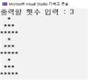
  실행결과2
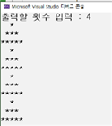

- 실습 예제3
```c
//예제6
#define _CRT_SECURE_NO_WARNINGS
#include<stdio.h>
int add(int, int);

int main()
{
	int x, y, sum;
	//정수 두 개 입력하세요 출력하고 입력받기

	sum = //함수 호출해서 더한 값 가져오기
	printf("%d + %d = %d", x, y, sum);
	return 0;
}

int add(int n1, int n2)
{
	int n3 = // 두 수 더하기
	return // 더한 값 반환하기;
}
```
  실행결과1
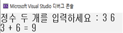
  실행결과2
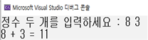

### 5. 수행 후 값을 반환(return)하는 함수

- 함수의 반환 자료형은 호출자 함수가 피호출자 함수를 호출해서 얻을 수 있는 정보의 형식

- 함수가 반환한 자료는 즉시 활용하지 않거나 저장하지 않으면 사라짐.

- 반환자료형을 즉시 활용하는 방법
  > ① 자료형이 일치하는 **변수에 대입**하여 정보를 보관
    ② 피연산자로 **다른 연산에 참여**
    ③ **다른 함수를 호출하는데 인수**로 사용
  > 인수란? 매개변수로 전달되는 값

- 반환 자료가 없으면 우리는 함수를 선언할 때 void로 선언하고, 그렇지 않으면 반환되는 형식에 맞도록 int, float, double, char로 선언한다.

- 위의 예제6도 return을 통해 값을 반환하는 예제이다.

- 실습 예제1
```c
//예제7

#include <stdio.h>
// 함수 선언
int GetMax(int, int, int);

int main()
{
	int nResult = 0;

	// 함수가 반환한 값을 출력한다.
	printf("MAX : %d\n", GetMax(1, 2, 3));

	// 함수가 반환한 값에 * 2 연산을 수행하고 출력한다.
	printf("MAX : %d\n", GetMax(2, 3, 1) * 2);

	// 함수가 반환한 값을 nResult 변수에 저장한 후
	// nResult에 저장된 값을 출력한다.
	printf("MAX : %d\n", nResult = GetMax(3, 1, 2));

	return 0;
}
// 함수 정의
int GetMax(int a, int b, int c)
{
	int nMax = a;
	if (b > nMax) nMax = b;
	if (c > nMax) nMax = c;

	return nMax;
}
```
  실행결과1
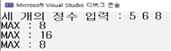
  실행결과2
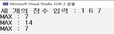

- 실습 예제2 (반환값과 매개변수를 구분하는 함수 선언)
```c
//예제8
#define _CRT_SECURE_NO_WARNINGS
#include <stdio.h>
// 함수 선언
int add(int num1, int num2); // 매개변수 O, 반환값 O
void Showresult(int num); // 매개변수 O, 반환값 X
int scanNum();              // 매개변수 X, 반환값 O
void HowToUseThisProg();     // 매개변수 X, 반환값 X

int main()
{
	int result, num1, num2;
	HowToUseThisProg();
	num1 = scanNum();
	num2 = scanNum();
	result = add(num1, num2);
	Showresult(result);
	return 0;
}
// 함수 정의
int add(int num1, int num2)
{
	return num1 + num2;
}
void Showresult(int num)
{
	printf("덧셈결과 출력 : %d\n", num);
}
int scanNum()
{
	int num;
	scanf("%d", &num);
	return num;
}
void HowToUseThisProg()
{
	printf("두 개의 정수를 입력하시면 덧셈결과가 출력됩니다.\n");
	printf("자! 그럼 두개의 정수를 입력하세요.\n");
}
```
  실행결과1
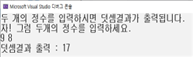
  실행결과2
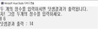

- 실습 예제3 (반환값이 여러 개일 때는?)
```c
//예제9
#define _CRT_SECURE_NO_WARNINGS
#include <stdio.h>

int NumCompare(int num1, int num2);
int main()
{
	int n1, n2;
	while (1) {
		// 두 개의 정수를 입력받는 코드 작성
		// 입력받은 값 중 하나라도 0이면 반복문 종료하는 코드 작성
		// 두 수 중 더 큰 수 출력하는 코드 작성(함수 호출)
	}
	return 0;
}
int NumCompare(int num1, int num2)
{
	if (num1 > num2)
		return // 반환 값 작성
	else
		return // 반환 값 작성
}
```
  실행결과1
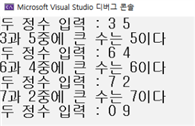

- 실습 예제4 (호출된 함수에서 또 다른 함수 호출)     
```c
//예제10

#define _CRT_SECURE_NO_WARNINGS
#include <stdio.h>
int compare(int num1, int num2); // 절대값이 큰 수 반환
int absvalue(int num); // 매개변수의 절대값을 반환

int main()
{
	int num1, num2;
	// 두 개의 정수를 입력하는 프로그램 작성
	// 절대값 비교하여 출력하는 프로그램 작성(함수 compare호출)
	return 0;
}
int compare(int n1, int n2)
{
	if (//n1 절대값 구하는 함수 호출 > n2 절대값 구하는 함수 호출) 
		return n1;
	else
		return n2;
}
int absvalue(int num)
{
	 // 절대값 구해서 반환하는 프로그램 작성
      (변수가 0보다 크면 그대로 반환, 아니면 –1곱해서 반환)
}
```
  실행결과1
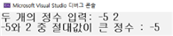

## +) 함수 활용 문제
## +) 함수 활용 문제 (1)
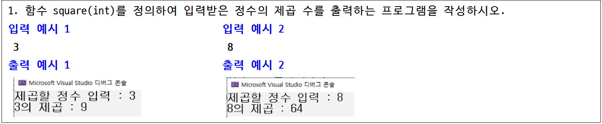
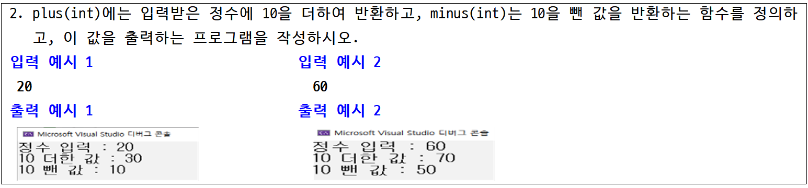
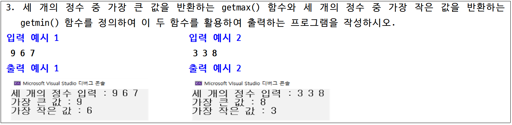
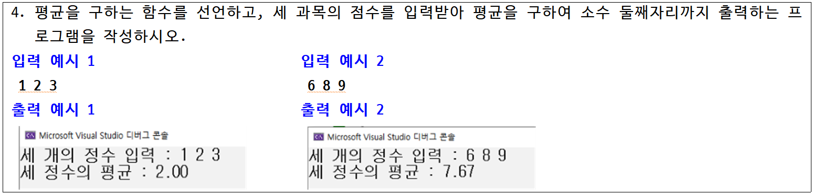
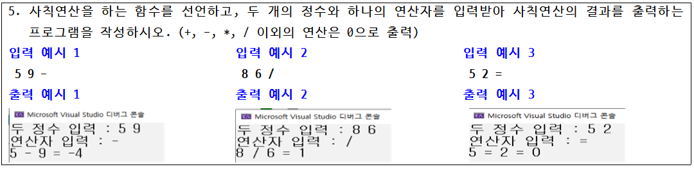
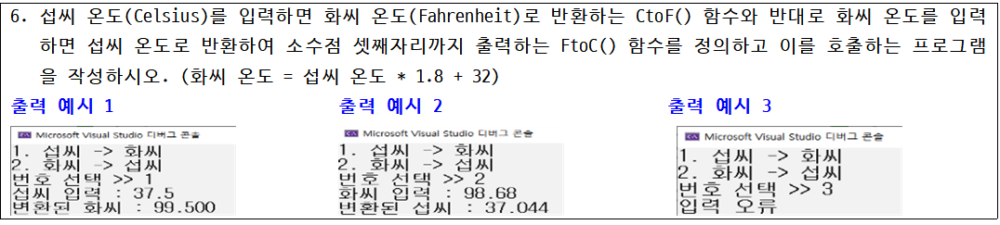
## +) 심화문제
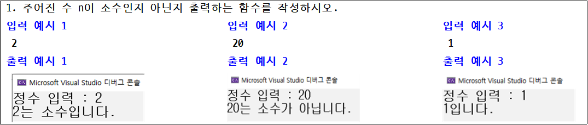
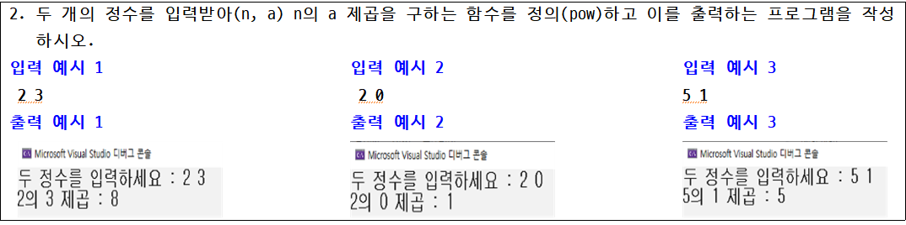
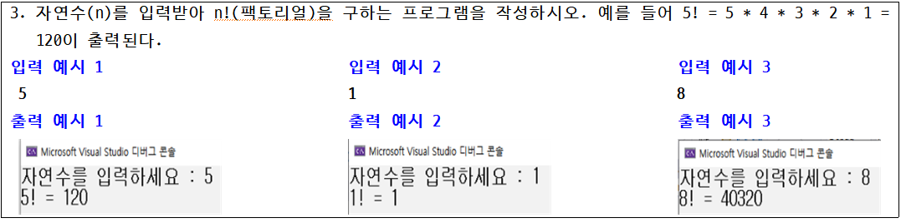
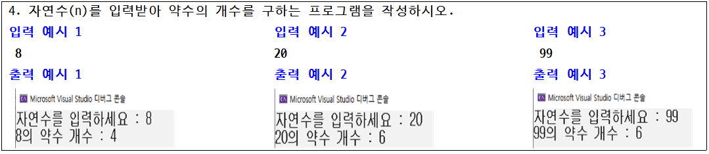
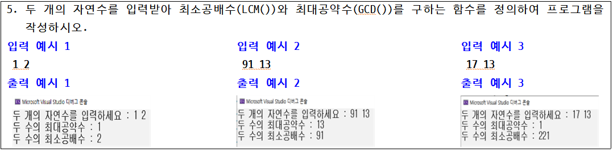

### 6. 변수의 존재 기간과 접근 범위 1 : 지역변수

- 변수 선언 위치는 함수와 깊은 관계가 있다.

- 변수 선언 위치에 따라 ‘지역변수’와 ‘전역변수’로 나뉜다.

- 메모리상에(변수에 값이) 존재하는 기간과 변수에 접근할 수 있는 범위에 차이점이 있다.

- 함수 내에서만 존재 및 접근이 가능한 ‘지역 변수’ (Local Variable)

- 지역 변수 예제1
```c
#include <stdio.h> 
int One(int);
int Two(int, int);
int main()
{
	int num1 = 10;	// 이후부터 main의 num1 유효
	int num2 = 12;	// 이후부터 main의 num2 유효
	One(num1);
	Two(num1, num2);
	printf("main num1 : %d, num2 : %d\n", num1, num2);
	return 0;	// main의 num1, num2이 유효한 마지막 문장
}

int One(int num)
{
	num++;
	printf("One num : %d\n", num);
	return 0; // num 변수 소멸
}

int Two(int num1, int num2)
{
	int num3 = 30;
	num1++, num2--;
	printf("Two num1 : %d, num2 : %d, num3 : %d\n", num1, num2, num3);
	return 0; // num1, num2, num3 변수 소멸
}
```
  실행 결과
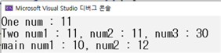

- 함수를 정의할 때 선언하는 매개변수도 지역변수

- 매개변수는 선언된 함수 안에서만 접근이 가능

- 매개변수는 선언된 함수가 반환하면(끝나면) 지역변수와 마찬가지로 소멸

### 7. 변수의 존재 기간과 접근 범위 2 : 전역변수

- 프로그램 시작과 동시에 변수를 선언하여 프로그램이 끝날 때까지 존재하는 변수

- 별도의 값으로 초기화하지 않으면 0으로 초기화 된다.

- 프로그램 전체 영역 어디서든 접근이 가능하다.

- 지역 변수 VS 전역 변수(들어갈 말은 무엇일까요?)
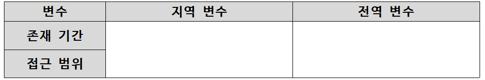

- 전역 변수 예제1
```c
#include <stdio.h> 
int num;	// 전역변수는 기본 0으로 초기화됨
void Add(int val);
int main()
{
	printf("num : %d\n", num);
	Add(3);
	printf("num : %d\n", num);
	num++;		// 전역변수 num의 1 증가
	printf("num : %d\n", num);
	return 0;
}
void Add(int val)
{
	num += val;  // 전역변수 num에 지역 변수 val 더하기
}
```
  실행 결과
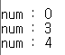

- 전역 변수 num은 전체 프로그램에서 접근 가능 => 값 변경

- main 함수와 Add 함수 전체에서 num이라는 공통의 변수가 사용 된 것이다.

- 전역 변수 예제2
```c
#include <stdio.h>
int num = 1;	// 전역변수 
int Add(int val);
int main()
{
	int num = 5;	// 지역변수
	printf("num : %d\n", Add(3));
	printf("num : %d\n", num+9);	// num은 지역변수? 전역변수?
	return 0;
}

int Add(int val)
{
	num += val; // num은 지역변수? 전역변수?
	return num;
}
```
  실행 결과
    메모장에 작성해보세요~

- 지역 변수와 전역 변수의 이름이 동일하다면 해당되는 함수 내에서는 전역 변수가 가리워지고, 지역 변수로 접근이 이루어진다.

### 8. 변수의 존재 기간과 접근 범위 3 : static 변수

- 지역변수 static 선언 > 전역변수의 성격을 일부 가지고 있다.

- 선언된 함수 내에서만 접근이 가능하다. (지역변수의 특성)

- 초기화는 딱 1번, 이후 프로그램 종료할 때까지 메모리 공간에 값 존재 (전역변수의 특성)

- static 변수 예제1
```c
#include <stdio.h> 
void stvalue();
int main()
{
	int i;
	for (i = 1; i <= 5; i++)
	{
		stvalue();
	}
	return 0;
}
void stvalue()
{
	// 접근성은 SimpleFunc() 내부로 제한된 지역변수이나
	// 초기화는 이 함수가 여러번 호출되더라도 단 한번만 적용됨.
	static int num1 = 0; // 초기화 하지 않으면 0 초기화
	int num2 = 0;		 // 초기화 하지 않으면 임의의 값으로 초기화
	num1++, num2++;
	printf("static : %d\tlocal : %d\n", num1, num2);
}
```
  실행 결과
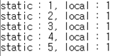

- static 선언한 변수는 프로그램 시작과 동시에 메모리 할당 및 초기화가 자동으로 됨.

- 프로그램이 종료될 때까지 메모리 공간이 남아있다. -> 전역변수 특징

- 접근 범위는 함수 내로 제한되어 있다. -> 지역변수 특징

- 위의 예제에서 **static int num1** 선언됨과 동시에 초기화 되고 초기화는 딱 한번만 한다.

- static 변수 예제2
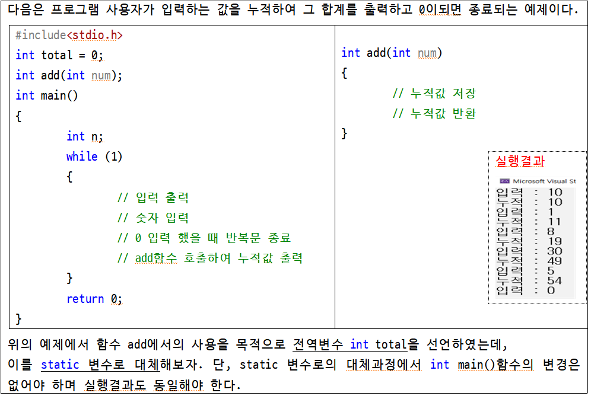

### 9. 재귀 함수

- 재귀함수란 함수 내에서 자기 자신을 다시 호출하는 함수를 의미

- 이해하기 쉬운 재귀 함수 짤

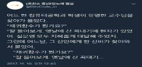
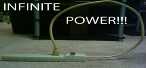

- 재귀호출에서는 조건에 부합할 때 함수가 반환하는 방법으로 멈춤

- 실습예제 1
```c
#include <stdio.h>
void func(int n);
int main()
{
	func(3);
	return 0;
}
void func(int n)
{
	if (n == 0) return; // 종료조건
	printf("재귀호출 전 : %d\n", n);
	func(n - 1);
	printf("재귀호출 후 : %d\n", n);
}
```
  실행 결과
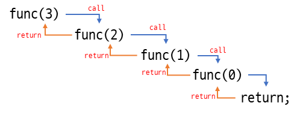
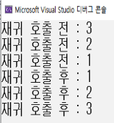

- 실습예제 2 (재귀 함수 동작 원리 파악하기)
```c
#include<stdio.h>
int func(int n)
{
	if (n > 10) return 0; //재귀함수 종료 조건
	return n + func(n+1); //함수 호출
}
int main()
{
	printf("재귀함수 결과값 : %d", func(1));
	return 0;
}
```
  실행 결과
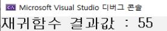

- 위의 예제는 1부터 (         )까지 (          )값을 출력하는 함수이다.

- 위의 예제 호출 순서
  > main → func(1) → 1 + func(2) → 2 + func(3) → 3 + func(4) → 4 + func(5) →
뒷 순서는 직접 작성해보기!　(재귀함수 이해하는 것에 도움이 됩니다. 꼭 작성하세요!)

## +) 재귀함수 활용 문제
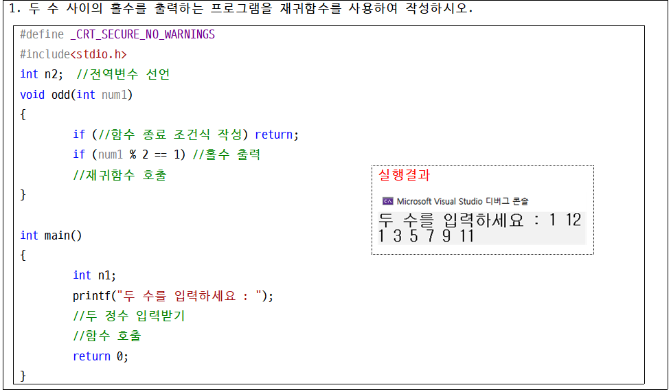
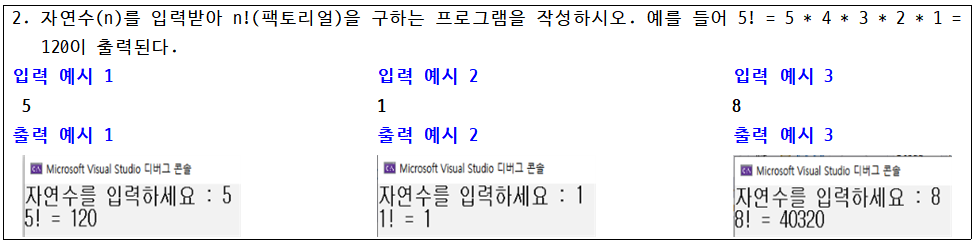
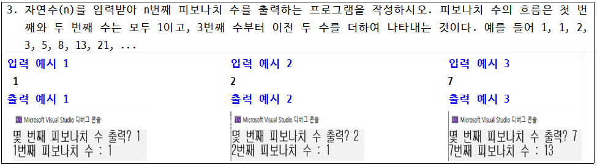
1. 짤 만들기
 [https://www.acmicpc.net/problem/17478](https://www.acmicpc.net/problem/17478)
