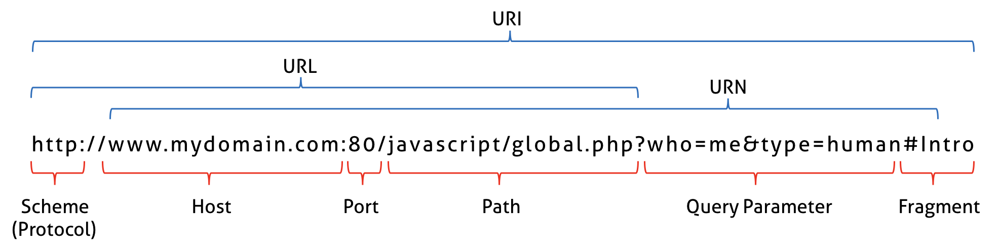

<!-- notion-page-id: 3a02cdd741ac809f9949c65d9737e273 -->

# URI, URL, URN

> 이걸 왜 정리하게 되었는지의 서사를 풀자면, 솔직히 말해서 URL, URI, URN이 뭔지 구분이 제대로 되지 않았다. 아직도 3개를 구분하지 못한다는 것이 부끄러워서 다시 정리하게 되었다…

- Scheme : 통신 프로토콜 

- Host : 웹서버, 도메인 또는 IP

- Port : 웹 서버에 접속하기 위한 통로

URI, URL, URN을 검색하면 이런 그림이 아주 많이 나온다. 나는 이 그림이 URI, URL, URN을 알기 가장 적합한 그림이라고 생각된다.

### URI : 인터넷에 있는 자원을 나타내는 유일한 주소

URI는 Uniform Resource Identifier, 통합 자원 식별자의 줄임말로 자원을 나타내는 주소를 말한다.

### URL : 네트워크 상에서 자원이 어디있는 지 알려주는 규약 -> 웹페이지의 주소

URL은 Uniform Resource Locator의 줄임말로, 네트워크 상에서 웹 페이지, 이미지, 동영상등의 파일이 위치한 정보를 알려준다.

URL은 웹 상의 주소를 나타내기 때문에 효율적으로 리소스에 접근하기 위한 방법론이 생겨났는데 그 중 하나가 REST API이다.

### URN : 자원의 이름을 나타냄

URN은 Uniform Resource Name의 줄임말로, 이름으로 리소스를 특정하는 URI이다.

URN에는 리소스 접근방법과, 웹 상의 위치가 표기되지 않으며, 실제 자원을 찾기 위해서는 URN을 URL로 변환하여 이용한다.

URL과 URN의 차이점

- URL은 어떻게 리소스를 얻을 것이고 어디에서 가져와야하는지 명시하는 URI이다.

- URN은 리소스를 어떻게 접근할 것인지 명시하지 않고 경로와 리소스 자체를 특정하는 것을 목표로하는 URI이다.
