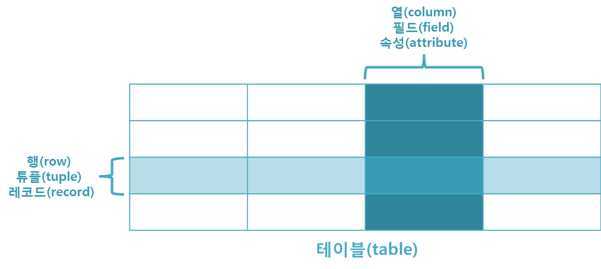

<!-- notion-page-id: 3a22cdd741ac80889767e7112aa9fc7c -->

# 데이터베이스 

## SQL
 관계형 데이터베이스의 관리를 위한 언어
quit
**자주 쓰는 쿼리문**
| 쿼리 | 설명 |
|---|---|
| SHOW DATABASES; | 데이터베이스 조회 |
| USE 데이터베이스명 | 편집할 데이터베이스를 선택 |
| SHOW TABLES; | 데이터베이스 안의 테이블 전부 조회 |
| INSERT INTO 테이블명(값1, 값2) VALUE(1, ‘최희’) |  |
| CREATE database 데이터베이스명; | 데이터베이스 생성 |
| DROP DATABASE 데이터베이스명; | 데이터베이스 삭제 |
| DROP TABLE 테이블명; | 특정 테이블 삭제 |

데이터를 묶어 놓은 것 데이터 작성 및 쿼리 작업에서 구조화 질의 언어(SQL)를 사용

- 표 형식의 테이블과 세로를 열, 필드, 속성이라 하고 가로를 행, 튜플, 레코드라고 한다.

- 키(Key) : 테이블에서 행의 식별자로 이용되는 열

- 일대일, 일대다, 다대다 로 연결된다.

**1. 관계형 데이터 베이스(RDBMS)**

관계형 데이터베이스는 현재 가장 많이 사용되고 있는 데이터베이스의 한 종류이다.

데이터들을 테이블이라는 표 형식으로 관리 할 수 있는 데이터 베이스를 말한다.

**2. 데이터베이스**

- MySQL
  오픈 소스이며, 다중 사용자와 다중 스레드를 지원합니다.
  - 오픈 소스 : 오픈 소스 소프트웨어는 소스 코드를 공개해 누구나 특별한 제한 없이 그 코드를 보고 사용, 복제, 배포 수정 할 수 있으며, 소스 코드가 공개된 소프트웨어
  - 스레드 : 프로세스는 프로그램이 실행되는 단위, 그 프로세스를 더 잘게 쪼개서 메모리 공유를 할 수 있도록 하는게 스레드
  또한, C언어, C++, JAVA, PHP 등 여러 프로그래밍 언어를 위한 다양한 API를 제공하고 있습니다.
  MySQL은 유닉스, 리눅스, 윈도우 등 다양한 운영체제에서 사용할 수 있으며, 특히 PHP와 함께 웹 개발에 자주 사용됩니다.

- MariaDB
  오픈 소스의 관계형 데이터베이스 관리 시스템이다. *MySQL과 동일한 소스코드를 기반*으로 한다. 동일한 소스를 기반으로 하다보니 MySQL과 호환이 된다.

**3. JDBC**

Java Database Connectivity의 약자로, 자바에서 데이터베이스에 접속할 수 있도록하는 자바 API이다. 한마디로 자바에서 데이터베이스에 접근하기 위해서는 꼭 필요하다.

자바 어플리케이션 -> JDBC API -> JDBC 드라이버 -> MySQL
