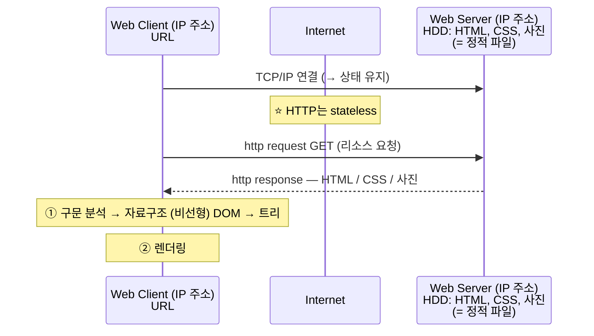

<!-- notion-page-id: 3a02cdd741ac80d09adfd4784c3aaf84 -->

# 웹 서비스 구조

### 메모

- Web Server의 HDD에는 HTML, CSS, 사진 등 **정적 파일**이 저장되어 있다.

- 브라우저는 응답으로 받은 HTML을
  1. **구문 분석** → 자료구조 **(비선형) DOM** → **트리**로 만들고
  1. **렌더링**한다.

- **TCP/IP 연결은 상태 유지를 기본으로 하지만, TCP/IP 연결 위에서 동작하는 HTTP는 stateless를 기본으로 작동한다.** ⭐
