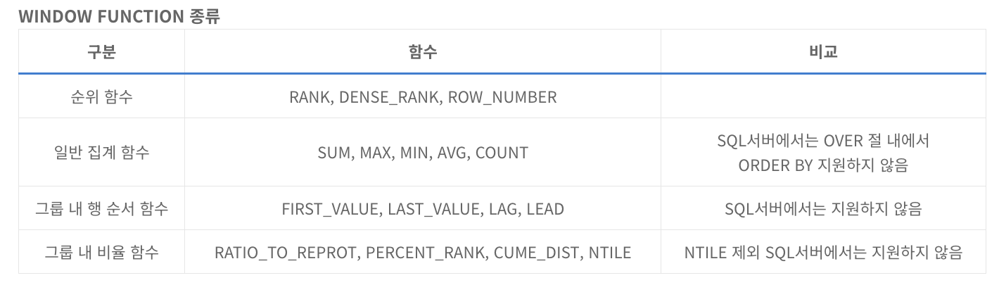

<!-- notion-page-id: 3c32cdd741ac8062ae9fcc0f058630bc -->

# WINDOW FUNCTION

SQL의 윈도우 함수란 행과 행 간을 비교, 연산, 정의하기 위한 함수이다. 분석함수 또는 순위함수라고 하기도 한다. 다른 함수들처럼 중첩해서 사용할 수는 없지만 서브쿼리에서는 사용가능하다.

## **WINDOW FUNCTION 기본 문법**

윈도우 함수에는 OVER 문구가 필수로 들어간다.

```sql
SELECT WINDOW_FUNCTION (ARGUMENTS) OVER([PARTITION BY 컬럼] [ORDER BY 컬럼] [WINDOWING 절])
FROM 테이블명;
```


