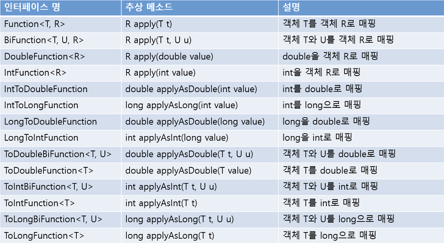

<!-- notion-page-id: 3d82cdd741ac801eb4c6d08a66917b02 -->

# Function 함수적 인터페이스

매개변수로 받은 값을 변환하고자하는 값(리턴 타입)으로 변경하여 출력해주는 함수이다.

→ 간단하게 말하면 타입변환을 해주는 함수적 인터페이스이다.

- 매개값과 리턴값 둘 다 있음 

<예제코드>

```java
BiFunction<String, String, Integer> f = (t, u) -> t.length() + u.length();
int num = f.apply("QWQWQ", "BCBCB");
System.out.println(num); 
```

출력 결과
```java
10
```


