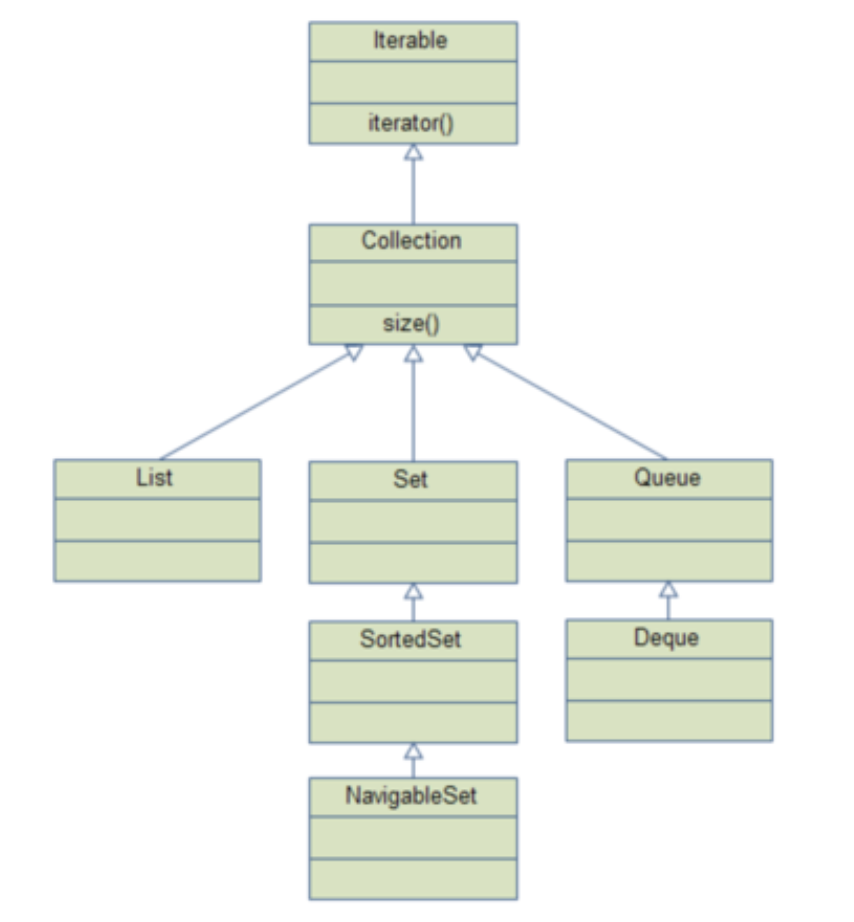
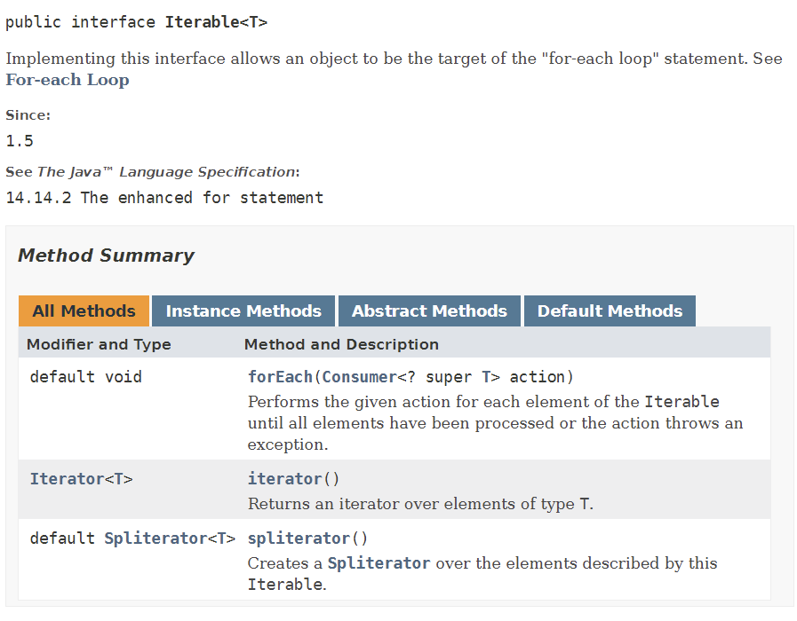

<!-- notion-page-id: 3a02cdd741ac80e8a2ffe2be851adc28 -->

# Iterable

iterable을 처음 접하게 된 것은 repository의 메소드 반환형이 iterable이었기 때문이다.

> CrudRepository에서는 findAll() 메소드를 사용하면  iterable타입으로 반환이 된다.

    Iterable은 Collection가 상속하는 인터페이스이다. 
    > Collection 인터페이스와 이를 상속받는 List, Set, Queue는 알고 있었지만, Iterable에 대해서는 잘 모르고 있었다.

    - Iterable 인터페이스에서는 Iterator를 반환하는 `iterator()`가 메소드로 선언 되어있는데, Iterable을 상속받는 클래스들은 강제적으로 `iterator()` 메소드를 구현하도록 하고 있다.
    - Iterable는 JDK8에서 `forEach` 메서드가 추가되었다. 이를 통해서 stream이 아닌 컬렉션에서 바로 forEach를 사용할 수 있게 되었다.

java의 api 문서를 들어가면 Iterable에 대해서 아래와 같이 설명되고 있다.
