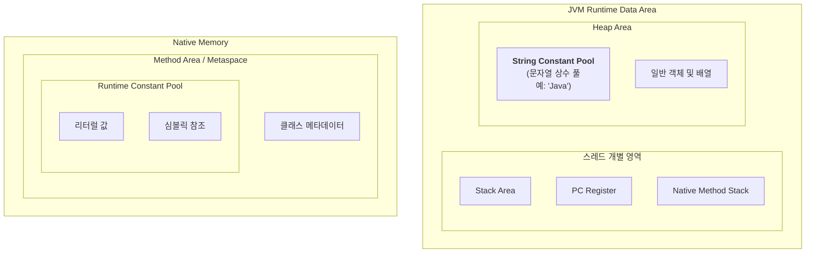

<!-- notion-page-id: 3a82cdd741ac80cea995ee5d8ece865f -->

# JVM 메모리 구조

Method Area(기존 PermGen 대신 생성된 Native Memory의 Metaspace)**에 위치하며, 문자열 상수 풀(String Constant Pool)은 Heap 영역에 격리되어 관리됨.

- **런타임 상수 풀 (Runtime Constant Pool):** Method Area (Metaspace)에 위치한다. 클래스의 설계도(메타데이터)와 함께 저장되며, 실행 시점에 실제 메모리 주소를 찾아가기 위한 참조 정보를 담고 있다.

- **문자열 상수 풀 (String Constant Pool):** **Heap Area**에 위치한다. 문자열 리터럴의 중복 생성을 막아 메모리를 절약하는 곳으로, 런타임에 가비지 컬렉터(GC)의 관리 대상이 된다.
