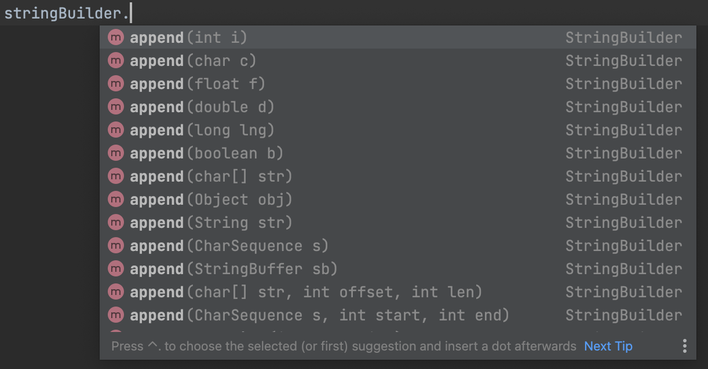
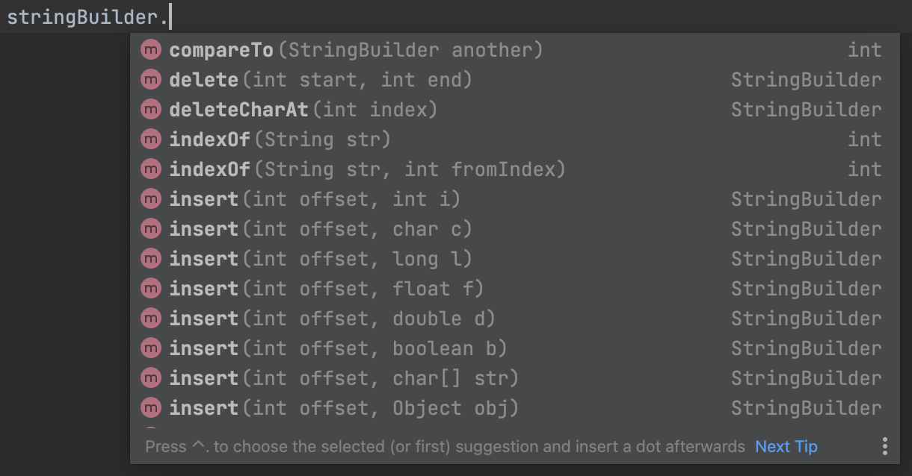
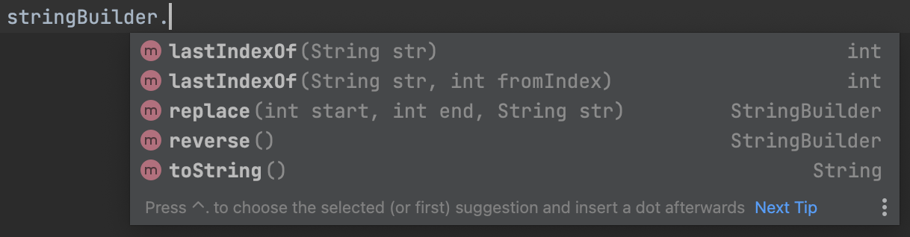

<!-- notion-page-id: 3a02cdd741ac80799af0eb729b282022 -->

# String Builder

String 객체들을 더하는 방법으로 + 연산자를 사용하는데, + 연산자를 사용하게 되면 메모리 할당과 해체를 발생시켜서 성능적으로 좋지 않다. ([참조](https://www.codejava.net/java-core/the-java-language/why-use-stringbuffer-and-stringbuilder-in-java))

```java
public static void main(String[] args) {
	StringBuilder stringBuilder = new StringBuilder();
	stringBuilder.append("문자열 ").append("연결");
	String str = stringBuilder.toString(); // String에 넣기 위해서는 toString()를 해야함
}
```

String Builder는 new를 통해 객체를 선언후 사용할 수 있다. `.append()` 라는 메소드를 통해서 문자열을 연결 할 수 있다.




    옆의 사진에 있는 것처럼 
String Builder은 많은 메소드들을 제공한다.
    `.append()` 는 문자열이 아닌 정수값이나 객체를 연결할 수 있으며, 
`.insert()` 으로 중간 삽입또한 가능하다.
