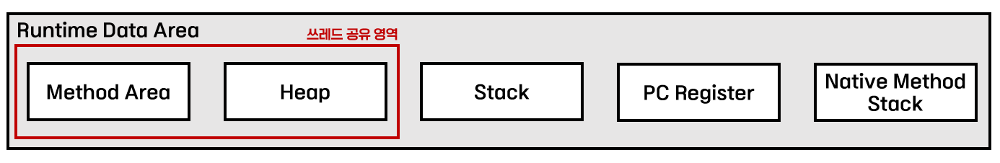

<!-- notion-page-id: 3a92cdd741ac80aba5e6d06bfb06fd4e -->

# 런타임 데이터 영역

### JVM runtime data area

- PC Register는 OS의 PC와 같은 역할을 하지만 Java byte code 수준에서 구동된다.

- 무한 재귀/순환에 빠지면 Stack Area에 스택이 꽉 차, stack overflow가 발생한다.

- **Method Area**
  - JVM이 읽어들인 각종 타입정보, 상수, 정적 변수 정보가 저장되는 영역.
  - JIT(Just In Time) 컴파일러가 번역한 기계어 코드를 캐싱하기 위한 메모리 공간으로 활용.
  - Java 8 부터는 PermGen이 아니라 Metaspace에 속함.
    - Metaspace는 JVM 힙이 아니라 네이티브 메모리에서 관리하며, 크기가 동적으로 달라질 수 있음.

- **runtime constant pool**
  - 클래스 버전, 필드, 메서드, 인터페이스 등 클래스 파일에 포함된 정보 및 각종 리터럴, 심볼 참조가 저장되는 영역.
  - 클래스 로더가 클래스를 로드할 때 상기 정보들을 저장.
  - 동적으로 운영되며 런타임에 새로운 상수가 추가될 수 있음.

Heap 영역이 넓을수록 인스턴스 관리가 어려워진다. → ~~GC가 해결~~
  ↳ Heap 영역이 클수록 GC가 느려짐.
