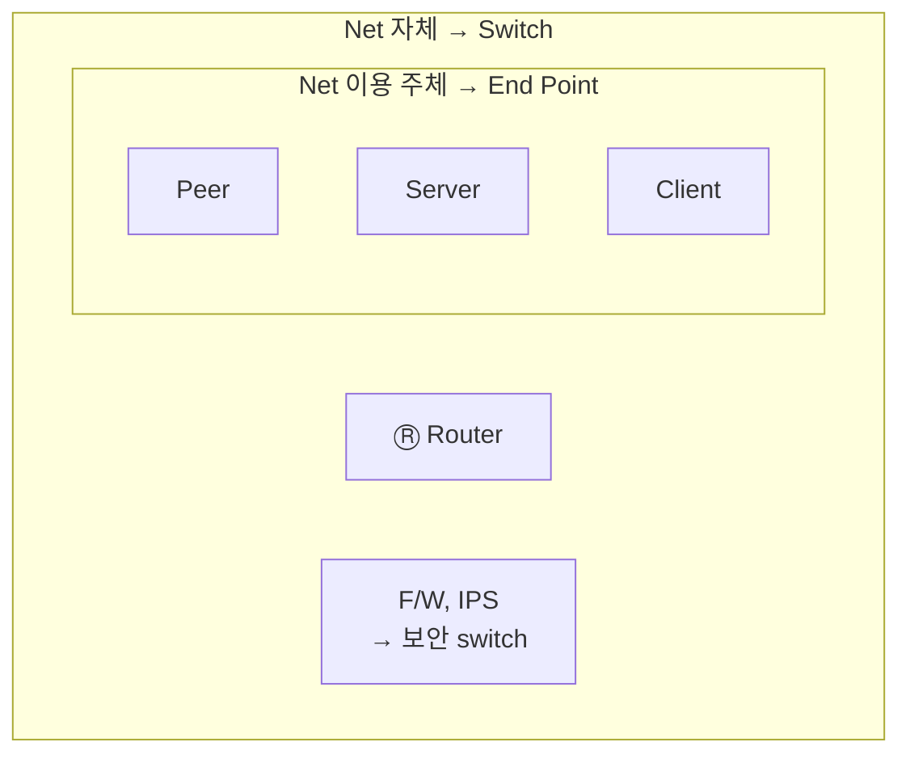

<!-- notion-page-id: 3a02cdd741ac8054a209c8d61894ead0 -->

# Host, Switch

## 1. Host

- **Host** = 네트워크에 연결된 컴퓨터 (Computer + Net)

- **Switch** = Net 자체

### 메모

- 네트워크를 **이용하는** computer는 **host**, 네트워크를 **이루는(구성하는)** computer는 **switch**이다.

- host를 다른 말로 **End Point**라고 한다.
  - End Point → 단말(끝말) → **단말기**

- Ⓡ Router는 **경로를 열기 위해** switching을 하고, F/W·IPS는 **보안적인 이유로** switching한다.

---
