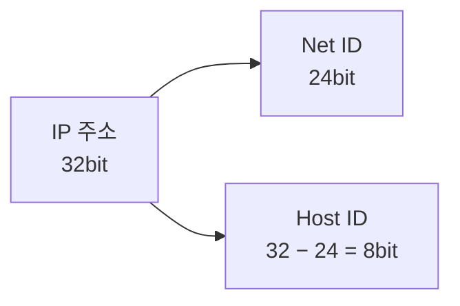
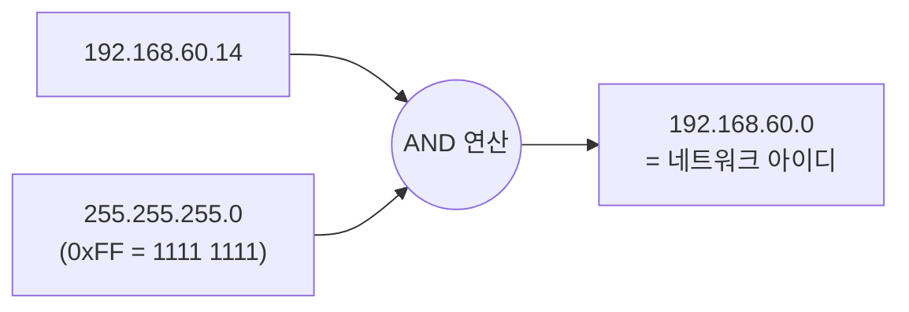

<!-- notion-page-id: 3a02cdd741ac80d1a9e0e58f364a5adf -->

# IP 주소와 Net-mask (Internet Protocol)

> 💡 윈도우 명령어: `ipconfig`

## 1. IP 버전

- **IPv4**
  - **32bit**의 주소 길이를 가짐 → 2의 32승 ≒ **43억**
  - **8bit씩 끊어서** 표시한다.
  - ex) `192.168.60.14` — 각 자리는 0~255 → 2⁸ = 8bit

- **IPv6**
  - **128bit**의 주소 길이를 가짐

> **암기**
  - IPv4 : **32bit**
  - IPv6 : **128bit**

## 2. IP의 구성 요소

```plain text
192 . 168 . 60  .  14
├─── Net ID ───┤├ Host ID ┤
```

- **IP 주소 = Net ID + Host ID**
  - IP 주소: 32bit
  - Net ID: 24bit → Host ID: 32 − 24 = **8bit**



## 3. Net-mask 사용 이유

- host ID는 각 기기의 식별자이기 때문에, **어느 부분이 Host ID이고 Net ID인지 구분하기 위해** 사용된다.

```plain text
192 . 168 . 60  . 14
255 . 255 . 255 .  0   ) AND 연산
─────────────────────
192 . 168 . 60  .  0   → 네트워크 아이디
```

- 255 → `0xFF` → `1111 1111`

- 8bit × 4자리 구조에서 앞의 세 자리 = **24bit**



- **Net ID는 24bit이다.**

## 4. Net ID 표기법

```plain text
192.168.60.14/24
```

- 앞 **24비트가 Net ID**라는 뜻.
