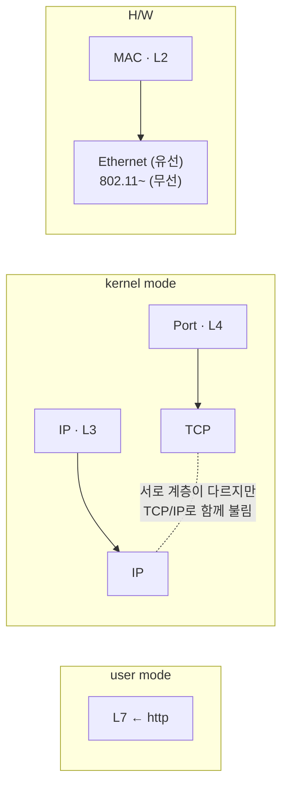
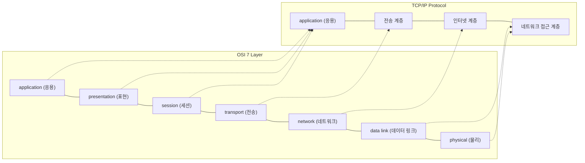

<!-- notion-page-id: 3a02cdd741ac8003846dcca0704e7713 -->

# Network

> **Internet ≒ ① Ⓡ(Router) + ② DNS**

## 계층별 식별자와 구현

### 메모

- Mac 주소는 하드웨어 주소지만, OSI 7 Layer에서 **L2에 존재**한다.

- Switching 하는 위치에 따라 **Mac은 L2 switch, IP는 L3, Port는 L4**이다.
  - 
    - http는 **L7 스위치**

- switch는 OSI 7 Layer 레벨이 오를수록 비싸진다. ⇒ **위로 갈수록 연산이 복잡해진다.**

- TCP/IP는 서로 계층이 다르지만, 서로 **실과 바늘 같은 관계**라서 꼭 함께 불린다.

---

## 포스트잇: OSI 7 Layer ↔ TCP/IP Protocol

### 계층별 대표 프로토콜
