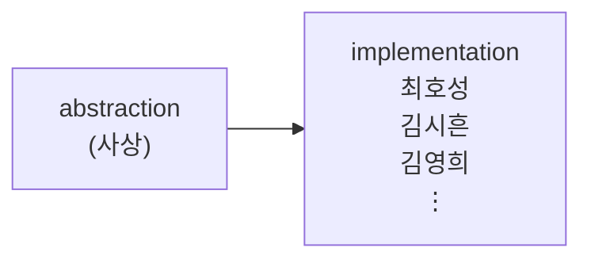
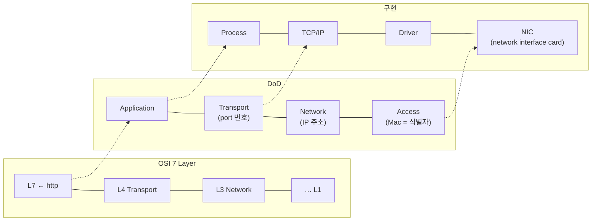

<!-- notion-page-id: 3a02cdd741ac80fab8bbe75c8dc684e1 -->

# OSI 7계층(추상 개념)이 아닌 구현체

> 제대로 된 OSI 7계층 정리는 뒤에서 할 듯

## 1. 개념 vs 사실

**이처럼 OSI 7 Layer는 사실이 아닌 개념이다.** (이상의 실체)

## 2. 컴퓨터 통신의 구조

OSI 7 Layer ↔ DoD 모델 ↔ 구현체 대응 관계:

- user / kernel 경계: L7과 L4 사이 (Application ↔ Transport)

- SW / HW 경계: L3과 그 아래 (Network ↔ Access)

### 메모

- TCP/IP socket은 **TCP를 user mode application이 접근할 수 있도록 파일 형식으로 추상화한 것**.

- DoD에서 **IP 주소는 Network 계층, Mac 주소는 Access 계층, port 번호는 Transport 계층**이다.

- NIC은 Driver가 구동함.

- Kernel의 구성요소를 user mode application으로 추상화할 땐 **File의 형태**로 추상화함.

---
