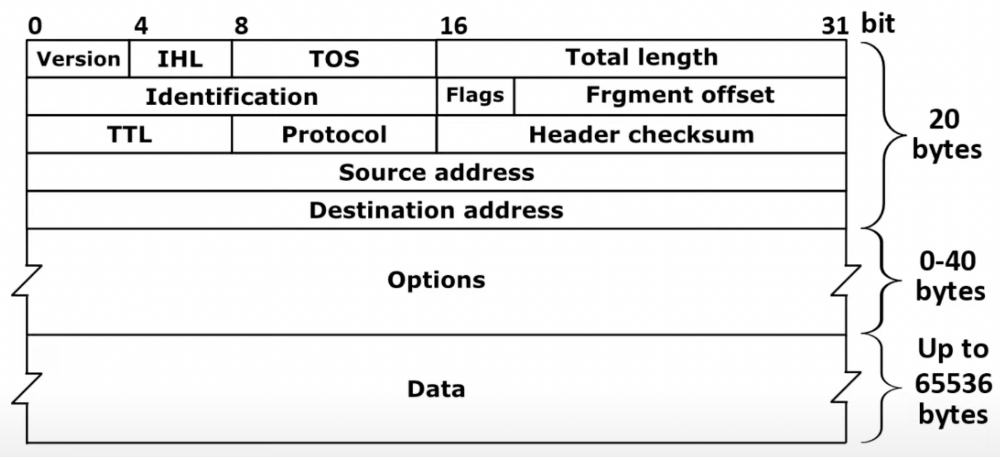

<!-- notion-page-id: 3a72cdd741ac80a388d3f41f9525c088 -->

# Packet IP 형식

## IP Header Format

> 65536 byte까지 전송 가능하지만 MTU는 1500 byte이다.

- **Total length**는 16 bit이다.
  - 2¹⁶ (Data 최대 크기) 까지 표시 가능.

- **Version**은 버전 표기
  - IPv4, IPv6

- **IHL** (Internet Header Length)는 헤더의 크기를 나타낸다.

- **Identification, Flags, Fragment offset**은 단편화와 관련있는 부분이다.

- **TTL**은 Time to live의 약자로, 라우터를 지나갈 때마다 1씩 감소하며 작동한다.
  - 0이 되는 순간 그 Packet은 버려진다.

- **Protocol**은 L4의 헤더를 담고있다. → TCP/UDP

- **Source address**는 출발지 주소, **Destination address**는 목적지 주소를 담고있다. (L3 주소)
  - IP
