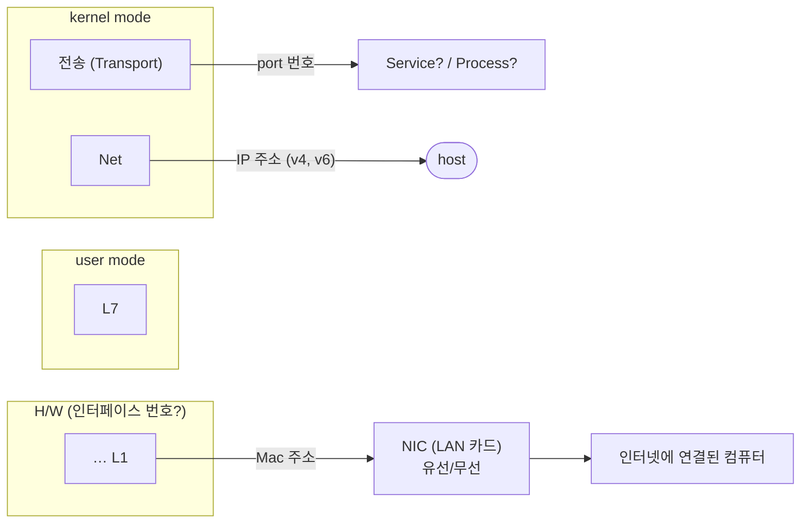

<!-- notion-page-id: 3a02cdd741ac80c2b920e8a050374d3b -->

# Port 번호 / IP 주소 / Mac 주소

## 1. 식별자

각 식별자가 가리키는 대상:

### 포스트잇 메모

- 노트북 ← NIC 2개 (유선/무선) → **Mac 주소 2개**

- 컴퓨터 ← IP 주소 몇 개? → **N개**

- **Mac 주소 하나에 여러 IP를 매핑(바인딩)함**
