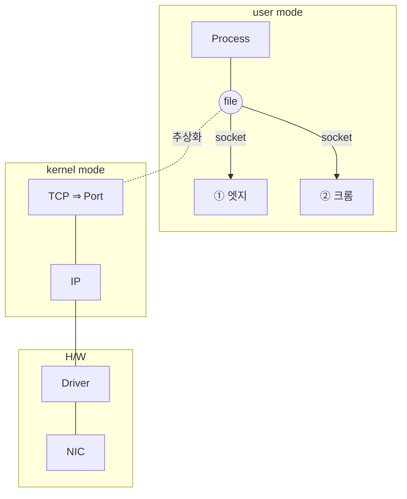

<!-- notion-page-id: 3a02cdd741ac80469ac2e5da55721049 -->

# Port 번호

## 1. 프로세스 식별자, 서비스, 인터페이스 카드

### 메모

- Port 번호는 **kernel 계층에서 TCP/IP를 file(socket)으로 추상화시킬 때 attach되는 정보**이다.

- Port 번호는 **2¹⁶개**이다. ⇒ **65535 − 2** (0과 65535 제외)의 경우의 수를 갖는다.

- **각 소켓은 서로 다른 Port 번호**를 갖는다.

- **L4(TCP)에서 Port 번호로 Process를 식별**한다.
