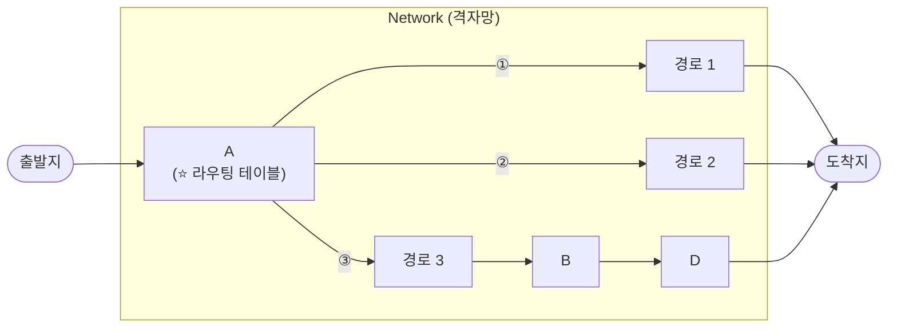

<!-- notion-page-id: 3a02cdd741ac801cb566caa4018c39b0 -->

# Switch, Switching?

> **Internet은 L3 스위칭을 한다.**

### 메모

- 각 **라우팅 테이블**은 서로 통신하며 **이정표를 구성**한다.
  - 어느 방향으로 갈지 정하기 + **효율적인 방향 찾기**

- **switching**은 통신 장치 간에 데이터 패킷을 수신하고 **올바른 목적지로 전달하기 위한 핵심 기술**이다.

- **Internet은 Ⓡ(Router)의 집합체**이다.
  - → L3 통신 ⇒ **IP로 통신**
  - → 각 기기별로 구분함.
