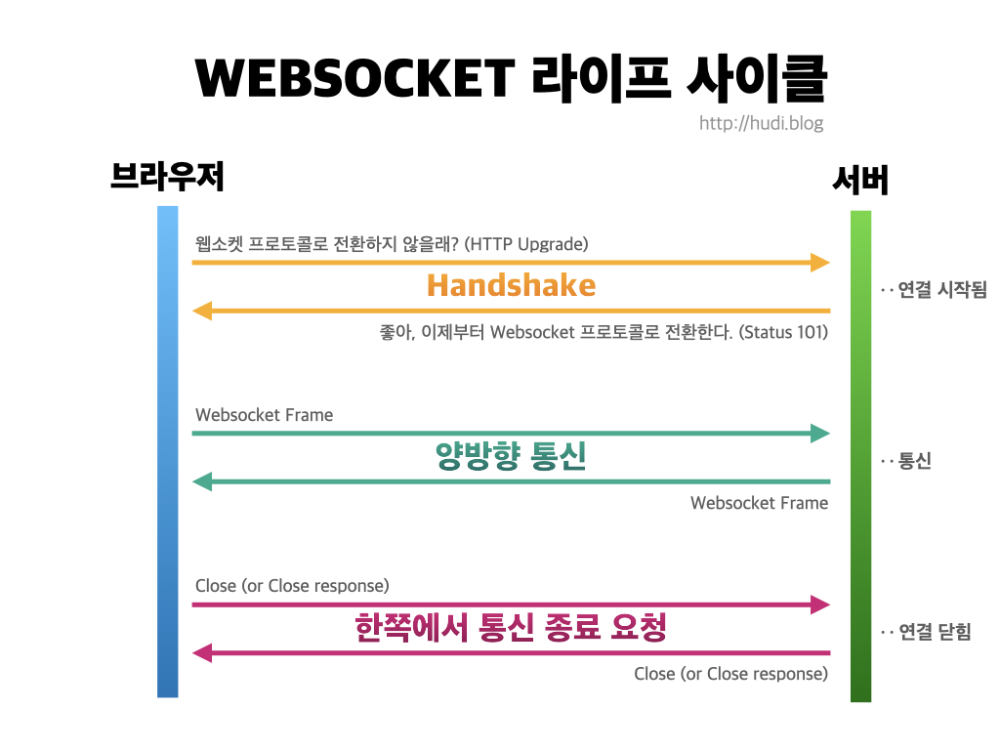
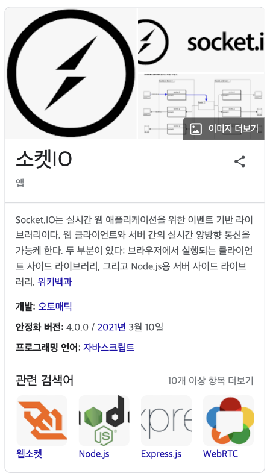
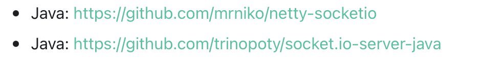
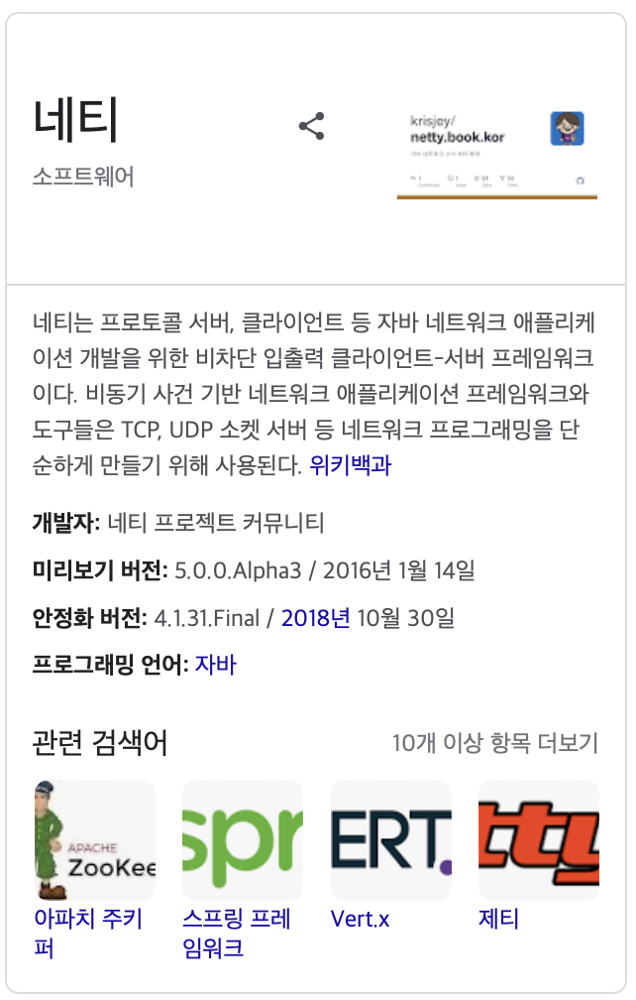

<!-- notion-page-id: 3a32cdd741ac80479e92e0df9bdcd9ef -->

# socket.io와 webSocket이란?

## Socket이란?

소켓(socket)은 TCP/IP 기반 네트워크 통신에서 데이터 송수신의 마지막 접점을 말한다. 

소켓은 소프트웨어와 소프트웨어를 연결하는 일을 한다.

- TCP/IP 4계층에서 전송 계층 위에 존재

- 전송 계층 위에서 전송 계층의 프로토콜 제어를 위한 코드 제공

> **Socket과 WebSocket은 구분되는 개념이다. (완전히 다른것은 아니다.)**
  IP와 port를 통해 통신하며, 둘 다 양방향 통신을 한다는 공통점이 있지만,
  Socket은 인터넷 프로토콜에 기반하므로, TCP/UDP가 속한 4계층에 위치하며,
WebSoket은 TCP에 의존하지만 HTTP에 기반하므로 7계층에 위치함
  Socket은 바이트 스트림을 통한 데이터 전송이므로 바이트로 이루어진 데이터를 다루지만,
WebSoket은 메시지 형식의 데이터를 다룬다.

## webSocket이란?

HTTP와 구분되는 하나의 TCP 접속에 전이중 통신 채널을 제공하는 **통신 프로토콜**이다. 

HTTP 통신은 요청(Request)와 응답(Response)이 존재하여, 클라이언트가 요청을 보내면 서버가 응답을 보내는 형식이다. 그렇기에 서버가 클라이언트에게 먼저 데이터를 전송할 수 없다. → 이와같은 통신 구조를 **반이중통신(Half-Duplex Communication)** 이라고 한다.

이와다르게 웹 소켓은 TCP/IP의 Socket과 마찬가지로 **전이중통신(Full-Duplex Communication) **을 제공한다. WebSocket으로 연결된 서버와 클라이언트가 요청과 응답없이 능동적으로 메세지를 보낼 수 있다.

> webSocket은 HTTP에서 실시간 통신을 할 수 없다는 단점을 보완하기 위해 나온 기술이다.

### 동작 원리 

## Socket.io란?

[https://socket.io/docs/v4/](https://socket.io/docs/v4/)

    webSocket은 Html5이후에 나와 지원되지 않는 브라우저가 존재한다. 이를 해결하기 위해 Socket.io가 등장하게 되었다. 
    Socket.io는 webSocket을 기반으로 신시간 웹 어플리케이션을 위한 javaScript 라이브러리이다. 
    Socket.io에서 webSocket을 사용할 수 있다.
    > Socket.io는 Node.js의 라이브러리여서 java Spring Boot에서는 지원되지 않을 것이라고 생각했는데 공식문서를 보니 

      자바관련 자료를 발견했다. 밑에서 더 자세히 알아보도록 하겠다.

> **Socket.io와 WebSocket의 차이점**
  - 연결이 끊어졌을 때 socket.io는 주기적으로 연결을 시도한다. 반면 webSocket은 한번 끊어지면 복구되지 않는다.
  - webSocket에는 room이 없다. 
    Socket.io에서 제공되는 room과 broadcast의 기능을 사용할 수 없다.
  - webSocket은 이벤트명도 데이터에 포함해서 받으며, String 형태의 데이터를 전송한다. Socket.io는 이벤드 명과 데이터를 명확하게 구분하고 모든 자료형을 주고 받을 수 있다.

### **Netty**

[https://netty.io](https://netty.io)

[https://github.com/mrniko/netty-socketio](https://github.com/mrniko/netty-socketio)

    Netty는 소켓을 위해 만들어졌다기 보다는 자바의 TCP, UDP 소켓 서버 개발과 같은 네트워크 프로그래밍을 쉽게 도와주는 프레임워크이다.
    //얘도 여까지만 하고 ㅎㅎ ^__^

## SockJS란?

// 이거 귀찮아서 정리한함 아래 참고에 정리하려던 자료 링크 있으니까 참고하삼

### 참고

[https://bentist.tistory.com/35](https://bentist.tistory.com/35)

[https://kadosholy.tistory.com/125](https://kadosholy.tistory.com/125)

[https://hudi.blog/websocket-with-nodejs/](https://hudi.blog/websocket-with-nodejs/)

[https://velog.io/@rhdmstj17/소켓과-웹소켓-한-번에-정리-1](https://velog.io/@rhdmstj17/%EC%86%8C%EC%BC%93%EA%B3%BC-%EC%9B%B9%EC%86%8C%EC%BC%93-%ED%95%9C-%EB%B2%88%EC%97%90-%EC%A0%95%EB%A6%AC-1)

[https://velog.io/@rhdmstj17/소켓과-웹소켓-한-번에-정리-2](https://velog.io/@rhdmstj17/%EC%86%8C%EC%BC%93%EA%B3%BC-%EC%9B%B9%EC%86%8C%EC%BC%93-%ED%95%9C-%EB%B2%88%EC%97%90-%EC%A0%95%EB%A6%AC-2)

[https://gusrb3164.github.io/web/2021/10/28/websocket-socket/](https://gusrb3164.github.io/web/2021/10/28/websocket-socket/)

[https://www.peterkimzz.com/websocket-vs-socket-io/](https://www.peterkimzz.com/websocket-vs-socket-io/)

[https://velog.io/@jguuun/Socketio-WS-diff](https://velog.io/@jguuun/Socketio-WS-diff)

[https://jangstory.tistory.com/12](https://jangstory.tistory.com/12)

Netty

[https://velog.io/@monami/Netty](https://velog.io/@monami/Netty)

[https://narup.tistory.com/118](https://narup.tistory.com/118)

[https://hbase.tistory.com/116](https://hbase.tistory.com/116)

socketJS

[https://velog.io/@yyong3519/스프링부트-웹소켓2](https://velog.io/@yyong3519/%EC%8A%A4%ED%94%84%EB%A7%81%EB%B6%80%ED%8A%B8-%EC%9B%B9%EC%86%8C%EC%BC%932)

[https://dev-gorany.tistory.com/224](https://dev-gorany.tistory.com/224)
