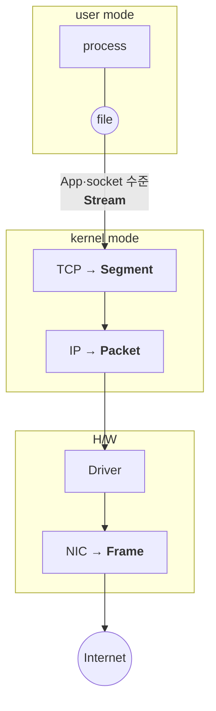
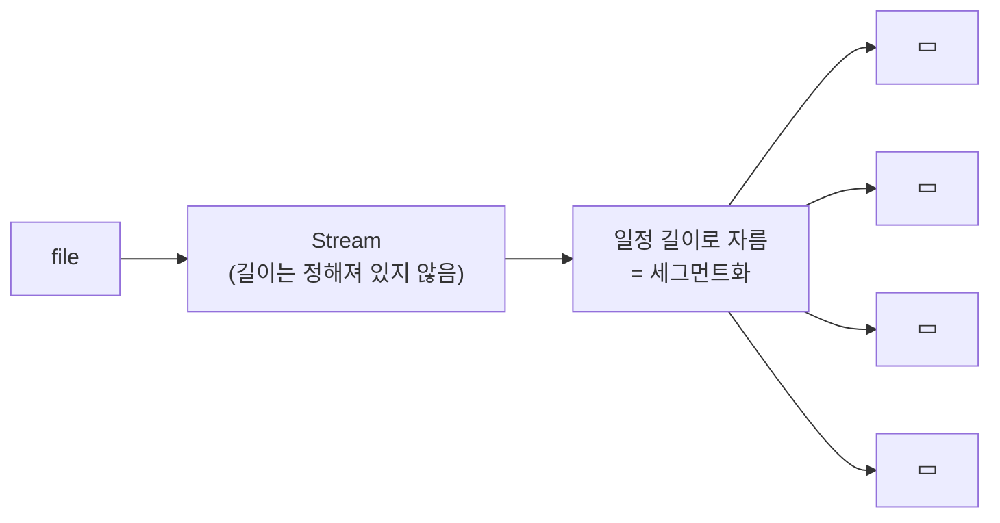

<!-- notion-page-id: 3a02cdd741ac80029128c785ffd807cf -->

# 데이터 단위

## 1. 계층별 단위

> ⭐ 위에서 아래로 내려가며 감싸는 과정 = **Encapsulation**

### 메모

- **계층마다 단위가 다르다.**
  - App 수준은 **Stream**
  - TCP는 **Segment**, IP는 **Packet**
  - H/W는 **Frame**

## 2. 세그먼트화 (Segmentation)

- 일정 길이로 자름 → **(TCP 수준) MSS** (Maximum Segment Size)

- **Packet의 최대 길이 = MTU** (Maximum Transport Unit)

### 메모

- **MTU는 거의 항상 1,500 byte**이다.
  - 1.5MB의 stream 데이터를 네트워크에 보내려면 **적어도 1,000개의 Packet**으로 잘린다.

- **Segmentation**은 App 영역의 stream 데이터를 file을 통해 **물리적 장비가 수용할 수 있는 최대 크기(MTU)로 나누는 작업**이다.

- **MSS는 MTU보다 작다.**
