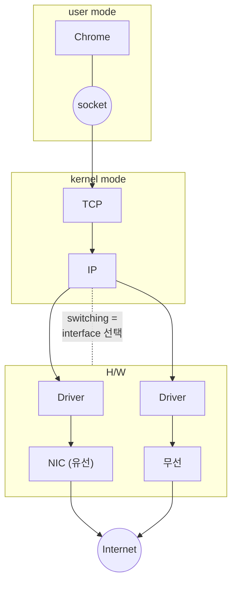

<!-- notion-page-id: 3a02cdd741ac80baa7a1f4d3e3ea79b2 -->

# 인터페이스 선택

> 💡 윈도우 명령어: `route PRINT`

- 왼쪽 참고 스택: HTTP / SSL / TCP / IP (u–k–H/W 경계)

### 메모

- **OS / Network stack / Routing manager**가 **메트릭 비용을 기준으로** (인터페이스를) 선택한다.
