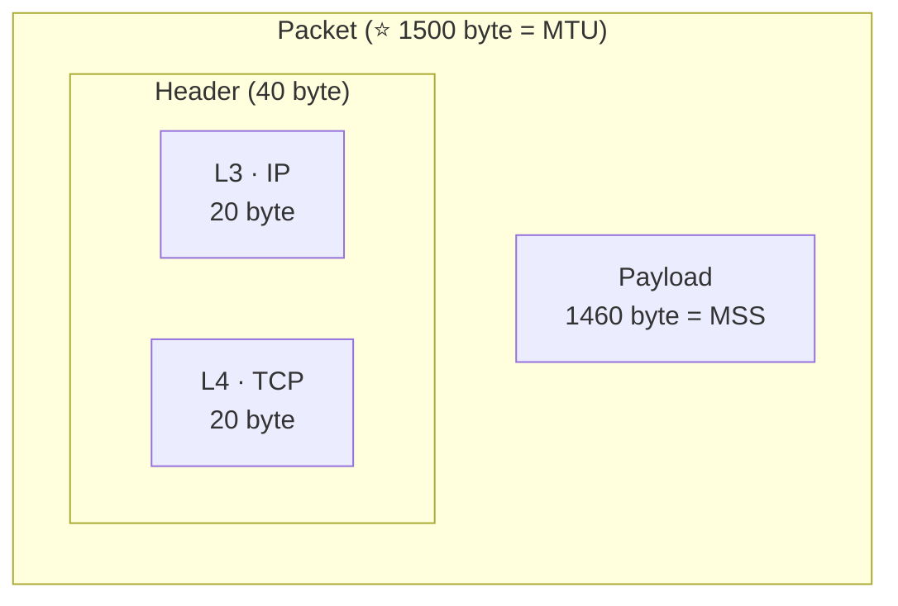
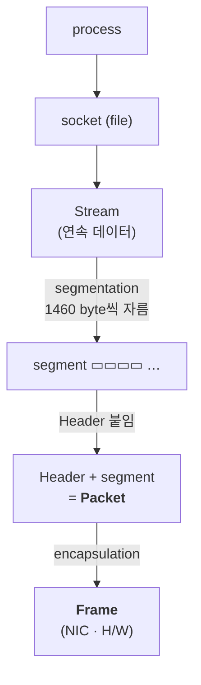

<!-- notion-page-id: 3a02cdd741ac80acade8c978a24e9191 -->

# 패킷 생성 원리와 캡슐화

## 1. 패킷 내부 구조

```plain text
├─ Header ─┤├──── Payload (1460 byte = MSS) ────┤
                                    ⭐ 전체 = 1500 byte MTU
Header 내부:
├ L3: IP (20 byte) ┤├ L4: TCP (20 byte) ┤  = 40 byte
```



### 메모

- Payload를 보는 것은 **DPI (Deep Packet Inspection)**이라 한다.

- **Header는 운송장, Payload는 택배의 내용물**이라 생각하면 충분하다.

> 📌 포스트잇 그림: **encapsulation**
  - frame = 🚚 트럭, packet = 📦 택배 상자 (Header = 운송장, segment = 내용물)
  - 트럭(frame)이 상자(packet) 여러 개를 싣고 나름

## 2. Segmentation / Encapsulation

계층 스택: HTTP / SSL / TCP·UDP / IP / Ethernet · 구현: process → socket(file) → TCP → IP → Driver → NIC



### 메모

- stream을 **1460 byte씩 잘라 segment**로 만든다.
  - 2000 byte의 stream은 **최소 2번**은 잘린다.

- **Packet은 segment에 Header를 붙여** 만들어진다.

- **1460 byte가 MSS (Maximum Segment Size)의 용량**이다.
